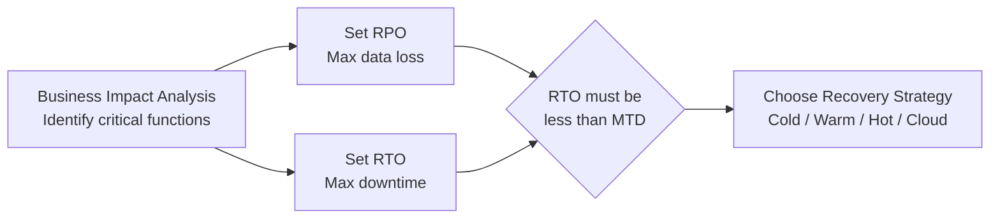
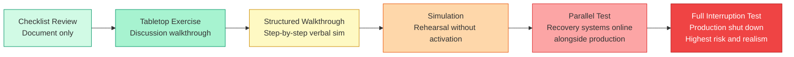
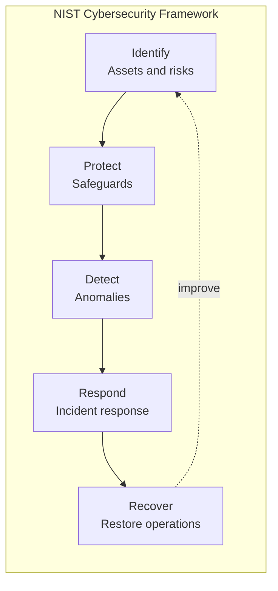
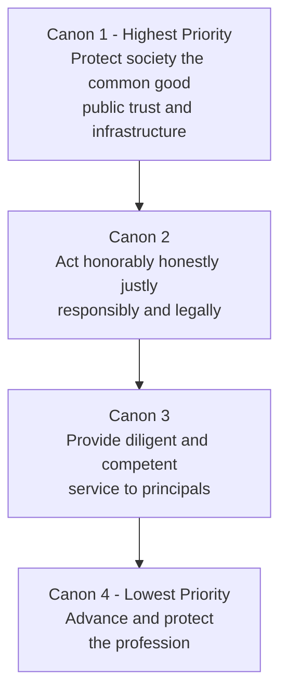
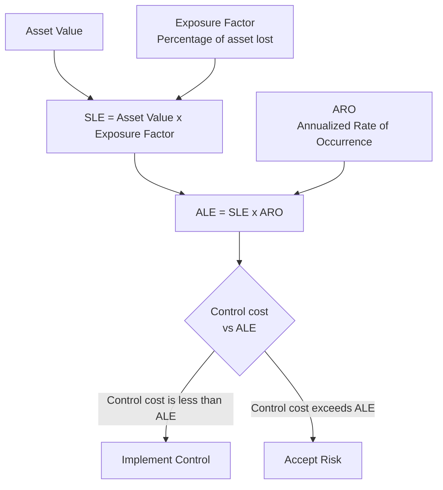
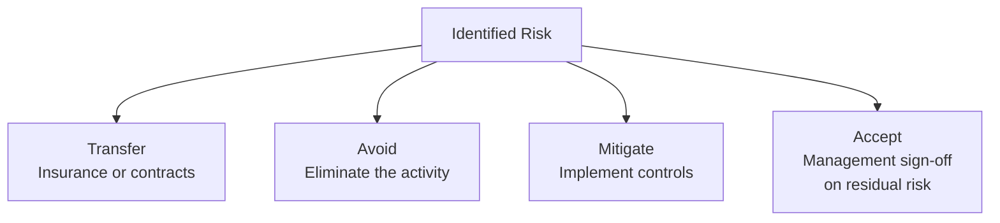
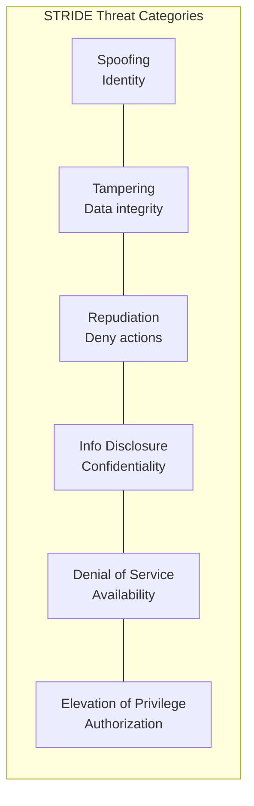

# Domain 1: Security and Risk Management

**Exam Weighting: ~15% — the largest single domain on the CISSP exam.**

This domain establishes the foundational principles that underpin every other CISSP domain. Expect a heavy volume of scenario-based questions that ask you to make risk-based decisions, choose governance frameworks, or identify the right response to a regulatory or ethical situation. Mastering this domain pays dividends across the entire exam.

---

## Overview

Security and Risk Management covers the "why" of information security — the policies, frameworks, legal obligations, and risk processes that define how organizations govern their security posture. Questions in this domain test whether you think like a manager and risk decision-maker, not just a technical practitioner.

---

## Business Continuity Planning (BCP) and Disaster Recovery (DR)

BCP ensures an organization can continue critical operations during disruptions. DR is the technical subset focused on restoring IT systems after a disaster.

**Key metrics every candidate must know:**
- **RTO (Recovery Time Objective)** — maximum acceptable time to restore a system after disruption
- **RPO (Recovery Point Objective)** — maximum acceptable data loss measured in time (how old can the restored data be?)
- **MTD/MTO (Maximum Tolerable Downtime/Outage)** — the absolute upper limit before business harm becomes unacceptable; RTO must always be less than MTD
- **BIA (Business Impact Analysis)** — the process of identifying critical functions and quantifying the impact of their loss; it drives RTO/RPO targets

**BCP testing types — in order of increasing rigor and cost:**

---

## Privacy and Legal/Regulatory Environment

Understanding the legal landscape is essential — the CISSP is a management-level credential and you are expected to know when to escalate to legal counsel.

**Major regulations:**
- **GDPR (EU)** — applies to any organization processing EU resident data. Fines up to **€20 million or 4% of global annual revenue**, whichever is higher. Key principles: lawfulness, purpose limitation, data minimization, accuracy, storage limitation, integrity/confidentiality. Breach notification required within **72 hours**.
- **CCPA (California)** — grants California residents rights to know, delete, and opt out of data sale. Fines up to $7,500 per intentional violation.
- **HIPAA (US Healthcare)** — protects Protected Health Information (PHI). Covered entities and business associates must comply. Civil penalties up to $1.9 million per violation category per year.
- **PCI-DSS** — payment card industry standard (not law, but contractually required). 12 core requirements organized around protecting cardholder data.

**Privacy principles to internalize:** data minimization, purpose limitation, consent, right of access, right to erasure ("right to be forgotten").

---

## Governance and Compliance Frameworks

Governance establishes accountability and direction for an organization's security program.

**Key frameworks:**
- **NIST Cybersecurity Framework (CSF)** — five functions: Identify, Protect, Detect, Respond, Recover. Widely adopted in US critical infrastructure.
- **NIST SP 800-53** — comprehensive catalog of security controls for federal systems; basis for many compliance programs.
- **ISO/IEC 27001** — international standard for an Information Security Management System (ISMS). Certifiable. Annex A contains 93 controls organized into 4 themes (2022 revision).
- **COBIT** — IT governance framework focused on aligning IT with business objectives. Emphasizes governance vs. management distinction.

**Due care vs. due diligence:** Due care is doing what a reasonable person would do (acting). Due diligence is researching and verifying before acting. Both are required to avoid negligence.

---

## ISC² Code of Ethics

All CISSPs are bound by the Code of Ethics. The four canons in priority order:

**Canon order matters on the exam.** When canons conflict, the higher-numbered canon yields to the lower. Society always comes first.

---

## Personnel Security

People are consistently the weakest link and the most exploited attack vector.

**Core principles:**
- **Separation of duties (SoD)** — no single person can complete a sensitive transaction alone; prevents fraud
- **Least privilege** — users receive only the minimum access necessary to perform their job
- **Need-to-know** — even with clearance, access requires a justified need; clearance is necessary but not sufficient
- **Two-person integrity (Two-man rule)** — requires two authorized individuals to be present for sensitive operations
- **Job rotation** — reduces single points of failure and collusion risk; also aids in fraud detection
- **Mandatory vacation** — forces someone else to cover duties, exposing fraud or errors

**Hiring and termination:**
- Pre-employment: background checks, reference checks, employment verification
- Termination: immediate access revocation is the priority — especially for hostile separations

---

## Risk Management

Risk management is the analytical heart of this domain. Think quantitatively when numbers are available; think qualitatively when they are not.

**Core risk formula:**
> **Risk = Threat × Vulnerability × Asset Value**

**Quantitative risk analysis — key formulas:**
- **SLE (Single Loss Expectancy)** = Asset Value × Exposure Factor (EF)
- **ALE (Annualized Loss Expectancy)** = SLE × ARO
- **ARO (Annualized Rate of Occurrence)** = how often a threat is expected to occur per year

**Risk treatment options (the four T's):**

**Qualitative analysis** uses subjective ratings (High/Medium/Low) and expert judgment. Useful when data is unavailable or cost to quantify exceeds value.

**Residual risk** = risk remaining after controls are applied. **Total risk** = risk before controls. Management must formally accept residual risk.

---

## Threat Modeling

Threat modeling is a structured approach to identifying threats during the design phase — far cheaper than finding them in production.

**STRIDE** (Microsoft) — classifies threats by type:
- **S**poofing, **T**ampering, **R**epudiation, **I**nformation disclosure, **D**enial of service, **E**levation of privilege

**PASTA** (Process for Attack Simulation and Threat Analysis) — 7-stage, attacker-centric methodology aligned to business objectives.

**DREAD** — risk-rating model scoring: Damage, Reproducibility, Exploitability, Affected users, Discoverability. Now considered dated but still testable.

**VAST** — scales threat modeling across DevOps pipelines.

---

## Exam Tips

- **Think like a manager, not a technician.** When a question asks what to do "first" or "most importantly," the answer is often a risk-based or governance action — not a technical fix.
- **ALE questions are common.** Practice the SLE → ALE calculation chain until it is automatic. Watch for trick questions where the cost of a control exceeds the ALE (don't implement it).
- **Canon order saves points.** Memorize the four ISC² Code of Ethics canons in order — exam questions often present conflicts between them.
- **MTD > RTO, always.** If you see a question about acceptable recovery targets, remember that RTO must be less than MTD or the business cannot survive the outage.
- **Risk acceptance requires authorization.** Only management can accept risk — a security professional cannot accept risk on behalf of the organization.
- **GDPR breach notification = 72 hours.** This number appears frequently. Also remember that GDPR's territorial scope covers any organization processing EU resident data, regardless of where the organization is located.
