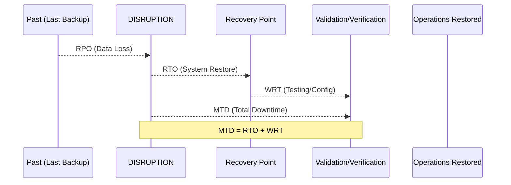

# Business Continuity Planning (BCP) and Disaster Recovery (DR)

Business Continuity (BCP) and Disaster Recovery (DR) are distinct but overlapping disciplines. **BCP** focuses on keeping the business running during a disruption, while **DR** focuses on restoring the technical infrastructure that supports it.

## 1. The BCP Lifecycle (NIST SP 800-34)

The BCP process is a continuous lifecycle that begins with policy and ends with maintenance.

## 2. Business Impact Analysis (BIA)
The BIA is the "brain" of the BCP. It identifies critical business processes and the impact of their failure.
*   **Identify Critical Processes**: What must the business do to survive?
*   **Identify Resources**: What people, technology, and facilities do those processes need?
*   **Calculate Metrics**: Establish the recovery timeframes.

## 3. Recovery Metrics (The "Four Pillars")

Understanding how these metrics interact is vital for the exam.

*   **MTD (Maximum Tolerable Downtime)**: The absolute maximum time a process can be down before the business suffers "irreparable harm."
*   **RTO (Recovery Time Objective)**: The target time for restoring a *system* or *service*. (RTO must be <= MTD).
*   **RPO (Recovery Point Objective)**: The maximum amount of *data loss* the organization can tolerate (measured in time, e.g., "we can lose 4 hours of data").
*   **WRT (Work Recovery Time)**: The time needed to verify data integrity, test systems, and perform "catch-up" work before returning to production.

## 4. Disaster Recovery Sites
| Site Type | Description | Cost | Recovery Time |
| :--- | :--- | :--- | :--- |
| **Mirrored (Hot)** | Real-time replication, fully redundant. | Highest | Immediate |
| **Hot Site** | Fully equipped, up-to-date data. | High | Minutes/Hours |
| **Warm Site** | Equipment present, but data must be restored. | Medium | Days |
| **Cold Site** | Facility only (power/cooling), no hardware. | Lowest | Weeks |
| **Mobile Site** | Self-contained trailer/container. | Varies | Varies |

## 5. Backup Strategies
*   **Full**: Copies everything. Fast restore, slow backup.
*   **Incremental**: Copies changes since the *last backup* (any type). Slowest restore (needs Full + all Incrementals).
*   **Differential**: Copies changes since the *last Full backup*. Faster restore (needs Full + last Differential).

## 6. DRP Testing Types (Least to Most Disruptive)
1.  **Read-Through (Checklist)**: Managers review the plan independently.
2.  **Structured Walkthrough (Tabletop)**: Stakeholders gather and "play out" a scenario verbally.
3.  **Simulation**: Teams practice procedures in a non-production environment.
4.  **Parallel**: Recovery systems are started, but production remains running.
5.  **Full Interruption**: Production is shut down, and recovery systems take over entirely.

---
*Sources: ISC2 CISSP CBK 2024, NIST SP 800-34 Rev 1.*
