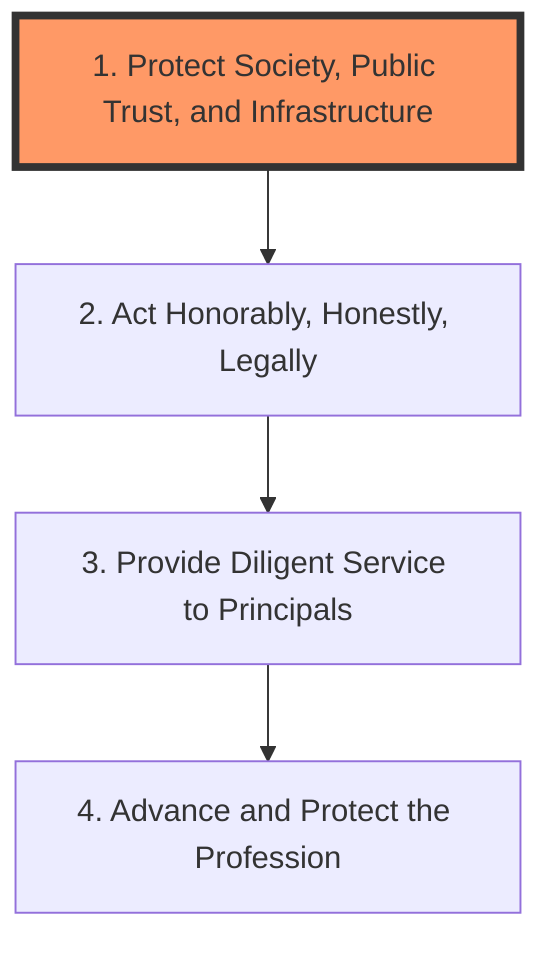
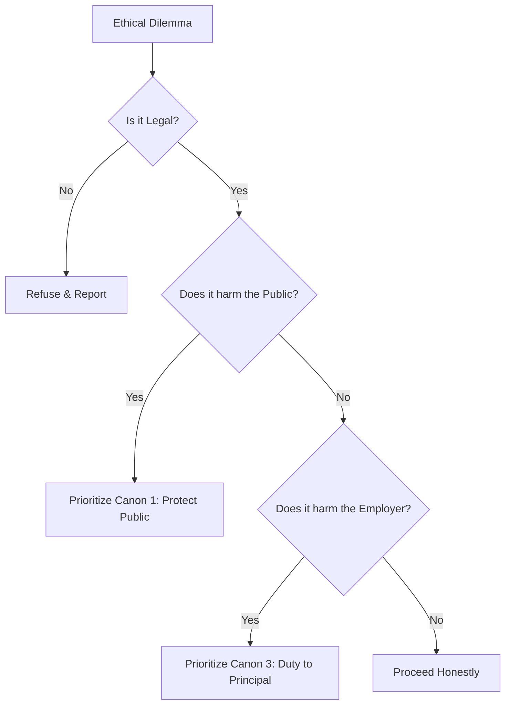

# Professional Ethics

Ethics is the foundation of the CISSP certification. ISC2 requires all members to adhere to a specific Code of Ethics, and violations can lead to the permanent revocation of the credential.

## 1. ISC2 Code of Ethics Canons
You **must** know these four canons and their **exact order of priority**. If canons conflict, the lower-numbered canon always wins.

1.  **Protect society, the common good, necessary public trust and confidence, and the infrastructure.**
    *   *Focus*: Safety of human life and the environment.
2.  **Act honorably, honestly, justly, responsibly, and legally.**
    *   *Focus*: Integrity and law-abiding behavior.
3.  **Provide diligent and competent service to principals.**
    *   *Focus*: Duty to your employer or client.
4.  **Advance and protect the profession.**
    *   *Focus*: Integrity of the CISSP brand and mentoring others.

## 2. Ethical Decision-Making
When faced with an ethical dilemma, the CISSP must evaluate the situation based on the priority of the canons.

## 3. RFC 1087: Ethics and the Internet
The Internet Architecture Board (IAB) defines unethical behavior on the internet in RFC 1087. An activity is considered unethical if it:
*   Seeks to gain unauthorized access to the resources of the Internet.
*   Disrupts the intended use of the Internet.
*   Wastes resources (people, capacity, computer) through such actions.
*   Destroys the integrity of computer-based information.
*   Compromises the privacy of users.

## 4. Computer Ethics Institute (CEI)
The CEI developed the "Ten Commandments of Computer Ethics," which include:
*   Thou shalt not use a computer to harm other people.
*   Thou shalt not snoop in other people's computer files.
*   Thou shalt not use a computer to steal.
*   Thou shalt not use a computer to bear false witness.
*   Thou shalt not use or copy software for which you have not paid.

## 5. Reporting Ethics Violations
*   Violations of the ISC2 Code of Ethics should be reported to the **ISC2 Ethics Committee**.
*   The report must be based on factual evidence, not hearsay.
*   ISC2 will investigate and may take disciplinary action, including decertification.

---
*Sources: ISC2 Code of Ethics, RFC 1087, Computer Ethics Institute.*
