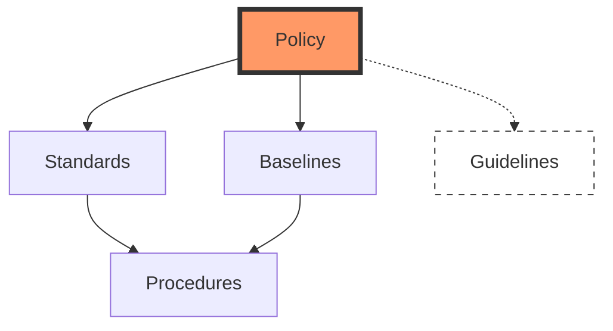
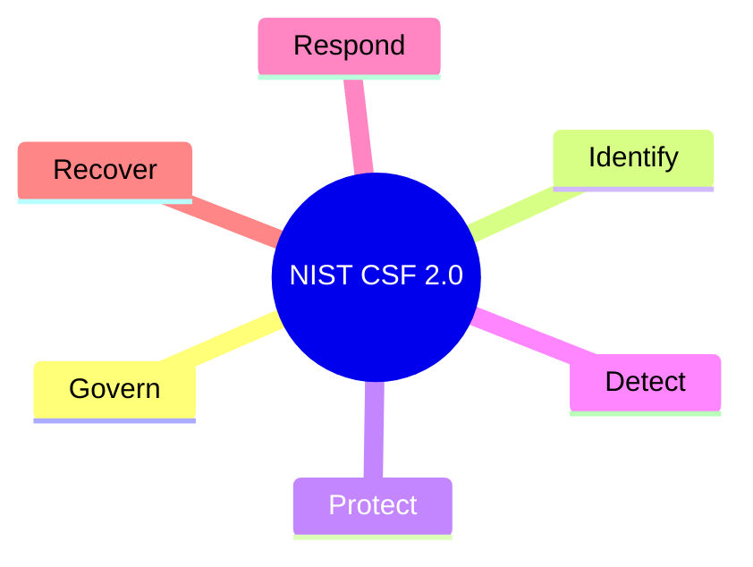

# Security Governance and Compliance

Governance is the set of responsibilities and practices exercised by the board and executive management with the goal of providing strategic direction. Compliance ensures the organization meets the requirements of laws, regulations, and contracts.

## 1. The Security Policy Hierarchy
The exam tests the difference between these documents frequently. They flow from strategic (abstract) to tactical (specific).

| Document | Nature | Description |
| :--- | :--- | :--- |
| **Policy** | Mandatory | High-level statement of management's intent (the "What"). |
| **Standard** | Mandatory | Specific technical requirements or hardware/software choices. |
| **Baseline** | Mandatory | Minimum security state (e.g., "all laptops must use disk encryption"). |
| **Procedure** | Mandatory | Step-by-step instructions for a specific task. |
| **Guideline** | **Optional** | Recommended actions or best practices. |

## 2. NIST Cybersecurity Framework (CSF) 2.0
The 2024 CISSP CBK emphasizes the updated CSF 2.0, which added the **Govern** function.

*   **Govern**: Establish organizational context, risk management strategy, and oversight.
*   **Identify**: Determine the assets and risks the organization must manage.
*   **Protect**: Implement safeguards to ensure delivery of services.
*   **Detect**: Identify the occurrence of a cybersecurity event.
*   **Respond**: Take action regarding a detected cybersecurity incident.
*   **Recover**: Restore capabilities or services impaired by a cybersecurity incident.

## 3. Due Care and Due Diligence
These are critical legal concepts for the CISSP:
*   **Due Diligence (Investigation/Planning)**: The *act of gathering* information and performing the research necessary to make a decision (e.g., "doing your homework").
*   **Due Care (Action/Execution)**: The *act of performing* the security controls. What a "reasonable person" would do in a similar situation (e.g., "doing the right thing").

> **Exam Tip**: "Diligence" is the thinking; "Care" is the doing. Failure to exercise Due Care is often defined as **Negligence**.

## 4. Key Laws and Regulations
Organizations must align their governance with various legal requirements:

| Regulation | Focus Area | Key Requirements |
| :--- | :--- | :--- |
| **GDPR** | Data Privacy (EU) | Right to be forgotten, data portability, 72-hour breach notification. |
| **HIPAA** | Healthcare (US) | Privacy and Security rules for PHI (Protected Health Information). |
| **SOX** | Financial (US) | Controls for public companies to prevent financial fraud. |
| **GLBA** | Financial (US) | Protection of consumer financial information. |
| **PCI DSS** | Payment Cards | Contractual requirement (not a law) for handling credit card data. |
| **FISMA** | Federal (US) | Security requirements for US government agencies and contractors. |

## 5. Third-Party Governance
Governance extends beyond the organization's walls:
*   **Service Level Agreement (SLA)**: Defines the performance expectations (e.g., 99.9% uptime).
*   **Memorandum of Understanding (MOU)**: A less formal agreement outlining cooperation between parties.
*   **Interconnection Security Agreement (ISA)**: Specific technical requirements for connecting two systems.

---
*Sources: ISC2 CISSP CBK 2024, NIST CSF 2.0, NIST SP 800-37.*
