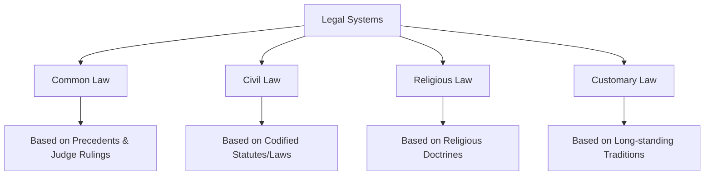
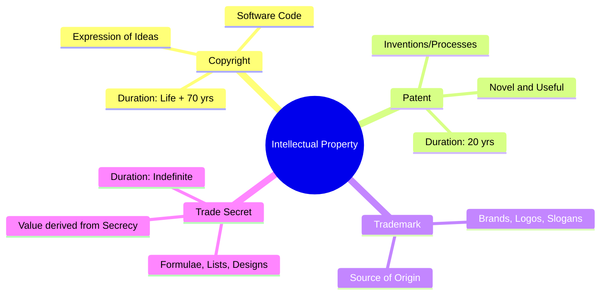

# Legal, Regulatory, and Investigation

Understanding the legal landscape is essential for the CISSP, as it defines the boundaries of corporate liability and the requirements for protecting data.

## 1. Major Legal Systems
The CISSP exam recognizes four primary types of legal systems worldwide.

## 2. Categories of Law (US Context)
*   **Criminal Law**: Deals with behavior that is an offense against the public, society, or the state (e.g., murder, theft, computer fraud). *Penalty: Jail or fines.*
*   **Civil (Tort) Law**: Deals with disputes between individuals or organizations (e.g., contract disputes, personal injury). *Penalty: Monetary damages.*
*   **Administrative Law**: Rules and regulations created by government agencies (e.g., FCC, SEC, HIPAA). *Penalty: Fines or revocation of licenses.*

## 3. Intellectual Property (IP)
IP protection is critical for maintaining an organization's competitive advantage.

## 4. Computer Crimes and Investigations
*   **Computer Fraud and Abuse Act (CFAA)**: The primary US federal law prohibiting unauthorized access to "protected computers."
*   **Electronic Communications Privacy Act (ECPA)**: Governs the wiretapping and interception of electronic communications.
*   **Evidence Handling**:
    *   **Best Evidence Rule**: Courts prefer original documents over copies.
    *   **Hearsay Rule**: Second-hand evidence is generally not admissible (exceptions exist for business records).
    *   **Chain of Custody**: A detailed, chronological record of who handled the evidence. Failure to maintain this renders evidence inadmissible.

## 5. Privacy Regulations (Global)
*   **GDPR (EU)**: The most stringent privacy law. Focuses on **Data Subjects'** rights (Access, Erasure, Portability). Includes roles like **Data Controller** (determines purpose) and **Data Processor** (acts on behalf of Controller).
*   **OECD Privacy Guidelines**: Eight principles that form the basis for most modern privacy laws (Collection Limitation, Data Quality, Purpose Specification, Use Limitation, Security Safeguards, Openness, Individual Participation, Accountability).

## 6. Liability and Compliance
*   **Prudent Person Rule**: The standard of "Due Care" where management must act as a reasonable person would in the same situation.
*   **Downstream Liability**: A legal theory where a company can be held liable for security failures in its supply chain or partners.

---
*Sources: ISC2 CISSP CBK 2024, GDPR Official Text, USPTO.*
