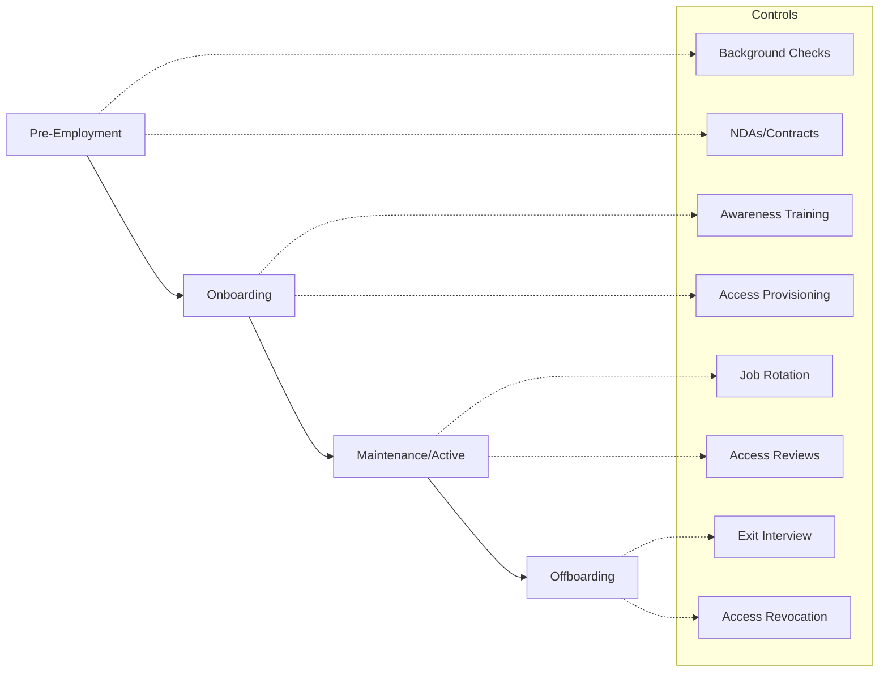
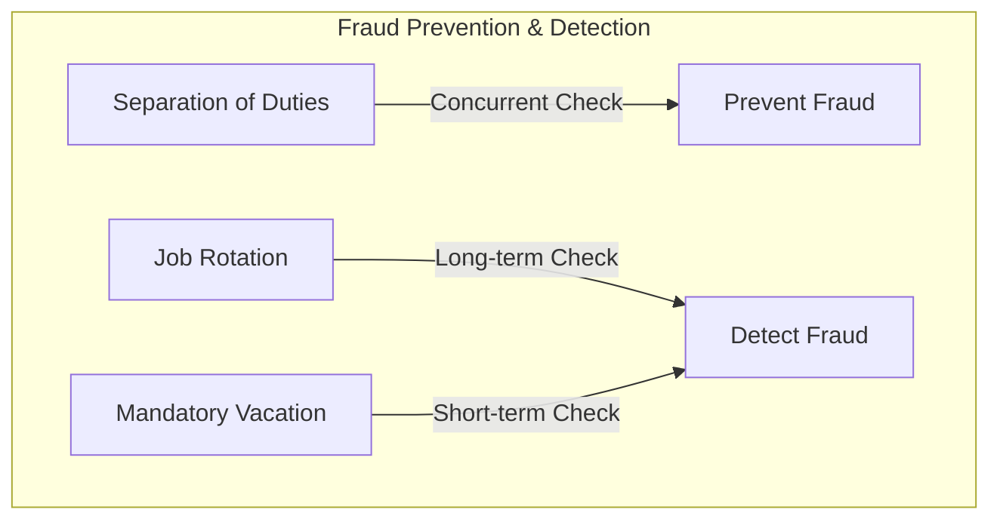

# Personnel Security and Ethics

Personnel security is often cited as the "weakest link" in the security chain. This section covers the controls used to manage the human element of security, from initial hire to termination.

## 1. The Employee Lifecycle

Security must be integrated at every stage of the employee's tenure.

## 2. Administrative Security Controls
These three controls are frequently tested and easily confused:

| Control | Definition | Primary Purpose |
| :--- | :--- | :--- |
| **Separation of Duties** | Splitting a single task across multiple people. | Prevents fraud/unilateral action. |
| **Job Rotation** | Moving people through different roles over time. | Detects fraud/collusion; cross-training. |
| **Mandatory Vacation** | Requiring 1-2 weeks of leave per year. | Detects fraud (someone else must do the work). |

## 3. Onboarding and Termination
*   **Onboarding**: Focuses on **Least Privilege** and **Need to Know**. Every employee should sign a Non-Disclosure Agreement (NDA) *before* access is granted.
*   **Termination (Offboarding)**:
    *   **Friendly**: Standard exit interview, return of assets, access revoked by end of day.
    *   **Hostile**: Immediate revocation of access (often *before* the meeting), escort from building, immediate return of assets.

## 4. Security Awareness and Training
Training must be role-based and continuous. 
*   **Awareness**: General knowledge for all (e.g., "don't click links").
*   **Training**: Skill-building for specific roles (e.g., "secure coding for developers").
*   **Education**: Higher-level conceptual knowledge (e.g., "security architecture for CISOs").

## 5. Social Engineering
The human brain is susceptible to specific psychological triggers:
*   **Authority**: Posing as a boss or official.
*   **Urgency**: "Do this now or your account will be locked!"
*   **Social Proof (Consensus)**: "Everyone else has already signed up."
*   **Scarcity**: "Only 5 slots left for this bonus."
*   **Familiarity (Liking)**: Building rapport before attacking.

## 6. ISC2 Code of Ethics
Candidates must know the four canons in their **strict order of priority**:

1.  **Protect society, the common good**, necessary public trust and confidence, and the infrastructure.
2.  **Act honorably, honestly, justly, responsibly, and legally.**
3.  **Provide diligent and competent service** to principals (employers/clients).
4.  **Advance and protect the profession.**

> **Exam Tip**: If an employer (Canon 3) asks you to do something that harms the public (Canon 1), your duty is to the public first.

---
*Sources: ISC2 CISSP CBK 2024, ISC2 Code of Ethics.*
