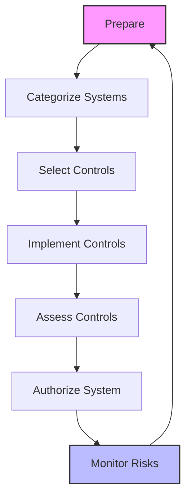
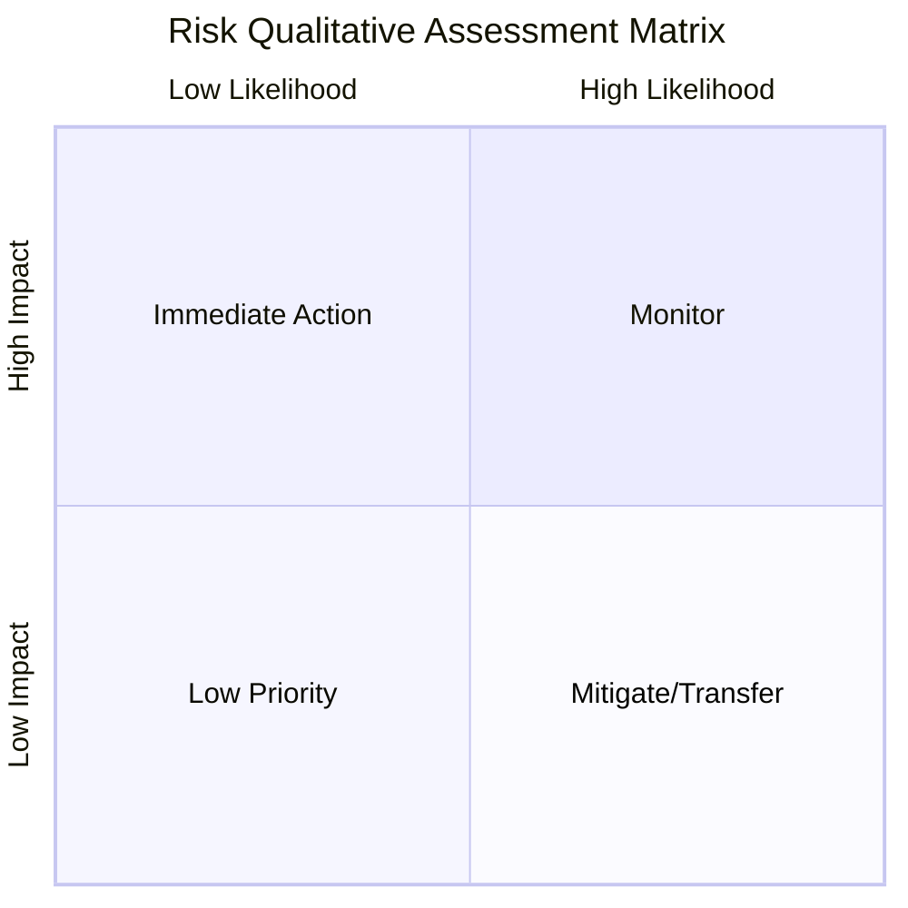

# Quantitative and Qualitative Risk Management

Risk management is the cornerstone of Domain 1 and arguably the most critical "thread" that runs through the entire CISSP CBK. It involves identifying, assessing, and responding to risks in a way that aligns with the organization's mission and risk appetite.

## The Risk Management Lifecycle (NIST SP 800-37)

The CISSP exam heavily references the NIST Risk Management Framework (RMF). Understanding the iterative nature of risk is key.

## 1. Foundational Risk Terminology
*   **Asset**: Anything of value to the organization (tangible or intangible).
*   **Threat**: Any potential occurrence that may cause an undesirable outcome.
*   **Vulnerability**: A weakness in an asset or its protection mechanism.
*   **Threat Agent**: The entity that exploits a vulnerability (e.g., a hacker, a storm).
*   **Likelihood**: The probability that a threat will exploit a vulnerability.
*   **Impact**: The magnitude of harm if a threat occurs.
*   **Risk**: The probability of a threat agent exploiting a vulnerability and the resulting impact (Risk = Threat × Vulnerability × Impact).

## 2. Quantitative Risk Analysis
Quantitative analysis assigns dollar values to risk components. You **must** memorize these formulas for the exam.

| Formula | Component | Description |
| :--- | :--- | :--- |
| **SLE = AV × EF** | **Single Loss Expectancy** | The dollar loss for a single realized threat. |
| **ALE = SLE × ARO** | **Annualized Loss Expectancy** | The expected annual loss from a specific risk. |
| **Benefit = (ALE1 - ALE2) - ACS** | **Cost-Benefit Analysis** | Determines if a control is worth the investment. |

*   **AV (Asset Value)**: The total value of the asset.
*   **EF (Exposure Factor)**: The percentage of asset value lost (expressed as a decimal, e.g., 0.5 for 50%).
*   **ARO (Annual Rate of Occurrence)**: How many times per year the threat is expected to occur.
*   **ACS (Annual Cost of Safeguard)**: The total cost of maintaining the control per year.

## 3. Qualitative Risk Analysis
Qualitative analysis uses descriptive rankings (High, Medium, Low) and is based on expert judgment and scenarios.

## 4. Risk Treatment (Response) Options
Once risk is analyzed, leadership must decide how to handle it:
*   **Mitigation (Reduction)**: Implementing controls to reduce likelihood or impact (e.g., installing a firewall).
*   **Transfer (Sharing)**: Shifting the financial burden to another party (e.g., buying insurance or outsourcing).
*   **Avoidance**: Eliminating the risk by stopping the associated activity (e.g., disabling a risky service).
*   **Acceptance**: Acknowledging the risk and doing nothing further because the cost of controls exceeds the benefit.

## 5. Risk Appetite, Tolerance, and Capacity
These terms are often confused but represent a hierarchy:
1.  **Risk Capacity**: The maximum amount of risk an organization can survive (Financial/Existential limit).
2.  **Risk Appetite**: The strategic amount of risk leadership is *willing* to take to achieve goals.
3.  **Risk Tolerance**: The tactical, acceptable deviation from the appetite for specific projects or operations.

> **Exam Tip**: Capacity > Appetite > Tolerance. If a risk exceeds capacity, it is an existential threat.

## 6. Frameworks and Standards
*   **NIST SP 800-30**: Guide for Conducting Risk Assessments.
*   **ISO 31000**: International standard for risk management.
*   **FAIR**: Factor Analysis of Information Risk (A formal quantitative model).
*   **COSO ERM**: Enterprise Risk Management framework often used by auditors.

## 7. The Risk Register
A central document used to track identified risks, their analysis, owners, and treatment status. It is a "living document" that must be reviewed regularly.

---
*Sources: ISC2 CISSP CBK 2024, NIST SP 800-37 Rev 2, NIST SP 800-30 Rev 1.*
