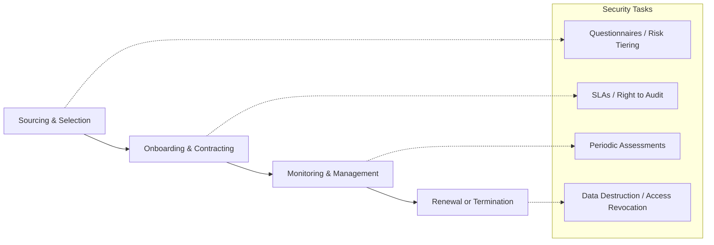
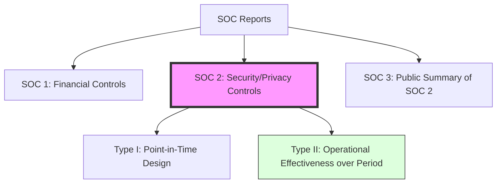

# Supply Chain Risk Management (SCRM)

Organizations rarely operate in isolation. They rely on a complex web of vendors, cloud providers, and software libraries. SCRM ensures that these third-party relationships do not introduce unacceptable risk.

## 1. The Vendor Lifecycle
Security must be integrated into every phase of the relationship with a third party.

## 2. Third-Party Assessments (SOC Reports)
For major service providers (like AWS or Azure), organizations use independent audit reports instead of performing their own audits.

*   **SOC 1**: Focused on internal controls over **financial reporting** (Relevant for SOX).
*   **SOC 2**: Focused on the **Trust Services Criteria** (Security, Availability, Processing Integrity, Confidentiality, and Privacy).
    *   **Type I**: Audit of the *design* of controls as of a specific date.
    *   **Type II**: Audit of the *operational effectiveness* of controls over a period (usually 6-12 months). **This is the preferred report.**
*   **SOC 3**: A high-level, public-facing summary of the SOC 2 report without sensitive details.

## 3. SCRM Transparency Tools
*   **SBOM (Software Bill of Materials)**: A formal record containing the details and supply chain relationships of various components used in building software. Essential for managing vulnerabilities in open-source libraries.
*   **VSA (Vendor Security Agreement)**: A contract that specifies the security requirements a vendor must meet.
*   **Right to Audit**: A contractual clause allowing the customer to perform their own security audit of the vendor.

## 4. Hardware Supply Chain Risks
*   **Counterfeit Parts**: Malicious or substandard hardware components inserted into the supply chain.
*   **Tampering**: Intercepting hardware in transit to install backdoors (Interdiction).
*   **Mitigation**: Using **TPM (Trusted Platform Module)** for hardware-based root of trust and performing supply chain integrity checks.

## 5. Cloud Service Models (Shared Responsibility)
Supply chain risk varies by the "layer" of service being consumed:
*   **IaaS (Infrastructure)**: Customer manages the OS, Apps, and Data. Provider manages Hardware/Facility.
*   **PaaS (Platform)**: Customer manages Apps and Data. Provider manages OS and below.
*   **SaaS (Software)**: Customer manages only Data and basic settings. Provider manages the entire stack.

---
*Sources: ISC2 CISSP CBK 2024, AICPA (SOC Standards), NIST SP 800-161.*
