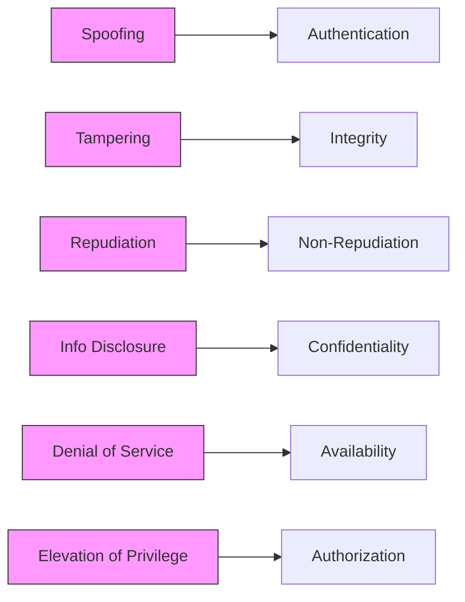
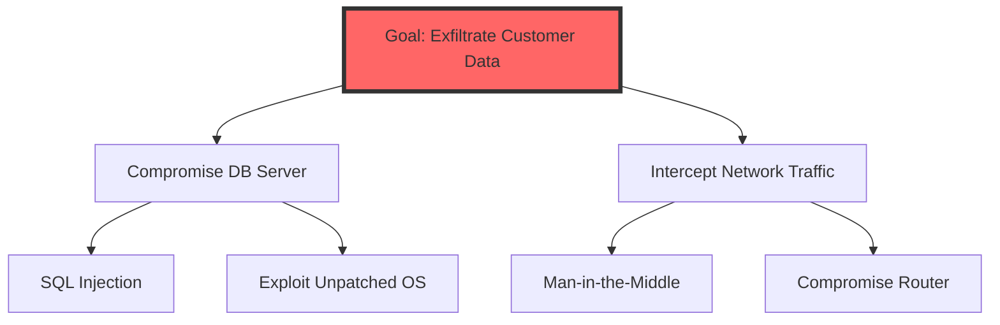

# Threat Modeling

Threat modeling is a systematic process for identifying, quantifying, and addressing security threats. It is ideally performed during the **design phase** of the Software Development Life Cycle (SDLC) to ensure "security by design."

## 1. STRIDE Methodology
The most common threat modeling framework, developed by Microsoft. It categorizes threats based on the security property they violate.

*   **Spoofing**: Pretending to be someone else.
*   **Tampering**: Modifying data or code.
*   **Repudiation**: Denying that an action was taken.
*   **Information Disclosure**: Leaking sensitive data.
*   **Denial of Service**: Crashing or overwhelming a system.
*   **Elevation of Privilege**: Gaining higher-level access than intended.

## 2. PASTA (Process for Attack Simulation and Threat Analysis)
PASTA is a **risk-centric** framework consisting of seven stages:
1.  **Define Objectives**: Identify business goals and compliance requirements.
2.  **Define Technical Scope**: Identify the application's boundaries and components.
3.  **Application Decomposition**: Map the data flows and trust boundaries.
4.  **Threat Analysis**: Identify relevant threats based on intelligence.
5.  **Vulnerability & Weakness Analysis**: Identify weaknesses in the application.
6.  **Attack Modeling (Simulation)**: Use attack trees and patterns to simulate attacks.
7.  **Risk & Impact Analysis**: Prioritize risks and recommend mitigations.

## 3. Attack Trees
Attack trees are hierarchical diagrams used to visualize how an attacker might achieve a specific goal.

## 4. Cyber Kill Chain (Lockheed Martin)
This model describes the seven sequential stages of an external attack:
1.  **Reconnaissance**: Researching the target.
2.  **Weaponization**: Creating the exploit/malware.
3.  **Delivery**: Sending the weapon to the target (e.g., email).
4.  **Exploitation**: The weapon executes on the target.
5.  **Installation**: Establishing a permanent presence (backdoor).
6.  **Command and Control (C2)**: Remotely controlling the compromised system.
7.  **Actions on Objectives**: Achieving the final goal (e.g., data theft).

## 5. DREAD Scoring (Deprecated but Testable)
DREAD was used to rank the severity of threats:
*   **D**amage Potential
*   **R**eproducibility
*   **E**xploitability
*   **A**ffected Users
*   **D**iscoverability

## 6. MITRE ATT&CK
A comprehensive, globally accessible knowledge base of adversary **tactics** (strategic goals) and **techniques** (methods). Unlike the linear Kill Chain, ATT&CK is a matrix that covers post-compromise behavior in detail.

---
*Sources: ISC2 CISSP CBK 2024, Microsoft Threat Modeling, Lockheed Martin Cyber Kill Chain.*
