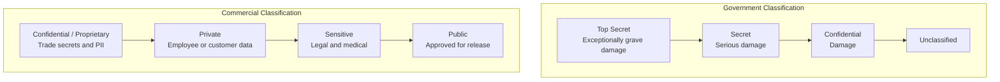
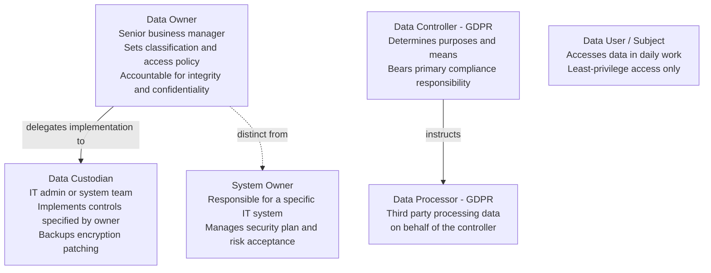
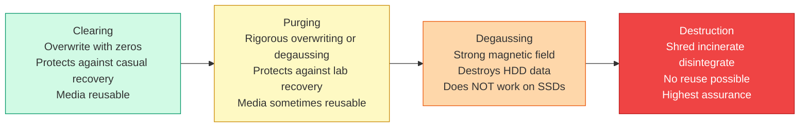
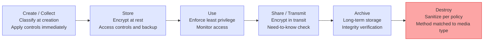

# Domain 2: Asset Security

**Exam Weighting: ~10% of the CISSP exam.**

Asset Security is one of the more focused domains — it centers on how organizations identify, classify, protect, and dispose of information assets throughout their lifecycle. Questions tend to be scenario-based, testing whether you can correctly assign roles, choose the right classification level, or select the appropriate data destruction method for a given situation. Understanding the "who owns what" relationships is especially high-yield.

---

## Overview

Every security control ultimately exists to protect an asset. This domain defines what assets are, how they are categorized and classified, who is responsible for them, and how they must be handled from creation to disposal. Getting these fundamentals right is the prerequisite for every other security decision.

---

## Data Classification and Categorization

**Classification** labels data by sensitivity — primarily to restrict access. **Categorization** groups data by type or function — often for compliance or operational purposes. Both are critical inputs to building appropriate controls.

**Government/military classification model (US):**
- **Top Secret** — unauthorized disclosure could cause "exceptionally grave" damage to national security
- **Secret** — could cause "serious" damage
- **Confidential** — could cause "damage"
- **Unclassified** — no damage to national security

**Commercial classification model (common example):**
- **Confidential/Proprietary** — trade secrets, internal financial data, PII
- **Private** — personal employee or customer data; internal but not public
- **Sensitive** — data requiring extra care (e.g., legal matters, medical)
- **Public** — information approved for public release

**Key principle:** Classification level should be based on the **impact of unauthorized disclosure**, not on how the data is stored or who currently holds it. Data should be classified at the **highest sensitivity of any element it contains** — a report mixing public and confidential data is classified Confidential.

**Declassification** occurs when data no longer requires its current level of protection. In government contexts this is a formal process; in commercial contexts it is managed through data lifecycle policies.

---

## Data Ownership Roles

This is one of the most tested concepts in Domain 2. Know each role's responsibilities precisely.

**Data Owner (Information Owner)**
- Typically a senior business manager or executive
- Responsible for the **classification** of data and for determining who should have access
- Accountable for the data's integrity and confidentiality
- Does NOT manage day-to-day data handling

**Data Custodian**
- Typically an IT professional or system administrator
- Responsible for **implementing** the controls specified by the owner: backups, access controls, encryption, patching
- Does NOT decide classification or access policy — they execute it

**Data Processor** (GDPR context)
- A third party that processes personal data **on behalf of** the data controller
- Subject to binding instructions from the controller; must have a data processing agreement in place

**Data Controller** (GDPR context)
- The entity that **determines the purposes and means** of processing personal data
- Bears primary compliance responsibility under GDPR

---

## Privacy Protection Requirements

Privacy is woven throughout this domain. The goal is ensuring personal data is handled lawfully, transparently, and with appropriate safeguards.

**Core privacy principles (aligned to GDPR and general best practice):**
- **Data minimization** — collect only what is necessary for the stated purpose
- **Purpose limitation** — data collected for one purpose must not be repurposed without consent or legal basis
- **Consent** — must be freely given, specific, informed, and unambiguous
- **Transparency** — data subjects must be informed of how their data is used
- **Accountability** — the controller must be able to demonstrate compliance

**Privacy by design** — embed privacy protections into systems and processes from the outset rather than bolting them on later. The CISSP exam expects you to advocate for privacy during the design phase.

**Personally Identifiable Information (PII)** — any information that can identify an individual directly or in combination with other data. Examples: name + address, Social Security Number, biometric data, IP address (in many jurisdictions).

---

## Data Retention, Destruction, and Sanitization

Data that outlives its usefulness becomes a liability. Proper disposal is both a legal requirement and a risk management imperative.

**Retention policies** define how long data must be kept. Drivers include:
- Legal/regulatory requirements (e.g., IRS records 7 years, HIPAA records 6 years)
- Business operational needs
- Litigation holds (legal discovery obligations override normal retention schedules)

**Data remanence** — residual data that remains on storage media after deletion. Standard "delete" operations do not remove data; they only remove the pointer to it.

**Sanitization methods — in order of increasing thoroughness:**

**NIST SP 800-88** ("Guidelines for Media Sanitization") is the authoritative reference. Know that SSDs and flash storage require different treatment than magnetic media — degaussing does not work on SSDs.

**Cryptographic erasure** — destroying the encryption keys for encrypted data, rendering the data unrecoverable. Increasingly used for cloud and SSD environments.

---

## Data Lifecycle Management

Data does not live forever — it passes through predictable stages, each with different security requirements.

**Scoping and tailoring** refers to adjusting baseline security controls (e.g., from NIST SP 800-53 or ISO 27001 Annex A) to match the specific context of an asset — removing controls that don't apply and strengthening those that do based on the asset's classification and risk profile.

---

## Protecting Data in Cloud and Third-Party Environments

Cloud environments shift some custodial responsibilities to providers, but **data ownership never transfers**. The data owner retains accountability.

- Always establish clear **data processing agreements** and **service-level agreements** covering security controls
- Understand the **shared responsibility model** — what the cloud provider handles versus what the customer must handle
- Verify **data residency** requirements — some regulations (e.g., GDPR) restrict where personal data can be stored or transferred
- Ensure contractual rights to **audit** third-party custodians and to **retrieve or destroy** data at contract end

---

## Exam Tips

- **Owner vs. custodian questions are guaranteed.** The owner classifies and authorizes; the custodian implements and maintains. When a question asks who is "responsible" for data classification, the answer is always the **data owner** (a business manager, not IT).
- **Clearing is not enough for sensitive media.** If media is leaving organizational control or being repurposed for lower-trust environments, clearing is insufficient — at minimum, purge; for highly sensitive data, destroy.
- **Degaussing does not work on SSDs.** This distinction appears on the exam. For solid-state media, use cryptographic erasure or physical destruction.
- **Data classification drives all downstream controls.** When a question presents a scenario about selecting controls, first ask: what is the classification? Controls should be proportionate to sensitivity.
- **GDPR data processor vs. controller distinction is testable.** The controller decides why and how data is processed; the processor acts on instructions. If your organization uses a third-party SaaS to process customer data, you are likely the controller and they are the processor.
- **Litigation holds override retention schedules.** If an organization is under a legal hold, normal destruction schedules are suspended — destroying data subject to a litigation hold can constitute obstruction of justice.
