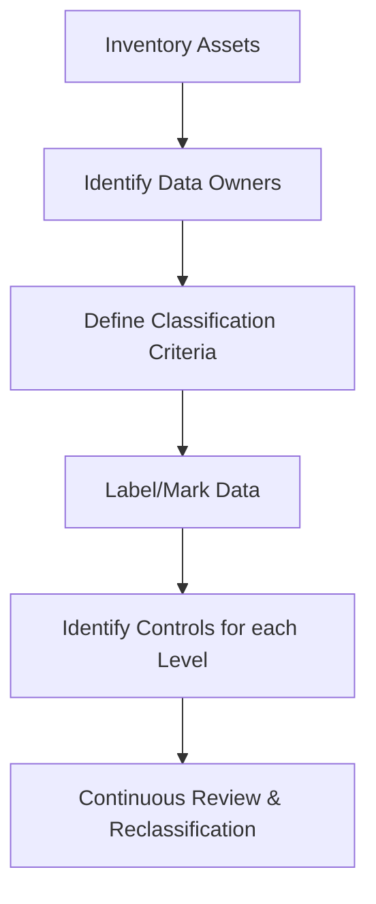
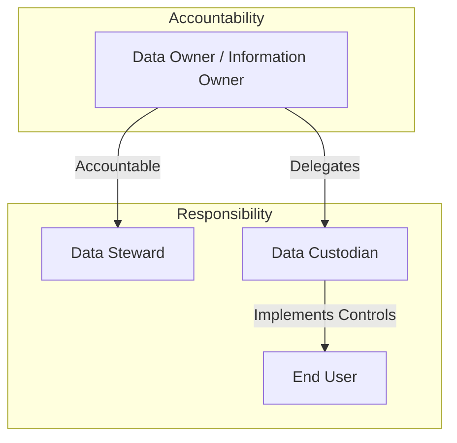

# Asset Classification and Management

Domain 2 (Asset Security) focuses on identifying, classifying, and protecting the organization's information and assets throughout their lifecycle.

## 1. Data Classification Process
Classification ensures that the most critical data receives the highest level of protection.

## 2. Classification Levels
Organizations use different labels depending on whether they are government/military or commercial entities.

| Level | Government/Military | Commercial/Private |
| :--- | :--- | :--- |
| **Highest** | **Top Secret** (Grave Damage) | **Confidential / Restricted** (Extreme Impact) |
| **High** | **Secret** (Serious Damage) | **Private** (PII/Internal HR) |
| **Medium** | **Confidential** (Damage) | **Sensitive** (Proprietary/Internal) |
| **Lowest** | **Unclassified** (No Damage) | **Public** (Marketing/External) |

## 3. Key Roles and Responsibilities
Understanding who is **accountable** versus who is **responsible** is a major exam point.

*   **Data Owner (Accountable)**: Usually a senior manager. They determine the classification level, retention requirements, and who has a "need to know."
*   **Data Steward (Responsible)**: Focuses on data quality, metadata, and ensuring data follows business rules.
*   **Data Custodian (Responsible)**: Typically IT staff or system administrators. They implement the technical controls (backups, encryption, ACLs) mandated by the Owner.
*   **End User (Responsible)**: Follows the policies and procedures to protect the data they access.

## 4. Information Lifecycle (NIST SP 800-18)
1.  **Creation**: Data is generated or collected. (Classification should happen here).
2.  **Classification**: Labeling the data based on value and impact.
3.  **Storage**: Encrypting and securing data at rest.
4.  **Usage**: Protecting data while in use (e.g., in memory).
5.  **Archive**: Long-term storage for legal or historical reasons.
6.  **Destruction**: Securely deleting or destroying the data when it's no longer needed.

## 5. Asset Inventory
You cannot protect what you don't know you have.
*   **CMDB (Configuration Management Database)**: Tracks IT assets and their relationships.
*   **Shadow IT**: Unmanaged devices or software used by employees without IT approval.
*   **Media Management**: Tracking tapes, drives, and other portable storage.

---
*Sources: ISC2 CISSP CBK 2024, NIST SP 800-18, NIST SP 800-60.*
