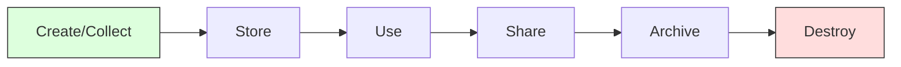
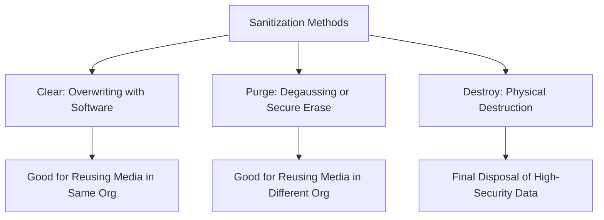

# Data Lifecycle and Protection

Protecting data requires different strategies depending on its state (at rest, in transit, or in use) and its position in the lifecycle.

## 1. The Data Lifecycle
Each stage of the lifecycle requires specific security controls.

1.  **Create**: Data is generated or acquired. Labeling and classification must happen at this stage.
2.  **Store**: Data is placed in a repository. Protect with encryption at rest and access controls.
3.  **Use**: Data is being processed by applications. Protect with memory isolation (enclaves) and masking.
4.  **Share**: Data is sent to other systems or parties. Protect with TLS (encryption in transit) and DLP.
5.  **Archive**: Data is moved to long-term storage. Ensure encryption remains valid and media is durable.
6.  **Destroy**: Data is permanently removed. Use NIST SP 800-88 standards.

## 2. Protecting Data States
*   **Data at Rest**: Data residing on disks, tapes, or cloud storage.
    *   *Controls*: AES-256 encryption, Full Disk Encryption (FDE), Database Encryption.
*   **Data in Transit (Motion)**: Data moving over a network.
    *   *Controls*: TLS (HTTPS), IPsec VPNs, SSH.
*   **Data in Use**: Data currently in memory (RAM) or CPU registers.
    *   *Controls*: Homomorphic encryption (processing encrypted data), Trusted Execution Environments (TEEs), Data Masking.

## 3. Advanced Protection Technologies
*   **DLP (Data Loss Prevention)**: Monitors and blocks unauthorized data transfers.
    *   *Network DLP*: Monitors traffic at the perimeter.
    *   *Endpoint DLP*: Monitors user actions on workstations (e.g., USB blocking).
    *   *Storage DLP*: Scans file shares and databases for sensitive content.
*   **CASB (Cloud Access Security Broker)**: A software tool or service that sits between cloud service users and cloud applications to monitor activity and enforce security policies.
*   **IRM (Information Rights Management)**: A subset of DRM that protects specific files (PDFs, Docs) with persistent encryption and permissions (e.g., "cannot print," "cannot forward").

## 4. Media Sanitization (NIST SP 800-88)
When data is no longer needed, it must be destroyed to prevent **Data Remanence**.

*   **Clearing**: Overwrites media with non-sensitive data (e.g., all zeros) so it cannot be recovered by standard software tools.
*   **Purging**: Uses more advanced methods like **Degaussing** (for magnetic media) or **Cryptographic Erasure** (deleting keys). Protects against laboratory-level recovery.
*   **Destruction**: Physical destruction (shredding, incineration, pulverizing). **Shredding** is the most common method for high-security media.

---
*Sources: ISC2 CISSP CBK 2024, NIST SP 800-88 Rev 1.*
