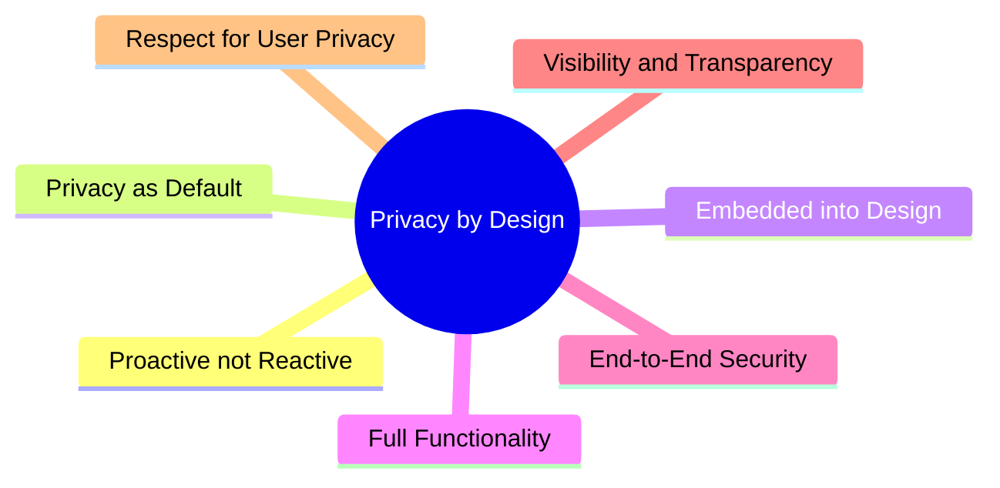
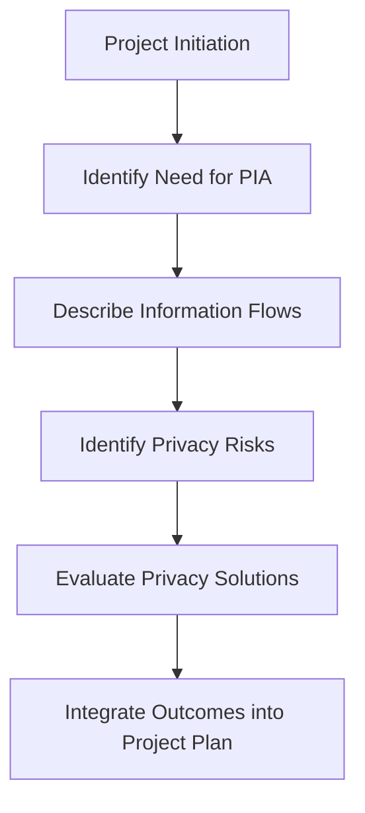

# Privacy Protection and Compliance

Privacy is the right of an individual to control how their personal information is collected, used, and shared. In the CISSP CBK, this focuses on protecting PII and PHI through technical and administrative controls.

## 1. Defining Sensitive Information
*   **PII (Personally Identifiable Information)**: Any information that can be used to distinguish or trace an individual's identity (e.g., Name, SSN, Biometrics).
*   **PHI (Protected Health Information)**: Any health-related information that can be linked to a specific individual (Governed by HIPAA in the US).

## 2. Privacy by Design (PbD)
Privacy by Design is a framework that ensures privacy is integrated into the system from the very beginning.

## 3. Privacy Impact Assessment (PIA)
A PIA is a process used to identify and reduce the privacy risks of a new project or system.

## 4. De-identification Techniques
To reduce risk, organizations often obfuscate or remove personal identifiers.

| Technique | Description | Reversibility |
| :--- | :--- | :--- |
| **Anonymization** | Permanently removing identifiers. | **Irreversible** |
| **Pseudonymization** | Replacing identifiers with aliases (pseudonyms). | **Reversible** (with a key) |
| **Tokenization** | Replacing sensitive data with a "token" (common in PCI DSS). | **Reversible** (via token vault) |
| **Data Masking** | Hiding parts of the data (e.g., `XXXX-XXXX-1234`). | **Static or Dynamic** |
| **Differential Privacy** | Adding statistical "noise" to a dataset. | **Mathematical** |

## 5. Privacy Roles
*   **Data Controller**: The entity that determines the **purpose and means** of processing personal data. (Most accountable).
*   **Data Processor**: The entity that processes data **on behalf** of the controller (e.g., a cloud provider).
*   **Data Subject**: The individual whom the data describes.
*   **Data Protection Officer (DPO)**: A mandatory role under GDPR for certain organizations, responsible for overseeing privacy strategy.

## 6. Privacy Principles (OECD)
These 8 principles are foundational to global privacy laws:
1.  **Collection Limitation**: Collect only what is necessary.
2.  **Data Quality**: Ensure data is accurate and up-to-date.
3.  **Purpose Specification**: State why the data is being collected.
4.  **Use Limitation**: Use data only for the specified purpose.
5.  **Security Safeguards**: Protect data with reasonable security.
6.  **Openness**: Be transparent about data practices.
7.  **Individual Participation**: Allow subjects to access/correct their data.
8.  **Accountability**: The controller is responsible for compliance.

---
*Sources: ISC2 CISSP CBK 2024, GDPR, OECD Privacy Guidelines.*
