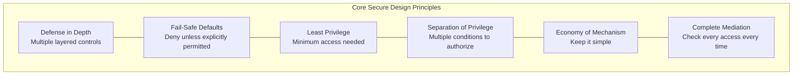
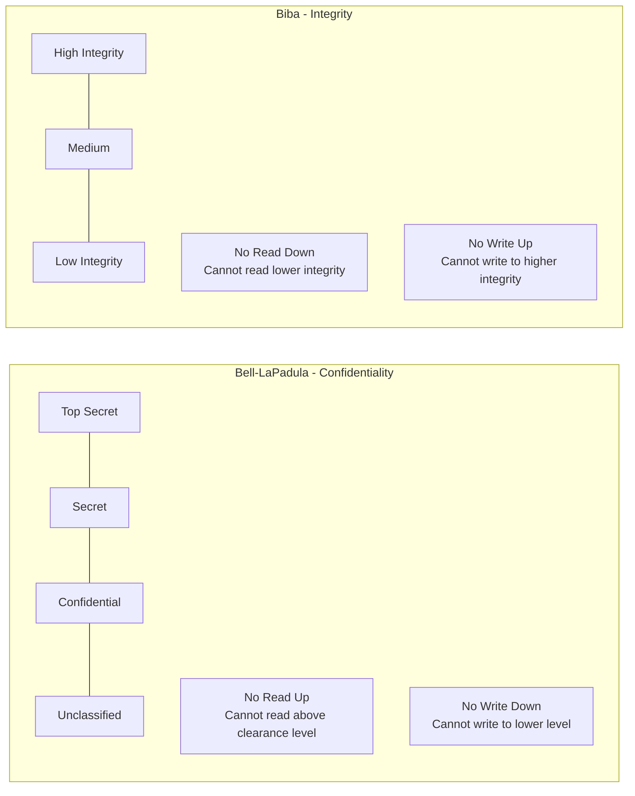
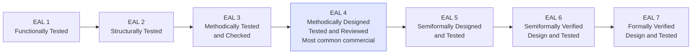
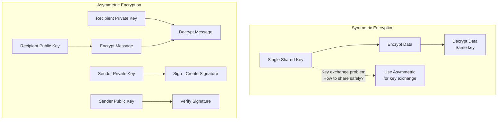
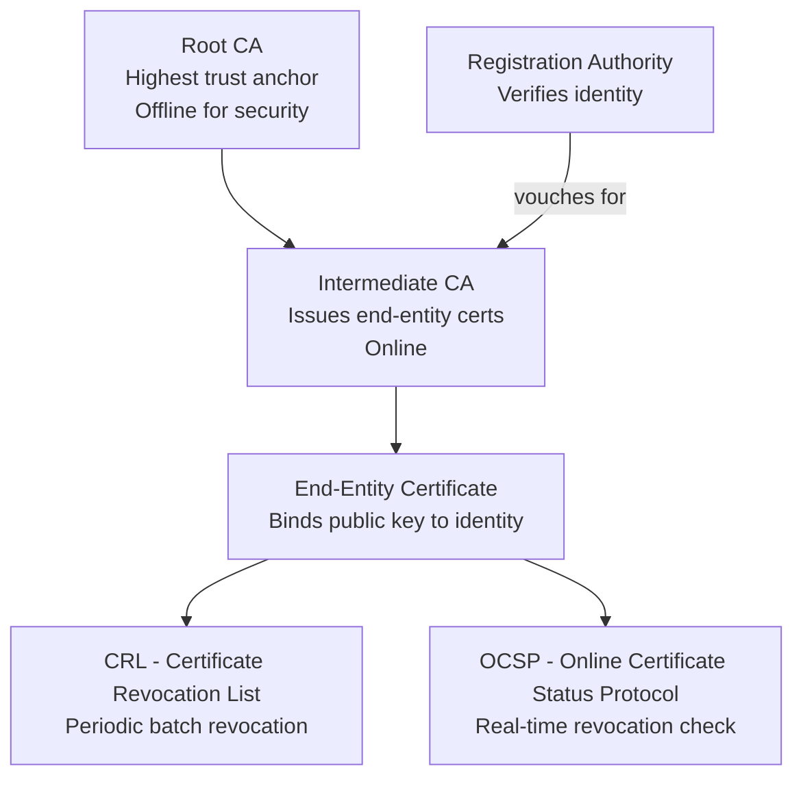
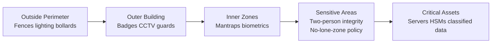
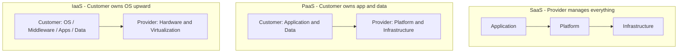

# Domain 3: Security Architecture and Engineering

**Exam Weight: ~13% | Questions: ~26 of 125–175**

Domain 3 is one of the most technically dense domains on the CISSP. It spans foundational security design principles, formal security models, evaluation criteria frameworks, cryptographic systems, physical security, and cloud architecture. Success here requires both memorization of specific standards and the ability to apply concepts to scenario-based questions.

---

## Overview

Security Architecture and Engineering asks: *how do you build secure systems from the ground up?* It covers the engineering discipline behind secure design — the models that prove systems are secure, the criteria used to evaluate them, the cryptographic primitives that underpin confidentiality and integrity, and the physical and cloud environments where systems live.

---

## Security Engineering Principles

These foundational principles appear in scenario questions where you must identify which design philosophy applies.

- **Defense in depth** — Layer multiple independent controls so that failure of one does not compromise the whole system
- **Fail-safe defaults** — Default to denial; access is granted only when explicitly permitted
- **Least privilege** — Grant the minimum access necessary to perform a function
- **Separation of privilege** — Require multiple conditions or parties to authorize sensitive operations
- **Economy of mechanism** — Keep security mechanisms simple to reduce the attack surface and ease verification
- **Complete mediation** — Every access request must be checked against an authorization policy, every time
- **Open design** — Security should not depend on secrecy of the design (distinct from secrecy of keys)
- **Psychological acceptability** — Security controls must be usable enough that people don't circumvent them

---

## Security Models

Formal security models provide mathematical proof that a system enforces a security policy. Know the model, what property it enforces, and a classic use case.

| Model | Enforces | Key Rule |
|---|---|---|
| **Bell-LaPadula** | Confidentiality | No read up, no write down (Simple Security + *-Property) |
| **Biba** | Integrity | No read down, no write up (opposite of BLP) |
| **Clark-Wilson** | Integrity | Well-formed transactions via CDIs, TPs, and UDIs |
| **Brewer-Nash (Chinese Wall)** | Confidentiality/Conflict of interest | Prevents access to data from competing organizations |
| **Graham-Denning** | Access control | Defines 8 rules for creating/deleting subjects and objects |
| **Harrison-Ruzzo-Ullman (HRU)** | Access control | Formal model for access rights; proves safety is undecidable in general |

- **Bell-LaPadula** is the classic military model — think classified documents
- **Biba** is the integrity-first complement — think financial transaction systems
- **Clark-Wilson** uses the concept of *constrained data items (CDIs)* and *transformation procedures (TPs)*

---

## Evaluation Criteria

Evaluation frameworks provide a standardized way to assess how trustworthy a system's security claims are.

- **TCSEC (Orange Book)** — U.S. DoD standard; ratings from D (minimal) to A1 (verified design); focused on confidentiality; now largely superseded
- **ITSEC** — European equivalent to TCSEC; introduced the concept of separate *functionality* and *assurance* ratings
- **Common Criteria (CC / ISO 15408)** — International standard; defines **Protection Profiles (PP)** and **Security Targets (ST)**; produces **Evaluation Assurance Levels (EAL 1–7)**:

Higher EAL means more rigorous assurance, **not** necessarily a more secure product.

---

## Cryptography

Cryptography is the largest subtopic within Domain 3. Expect 4–8 questions spanning algorithms, protocols, key management, and PKI.

### Symmetric Encryption
- Single shared key; fast; used for bulk data encryption
- **DES** — 56-bit key, broken; **3DES** — three passes of DES, effectively 112-bit; **AES** — 128/192/256-bit, current standard
- Modes: ECB (insecure for patterns), CBC, CFB, OFB, CTR, GCM

### Asymmetric Encryption
- Public/private key pair; slow; used for key exchange and digital signatures
- **RSA** — Based on factoring large primes; minimum 2048-bit keys recommended
- **ECC (Elliptic Curve Cryptography)** — Equivalent strength to RSA with much shorter keys (256-bit ECC ≈ 3072-bit RSA)
- **Diffie-Hellman** — Key exchange protocol; does not provide authentication on its own

### Hashing
- One-way; produces a fixed-length digest; used for integrity and digital signatures
- **MD5** — 128-bit; broken for collision resistance; avoid for security purposes
- **SHA-1** — 160-bit; deprecated
- **SHA-256 / SHA-3** — Current standards; SHA-256 is the most widely deployed

### PKI and Digital Signatures
- **Digital signature** = hash of message encrypted with sender's *private* key; provides non-repudiation and integrity
- **Certificate Authority (CA)** issues X.509 certificates binding a public key to an identity
- **Registration Authority (RA)** handles identity verification on behalf of the CA
- **CRL** (Certificate Revocation List) and **OCSP** (Online Certificate Status Protocol) handle revocation

### Key Management
- Key length, algorithm strength, and key lifecycle (generation, distribution, storage, rotation, destruction) all matter
- **Key escrow** stores copies with a trusted third party — a policy and legal issue as much as a technical one

---

## Physical Security

Physical security is the first line of defense. No technical control compensates for physical access.

- **Site selection** — Consider natural disaster risk, proximity to emergency services, visibility, and access routes
- **CPTED (Crime Prevention Through Environmental Design)** — Uses natural surveillance, natural access control, and territorial reinforcement to deter crime
- **Perimeter controls** — Fences (8 ft + barbed wire for high security), lighting, bollards, mantraps/airlocks
- **Access controls** — Badges, biometrics, guards; two-person integrity for sensitive areas
- **Environmental controls** — HVAC, fire suppression (Halon alternatives: FM-200, CO₂), UPS, raised floors for cable management
- **Fire classes**: A (ordinary), B (liquid), C (electrical), D (metals); suppression agent must match class

---

## Cloud Security

Cloud introduces shared responsibility — knowing *who* owns each layer is critical.

| Model | Provider Manages | Customer Manages |
|---|---|---|
| **IaaS** | Hardware, virtualization, networking | OS, middleware, apps, data |
| **PaaS** | Hardware through runtime | Applications, data |
| **SaaS** | Everything | Data configuration, user access |

- The **shared responsibility model** does not eliminate customer accountability — security *of* the cloud vs. security *in* the cloud
- **Hypervisor security** is unique to cloud: VM escape attacks target the hypervisor layer
- Key cloud risks: data remanence, multitenancy, loss of visibility, insecure APIs

---

## Exam Tips

- **Know the security models cold** — Bell-LaPadula vs. Biba is a classic trick question; remember BLP = confidentiality, Biba = integrity, and they are *mirrors* of each other
- **EAL levels on Common Criteria** — memorize EAL1 through EAL7 with one-word descriptors; EAL4 is the highest level routinely achievable without significant re-engineering
- **Asymmetric key usage** — Encrypt *to* someone using their *public* key; sign *with* your *private* key; this distinction appears repeatedly
- **CPTED questions** are about design, not guards or cameras — think natural deterrence through environment
- **Cloud questions** almost always hinge on the shared responsibility model — identify what layer the scenario is about, then determine who owns it
- **Fail-safe defaults vs. fail-open** — CISSP favors fail-safe (deny on failure) in almost every scenario; fail-open is a red flag answer unless business continuity explicitly requires it
