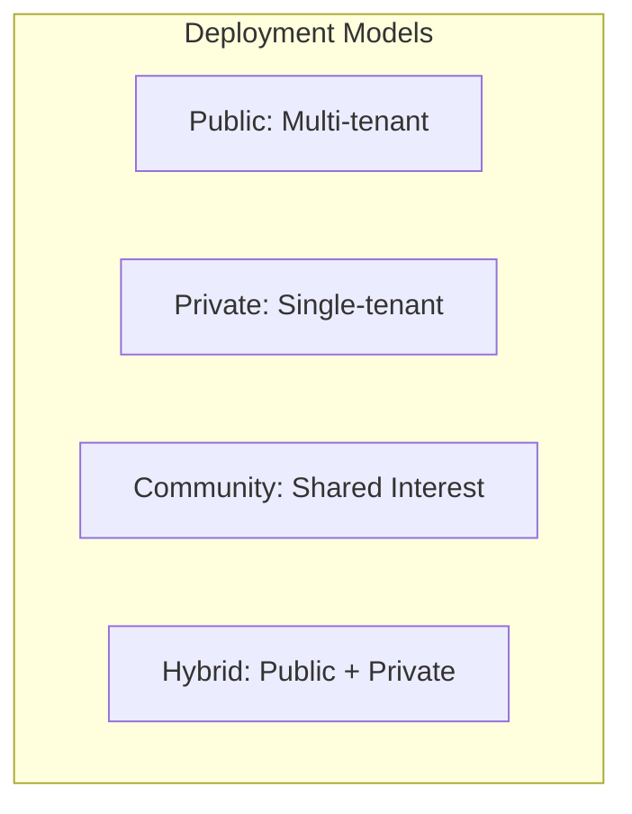
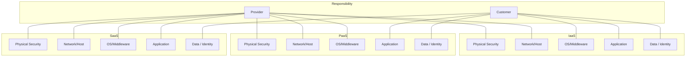

# Cloud Security for the CISSP Exam

Cloud computing is the delivery of computing services over the internet. The CISSP exam focuses on the security implications of this shift, primarily through the lens of **Shared Responsibility**.

## NIST Cloud Definition (5-3-4)

NIST SP 800-145 defines the cloud through three key lists:

### 5 Essential Characteristics
1. **On-demand self-service**: Provision resources without human intervention.
2. **Broad network access**: Available over standard networks (internet/intranet).
3. **Resource pooling**: Multi-tenant model where resources are shared.
4. **Rapid elasticity**: Ability to scale up or down quickly.
5. **Measured service**: Usage is metered and reported.

### 3 Service Models
- **IaaS (Infrastructure as a Service)**: Provides virtualized hardware (Servers, Storage).
- **PaaS (Platform as a Service)**: Provides a platform for developers (OS, Databases).
- **SaaS (Software as a Service)**: Provides finished software (Email, CRM).

### 4 Deployment Models
- **Public**: Open to the general public; multi-tenant.
- **Private**: Exclusive use by a single organization.
- **Community**: Shared by organizations with common concerns (e.g., healthcare).
- **Hybrid**: A composition of two or more models (e.g., Public + Private).

## The Shared Responsibility Model

The most critical concept in cloud security. As you move from IaaS to SaaS, the provider takes on more responsibility, but the customer **ALWAYS** retains responsibility for their data.

## Specialized Cloud Security Tools

- **CASB (Cloud Access Security Broker)**: Sits between the user and the cloud provider to enforce security policies (Visibility, Compliance, Data Security, Threat Protection).
- **CSPM (Cloud Security Posture Management)**: Monitors for misconfigurations (e.g., open S3 buckets).
- **CWPP (Cloud Workload Protection Platform)**: Protects the actual workloads (VMs, Containers).

## Cloud-Specific Risks

- **Multi-tenancy**: Risks of data leakage between customers on the same physical hardware.
- **Hypervisor Escape**: An attacker breaking out of a VM to access the underlying host.
- **Data Sovereignty**: Legal requirements for where data can be stored (e.g., GDPR).

## Authoritative Sources
- Sybex *ISC2 CISSP Official Study Guide*, 10th edition, Chapter 16.
- [NIST SP 800-145 — The NIST Definition of Cloud Computing](https://csrc.nist.gov/pubs/sp/800/145/final)
- [Destination Certification — Shared Responsibility Model](https://destcert.com/resources/shared-responsibility-model/)
