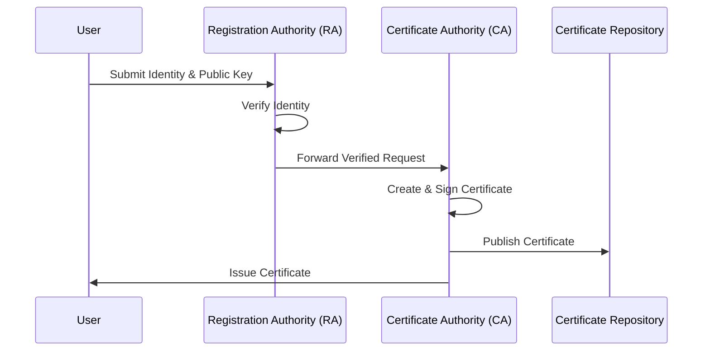
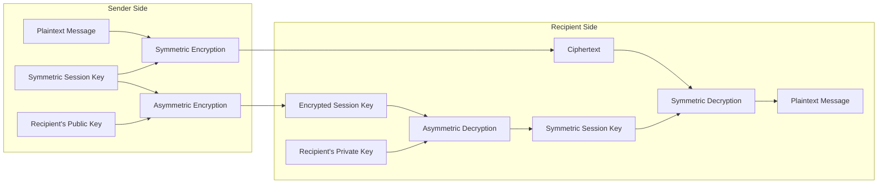

# Cryptography Fundamentals for the CISSP Exam

Cryptography is a cornerstone of Security Architecture and Engineering. It provides the mechanisms to ensure Confidentiality, Integrity, Authentication, and Non-repudiation.

## The Pillars of Cryptography

- **Confidentiality**: Ensured via Encryption (Symmetric/Asymmetric).
- **Integrity**: Ensured via Hashing and Digital Signatures.
- **Authentication**: Ensured via Digital Signatures and MACs.
- **Non-Repudiation**: Ensured ONLY via Digital Signatures.

## Symmetric vs. Asymmetric Algorithms

### Symmetric (Private Key)
- **Characteristics**: Single shared key, very fast, bulk encryption.
- **Key Distribution Problem**: $n(n-1)/2$ keys required for $n$ users.
- **Algorithms**: AES (current standard), DES (broken), 3DES (deprecated), Blowfish, Twofish, IDEA, RC4 (stream).

### Asymmetric (Public Key)
- **Characteristics**: Key pairs (Public/Private), slow, used for key exchange and signatures.
- **Algorithms**: RSA, ECC, Diffie-Hellman (key exchange only), ElGamal, DSA.

#### RSA vs. ECC (Elliptic Curve Cryptography)
ECC is increasingly favored over RSA because it provides the same level of security with significantly smaller key sizes, leading to better performance and lower power consumption—critical for mobile and IoT devices.
- **256-bit ECC** $\approx$ **3072-bit RSA**
- **384-bit ECC** $\approx$ **7680-bit RSA**

## Public Key Infrastructure (PKI)

PKI is the framework that manages digital certificates.

## Digital Signatures and Envelopes

### Digital Signature (Integrity + Non-Repudiation)
1. **Hash** the message.
2. **Encrypt** the hash with the sender's **PRIVATE** key.
3. Recipient decrypts the hash with the sender's **PUBLIC** key and compares it to their own hash of the message.

### Digital Envelope (Hybrid Cryptography)
The standard way to secure communication (e.g., TLS). It uses asymmetric encryption to securely exchange a symmetric key, which is then used for bulk data encryption.

## Block Cipher Modes

- **ECB (Electronic Code Book)**: Insecure; same plaintext yields same ciphertext.
- **CBC (Cipher Block Chaining)**: Each block is XORed with the previous ciphertext block. Requires an Initialization Vector (IV).
- **CTR (Counter)**: Turns a block cipher into a stream cipher. Parallelizable.
- **GCM (Galois/Counter Mode)**: Provides both confidentiality and integrity (Authenticated Encryption).

## Cryptographic Attacks

- **Brute Force**: Attempting every possible key.
- **Birthday Attack**: Exploiting hash collisions (based on the probability of two people sharing a birthday).
- **Rainbow Tables**: Precomputed tables of hashes for password cracking. Countered by **Salting**.
- **Known Plaintext**: Attacker has both the plaintext and the ciphertext.

## Authoritative Sources
- Sybex *ISC2 CISSP Official Study Guide*, 10th edition, Chapters 6 and 7.
- [Destination Certification — Cryptography MindMap](https://destcert.com/resources/cryptography-mindmap-cissp-domain-3/)
