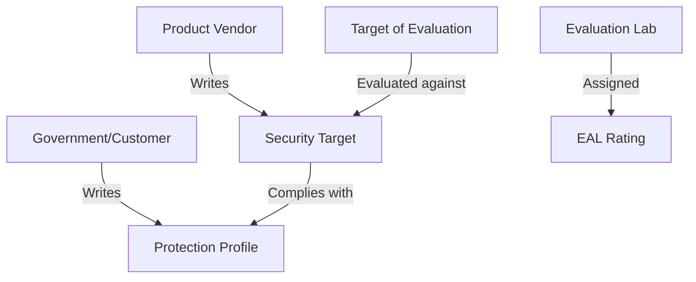
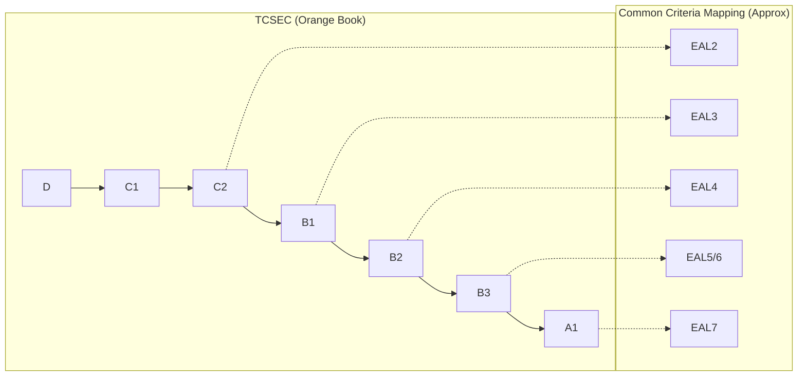

# Security Evaluation and Assurance Criteria

How do we know if a system is actually secure? Evaluation criteria provide a standardized way to measure the **Assurance** (level of confidence) in a system's security features.

## Common Criteria (ISO/IEC 15408)

The current international standard for product evaluation. It uses a specific set of terminology:

- **TOE (Target of Evaluation)**: The product or system being evaluated.
- **PP (Protection Profile)**: A generic document defining security requirements for a *class* of products (e.g., "Firewalls"). Written by the customer/government.
- **ST (Security Target)**: A document defining the security claims for a *specific* product. Written by the vendor.
- **EAL (Evaluation Assurance Level)**: The numerical rating (1-7) representing the depth and rigor of the evaluation.

### EAL Levels (The "Numbered Rating")
1. **EAL 1**: Functionally Tested.
2. **EAL 2**: Structurally Tested.
3. **EAL 3**: Methodically Tested and Checked.
4. **EAL 4**: **Methodically Designed, Tested, and Reviewed** (Highest level for retrofit COTS).
5. **EAL 5**: Semi-formally Designed and Tested.
6. **EAL 6**: Semi-formally Verified Design and Tested.
7. **EAL 7**: **Formally Verified Design and Tested** (High-assurance military).

## Historical Models (The Rainbow Series)

### TCSEC (Orange Book)
The original US Department of Defense standard. It focused on **Confidentiality**.
- **D**: Minimal Protection.
- **C1**: Discretionary Security Protection.
- **C2**: Controlled Access Protection (Individual accountability).
- **B1**: Labeled Security Protection (Mandatory Access Control).
- **B2**: Structured Protection (Covert channel analysis).
- **B3**: Security Domains (Security Administrator role).
- **A1**: Verified Design (Formal proofs).

## FIPS 140-3 (Cryptographic Modules)

While Common Criteria evaluates entire systems, FIPS 140-3 evaluates the **Cryptographic Module** specifically.
- **Level 1**: Basic security; no physical security required.
- **Level 2**: Tamper-evidence (e.g., seals).
- **Level 3**: Tamper-resistance and identity-based authentication.
- **Level 4**: Tamper-active (zeroizes keys if tampered with) and environmental protection.

## The Trap Patterns to Inoculate Against

- **PP vs ST**: Remember **P**rotection **P**rofile is the **P**referred requirements (Customer), while **S**ecurity **T**arget is the **S**pecific product's claims (Vendor).
- **EAL is Assurance, not Security**: An EAL 7 product is not necessarily "more secure" than an EAL 4 product; it just means it has been more *thoroughly verified*.
- **TCSEC Focus**: TCSEC (Orange Book) was only about **Confidentiality**.

## Authoritative Sources
- Sybex *ISC2 CISSP Official Study Guide*, 10th edition, Chapter 8.
- [Common Criteria Portal — Official Site](https://www.commoncriteriaportal.org/)
