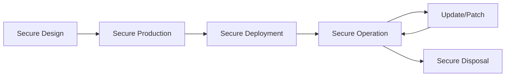

# ICS/SCADA and IoT Security for the CISSP Exam

Domain 3 covers the unique security challenges of Industrial Control Systems (ICS) and the Internet of Things (IoT). These systems often prioritize **Availability** and **Safety** over Confidentiality.

## Industrial Control Systems (ICS) and SCADA

ICS is a general term that encompasses several types of control systems, including SCADA, PLC, and DCS.

### Key Components
- **SCADA (Supervisory Control and Data Acquisition)**: A system for remote monitoring and control that operates with coded signals over communication channels.
- **PLC (Programmable Logic Controller)**: The "brain" of the industrial process. Ruggedized computers that handle high-speed industrial processes.
- **RTU (Remote Terminal Unit)**: A microprocessor-controlled electronic device that interfaces objects in the physical world to a SCADA system.
- **HMI (Human-Machine Interface)**: The operator's dashboard used to interact with the controller.
- **DCS (Distributed Control System)**: Used in large, continuous process industries (e.g., oil refineries).

### The Purdue Model for ICS Security
The Purdue Model is the industry standard for segmenting Operational Technology (OT) from Information Technology (IT).

```mermaid
graph TD
    subgraph "Enterprise Zone (IT)"
        L5[Level 5: Enterprise Network]
        L4[Level 4: Site Business Planning]
    end
    
    subgraph "DMZ"
        DMZ[Industrial DMZ]
    end

    subgraph "Manufacturing Zone (OT)"
        L3[Level 3: Site Operations / Historian]
        L2[Level 2: Control Systems / HMI]
        L1[Level 1: Intelligent Devices / PLC]
        L0[Level 0: Physical Process]
    end

    L5 --- L4
    L4 --- DMZ
    DMZ --- L3
    L3 --- L2
    L2 --- L1
    L1 --- L0
```

## Internet of Things (IoT)

IoT refers to the billions of physical devices around the world that are now connected to the internet, all collecting and sharing data.

### IoT Security Challenges
- **Embedded Systems**: Often have limited compute resources, making traditional encryption difficult.
- **Patch Management**: Many devices are difficult or impossible to update.
- **Default Credentials**: A major source of botnet infections (e.g., Mirai).
- **Edge vs. Fog Computing**: 
    - **Edge**: Data processing happens on the device itself.
    - **Fog**: Data processing happens on the local network (gateway).

### IoT Lifecycle Security



## OT vs IT: The Conflict of Priorities

| Feature | IT (Information Technology) | OT (Operational Technology) |
| :--- | :--- | :--- |
| **Primary Goal** | Data Privacy / Confidentiality | Physical Safety / Availability |
| **Lifecycle** | 3-5 years | 15-30 years |
| **Patching** | Frequent / Automated | Rare / Manual / Risk-Averse |
| **Environment** | Controlled (Office) | Harsh (Factory / Field) |

## Authoritative Sources
- Sybex *ISC2 CISSP Official Study Guide*, 10th edition, Chapter 9.
- NIST SP 800-82 (Guide to ICS Security).
