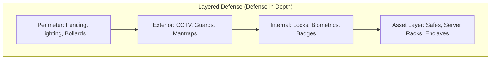
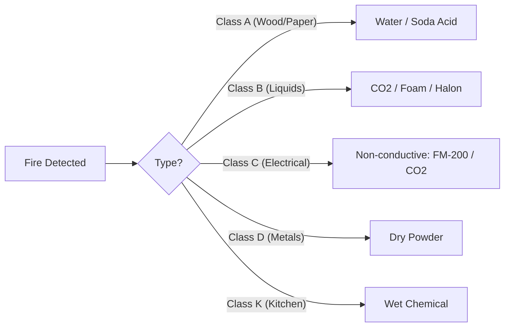

# Physical & Environmental Security for the CISSP Exam

Physical security protects people, property, and assets from physical threats. It is the "foundation" of the security stack—if an attacker has physical access, they have ultimate control.

## Site and Facility Design

### CPTED (Crime Prevention Through Environmental Design)
CPTED uses the physical environment to influence human behavior and reduce crime.
- **Natural Surveillance**: Maximizing visibility (e.g., windows, lighting, removing hiding spots).
- **Natural Access Control**: Guiding users through defined entrances/exits (e.g., bollards, fences, sidewalks).
- **Territorial Reinforcement**: Marking ownership (e.g., flags, signs, landscaping).
- **Maintenance**: The "Broken Windows" theory—a well-maintained area discourages crime.

### Site Selection and Construction
- **Visibility**: Avoid being in a high-crime area or near high-risk neighbors (e.g., chemical plants).
- **Utility Reliability**: Proximity to power grids and water supplies.
- **Construction**: Use of fire-resistant materials (UL ratings) and proper HVAC placement.

## Fire Prevention and Suppression

The CISSP exam requires memorizing the classes of fire and the correct suppression agents.

### Fire Classes
| Class | Fuel Source | Suppression Agent |
| :--- | :--- | :--- |
| **A** | Ordinary Combustibles (Wood, Paper) | Water, Soda Acid |
| **B** | Flammable Liquids (Gas, Oil) | CO2, Halon, Foam |
| **C** | Electrical Equipment | CO2, Halon, FM-200 |
| **D** | Combustible Metals (Magnesium) | Dry Powder |
| **K** | Commercial Kitchen (Fats, Oils) | Wet Chemical |

### Sprinkler Systems
- **Wet Pipe**: Pipes are always full of water. Risk of freezing and accidental discharge.
- **Dry Pipe**: Pipes are full of compressed air; water enters only when a head melts.
- **Preaction**: Standard for data centers. Requires both a smoke detector AND a head melt to discharge.
- **Deluge**: All heads are open; floods the area.

## Environmental Controls

- **HVAC**: Maintain optimal temperature (64-81°F) and humidity (40-60%). High humidity causes corrosion; low humidity causes static electricity (ESD).
- **Positive Pressure**: HVAC should push air OUT of the data center to keep dust and contaminants from entering.
- **Power**:
    - **UPS**: Short-term bridge (minutes).
    - **Generators**: Long-term power (hours/days).

## Physical Access Controls

- **Fences**: 3-4ft (Casual), 6-7ft (Serious), 8ft+ with barbed wire (High Security).
- **Bollards**: Protect against vehicle ramming.
- **Mantraps**: Two-door system to prevent **tailgating** (unauthorized entry without consent) and **piggybacking** (unauthorized entry with consent).

## Authoritative Sources
- Sybex *ISC2 CISSP Official Study Guide*, 10th edition, Chapter 10.
- [Destination Certification — Physical Security MindMap](https://destcert.com/resources/physical-security-mindmap-cissp-domain-3/)
