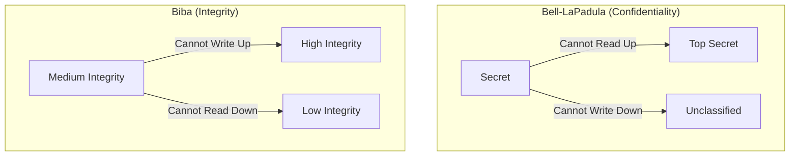
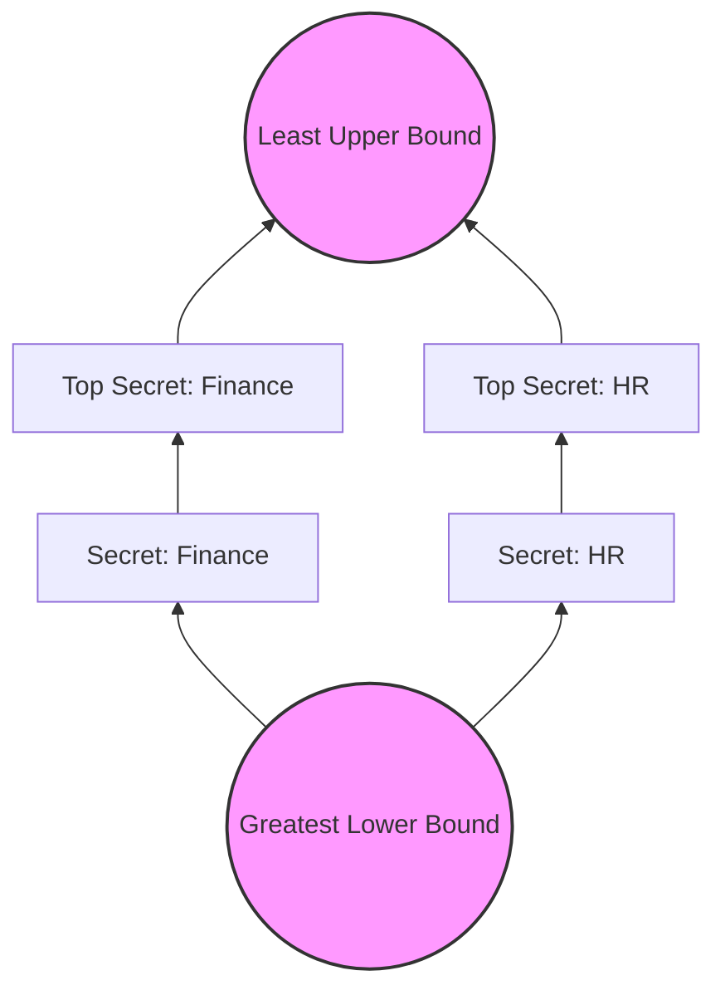

# Formal Security Models for the CISSP Exam

A focused drill set for the named, formal security models in CISSP Domain 3. These models define the rules that a system must follow to maintain its security state.

## Core Models: Confidentiality vs. Integrity

The CISSP exam heavily emphasizes the distinction between models focused on **Confidentiality** (preventing unauthorized disclosure) and those focused on **Integrity** (preventing unauthorized modification).

### 1. Bell-LaPadula (Confidentiality)
Developed by the US military, this state-machine model focuses strictly on confidentiality. It uses mandatory access control (MAC) and security labels.
- **Simple Security Property**: "No read up" (a subject at one level cannot read data at a higher level).
- **\* (Star) Security Property**: "No write down" (a subject at one level cannot write data to a lower level).
- **Strong \* Property**: A subject can only read and write at their own security level.

### 2. Biba (Integrity)
The "inverted" version of Bell-LaPadula. It focuses on the integrity of information.
- **Simple Integrity Axiom**: "No read down" (prevents a subject from being corrupted by lower-integrity data).
- **\* (Star) Integrity Axiom**: "No write up" (prevents a subject from corrupting higher-integrity data).
- **Invocation Property**: A subject cannot send messages to a subject at a higher integrity level.

## Abstract and Foundational Models

### Lattice-Based Access Control (LBAC)
A mathematical structure where every pair of elements has a least upper bound (LUB) and a greatest lower bound (GLB). Bell-LaPadula and Biba are both implementations of a lattice.

### Access Matrix
A table defining rights between subjects and objects.
- **ACLs (Access Control Lists)**: Object-focused (columns of the matrix).
- **Capability Lists**: Subject-focused (rows of the matrix).

## Specialized Models

### 1. Clark-Wilson (Integrity for Commercial Use)
Unlike Biba, Clark-Wilson focuses on **well-formed transactions** and **separation of duties**.
- **Constrained Data Items (CDI)**: Data that must be protected.
- **Unconstrained Data Items (UDI)**: Data that is not protected.
- **Transformation Procedures (TP)**: The only way UDIs become CDIs or CDIs are modified.
- **Integrity Validation Procedures (IVP)**: Ensures CDIs are in a valid state.

### 2. Brewer-Nash (The Chinese Wall)
Designed to prevent **Conflicts of Interest**. Access is dynamically adjusted based on a user's previous activity. If a consultant works for Company A, they are blocked from accessing data for Competitor B.

### 3. Graham-Denning
Focuses on the delegation and transfer of rights. It defines 8 specific protection rules for subjects and objects.

### 4. Harrison-Ruzzo-Ullman (HRU)
An extension of Graham-Denning that deals with the "safety problem" (can a right leak?). It proved that in the general case, this is undecidable.

### 5. Lipner
A hybrid model that combines Bell-LaPadula (confidentiality) and Biba (integrity) for commercial environments.

### 6. Non-Interference
Ensures that actions at a high security level do not affect (interfere with) actions at a lower level. This is the primary model for closing **covert channels**.

## The Trap Patterns to Inoculate Against

- **BLP vs Biba**: Remember "Read Down, Write Up" for Biba and "Read Up, Write Down" for BLP. Use the mnemonic "Biba = Integrity = I = Down" (No read down).
- **Clark-Wilson vs Biba**: Clark-Wilson is for "Well-formed transactions" and "Commercial integrity." Biba is for "Simple integrity" and "No read down/write up."
- **Covert Channels**: If the question asks how to prevent covert channels, the answer is usually **Non-Interference**.
- **Lattice**: If the question mentions "Least Upper Bound" or "Dominance," it is referring to the Lattice model.

## Authoritative Sources
- Sybex *ISC2 CISSP Official Study Guide*, 10th edition, Chapter 8.
- [Destination Certification — Information Security Models](https://destcert.com/resources/information-security-models/)
