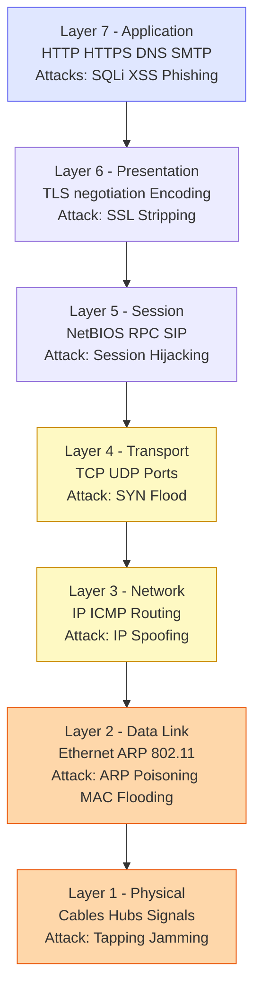
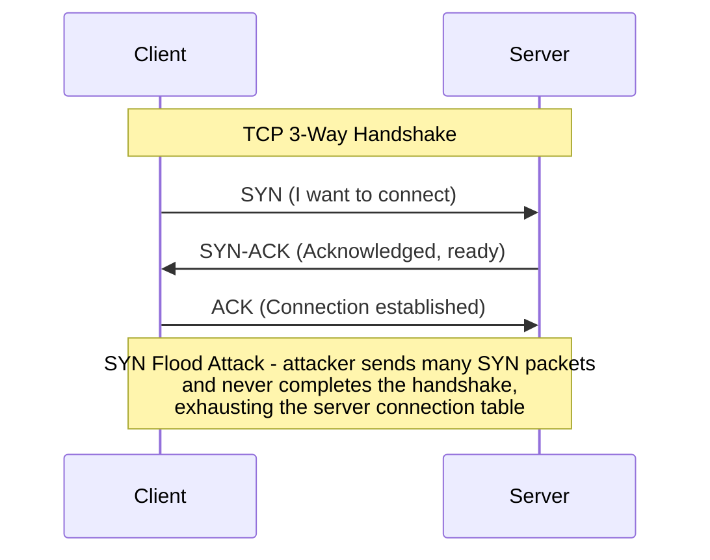
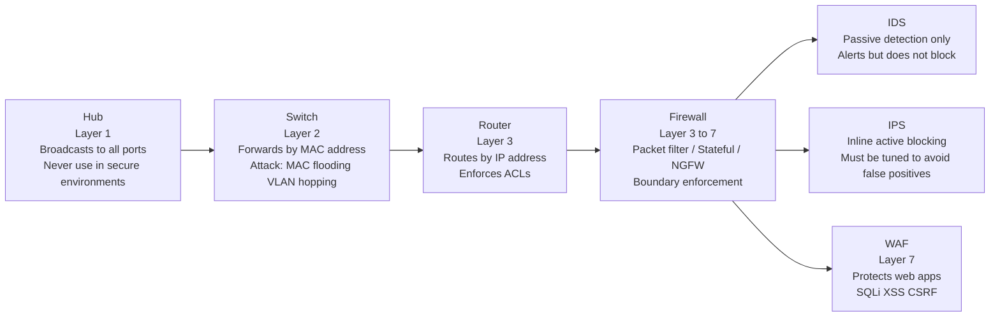
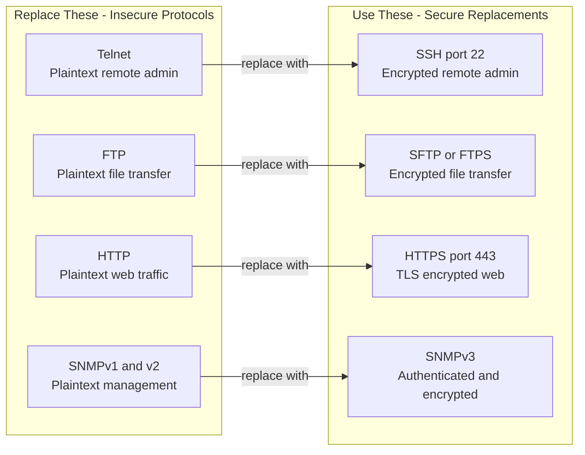
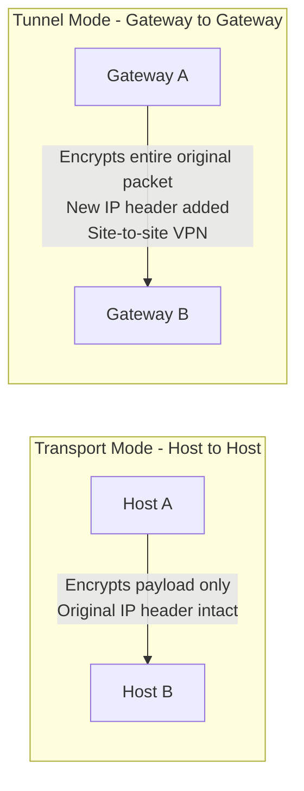
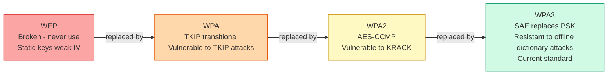
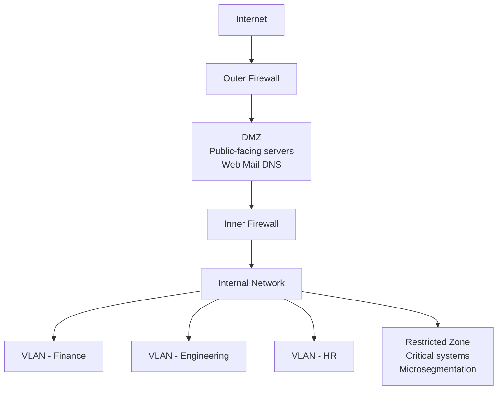

# Domain 4: Communication and Network Security

**Exam Weight: ~13% | Questions: ~26 of 125–175**

Domain 4 covers the design, implementation, and security of network infrastructure and communications. It is highly practical — expect scenario questions that ask you to identify the right network control for a given situation, map attacks to the correct OSI layer, and select appropriate protocols. A solid conceptual grasp of how networks function is essential before layering security on top.

---

## Overview

Network security asks: *how do you transmit data securely between systems?* The domain spans the mechanics of how networks work (OSI model, TCP/IP, devices) through to securing those networks (firewalls, IDS/IPS, segmentation, encryption protocols, wireless standards). The exam consistently tests whether you can connect a security problem to the right architectural solution.

---

## The OSI Model

The OSI model is the single most tested framework in Domain 4. You must know all 7 layers, what they do, which protocols live there, and which attacks target them.

| Layer | Name | Function | Key Protocols | Common Attacks |
|---|---|---|---|---|
| 7 | **Application** | User-facing services | HTTP, HTTPS, DNS, SMTP, FTP | SQL injection, XSS, phishing |
| 6 | **Presentation** | Data formatting, encryption/compression | SSL/TLS (negotiation), JPEG, MPEG | SSL stripping |
| 5 | **Session** | Session establishment and teardown | NetBIOS, RPC, SIP | Session hijacking |
| 4 | **Transport** | End-to-end delivery, ports | TCP, UDP | SYN floods, port scanning |
| 3 | **Network** | Logical addressing and routing | IP, ICMP, OSPF, BGP | IP spoofing, routing attacks |
| 2 | **Data Link** | MAC addressing, frame delivery | Ethernet, ARP, 802.11 | ARP poisoning, MAC flooding |
| 1 | **Physical** | Bits over wire/radio | Cables, hubs, repeaters | Physical tapping, jamming |

- **Mnemonic (top-down):** "All People Seem To Need Data Processing"
- Devices operate at specific layers: hubs at Layer 1, switches at Layer 2, routers at Layer 3, firewalls typically Layer 3–7

---

## TCP/IP Protocol Suite

TCP/IP is the operational model for modern networks. The exam occasionally maps it to OSI — know the correspondence.

- **TCP** — Connection-oriented; uses the 3-way handshake (SYN, SYN-ACK, ACK); guarantees delivery and ordering
- **UDP** — Connectionless; no handshake; used where speed matters over reliability (DNS, VoIP, streaming)
- **ICMP** — Network diagnostics; used by `ping` and `traceroute`; can be abused for tunneling or reconnaissance
- **DNS** — Translates hostnames to IPs; operates on UDP port 53; target of poisoning and amplification attacks
- **DHCP** — Assigns IP addresses dynamically; rogue DHCP servers are a common MITM setup

Key port numbers to know: SSH (22), SMTP (25), DNS (53), HTTP (80), HTTPS (443), LDAP (389), LDAPS (636), RDP (3389), SNMP (161/162)

---

## Network Devices

Each device type has a security role and corresponding attack surface.

- **IDS (Intrusion Detection System)** — Passive; detects and alerts; signature-based or anomaly-based; can produce false positives
- **IPS (Intrusion Prevention System)** — Inline; can block traffic in real time; must be tuned carefully to avoid blocking legitimate traffic
- **Proxy / Reverse Proxy** — Intermediates connections; can enforce policy and cache content; WAF is a specialized reverse proxy
- **WAF (Web Application Firewall)** — Layer 7; protects web apps from SQLi, XSS, CSRF
- **VPN Concentrator** — Aggregates remote VPN connections; uses IPSec or SSL/TLS tunnels
- **Load Balancer** — Distributes traffic; can also provide DDoS mitigation and SSL offloading

---

## Secure Network Protocols

The exam will ask which protocol is appropriate for a given secure communication requirement.

| Protocol | Purpose | Port | Notes |
|---|---|---|---|
| **TLS 1.2/1.3** | Secure web, email, general transport | 443 (HTTPS) | TLS 1.3 removes weak cipher suites; deprecates 1.0/1.1 |
| **SSH** | Secure remote administration | 22 | Replaces Telnet and rlogin |
| **IPSec** | Network-layer VPN and packet integrity | Various | Two modes: **Transport** (host-to-host) and **Tunnel** (gateway-to-gateway) |
| **SFTP / FTPS** | Secure file transfer | 22 / 990 | SFTP uses SSH; FTPS uses TLS over FTP |
| **HTTPS** | HTTP over TLS | 443 | Certificate validation critical |
| **SNMPv3** | Network device management | 161/162 | Adds authentication and encryption; v1/v2c are plaintext |
| **DNSSEC** | DNS record integrity | 53 | Signs DNS responses; does not encrypt queries |

- **IPSec components:** AH (Authentication Header) for integrity, ESP (Encapsulating Security Payload) for confidentiality + integrity; IKE for key exchange
- SSL is deprecated — the exam may use "SSL" colloquially but the correct protocol is TLS

---

## IPSec Modes

---

## Wireless Security

Wireless introduces significant attack surface due to the broadcast nature of radio frequency transmission.

- **802.1X** — Port-based Network Access Control (NAC); requires an authentication server (RADIUS); provides per-user/device authentication
- **EAP methods:** EAP-TLS (mutual certificate authentication — strongest), PEAP (tunneled, uses server cert + password), EAP-TTLS
- **Rogue AP** — Unauthorized access point; mitigated by wireless IDS and 802.1X
- **Evil Twin** — Attacker clones a legitimate SSID to intercept traffic; user-awareness and strong authentication help

---

## Network Attacks

Understand the attack mechanism, the OSI layer it operates on, and the appropriate countermeasure.

- **Man-in-the-Middle (MITM)** — Attacker intercepts and optionally modifies traffic between two parties; mitigated by mutual authentication and encryption
- **ARP Poisoning** — Layer 2; attacker sends fake ARP replies to associate their MAC with a legitimate IP; enables MITM on local segments; mitigated by Dynamic ARP Inspection (DAI)
- **DNS Poisoning / Spoofing** — Attacker injects false DNS records to redirect traffic; mitigated by DNSSEC and secure resolvers
- **Replay Attack** — Captures and retransmits valid authentication credentials; mitigated by timestamps, nonces, and session tokens
- **SYN Flood** — Layer 4 DoS; exhausts TCP connection table with incomplete handshakes; mitigated by SYN cookies and rate limiting
- **DDoS** — Distributed denial of service using botnets; mitigated by upstream scrubbing, CDNs, and rate limiting
- **Smurf Attack** — ICMP amplification using broadcast addresses; largely obsolete on modern networks
- **Ping of Death / Teardrop** — Malformed packet attacks targeting IP fragmentation; patched in modern OSes

---

## Network Segmentation

Segmentation limits blast radius and enforces least privilege at the network level.

- **VLAN (Virtual LAN)** — Logical network segments on shared physical infrastructure; Layer 2; enforced by switches; attack: VLAN hopping via double-tagging
- **DMZ (Demilitarized Zone)** — Network segment between the internet and internal network; hosts public-facing services (web servers, mail relays); dual-firewall architecture is strongest
- **Microsegmentation** — Fine-grained east-west traffic control, often in virtual/cloud environments; enforced by software-defined networking (SDN) or host-based firewalls
- **Air gap** — Physical isolation with no network connection; highest assurance; used for critical ICS/SCADA and classified systems
- **Network zoning** — Organize assets into zones (internet, extranet, intranet, restricted) with enforced controls at each boundary

---

## Exam Tips

- **OSI layer mapping is non-negotiable** — Memorize which devices and protocols operate at which layers; many questions hinge on "at which layer does this attack/control operate?"
- **Identify the right device for the job** — IDS detects and alerts (passive), IPS blocks inline (active); stateful firewall tracks connection state, packet filter does not; WAF is specifically for web application traffic
- **Protocol selection questions** — When asked which protocol replaces an insecure one: Telnet → SSH, FTP → SFTP/FTPS, HTTP → HTTPS, SNMPv1/v2 → SNMPv3; the pattern is consistent
- **Wireless protocol order matters** — WEP is always wrong, WPA3 is always best; when WPA3 is not an option, WPA2+AES with 802.1X is the answer over WPA2+PSK
- **IPSec modes** — Transport mode protects payload between two hosts; Tunnel mode encapsulates the entire IP packet and is used for site-to-site VPNs
- **DMZ placement** — Public-facing servers go in the DMZ, never on the internal network; the dual-firewall DMZ design is more secure than a single firewall with three interfaces
