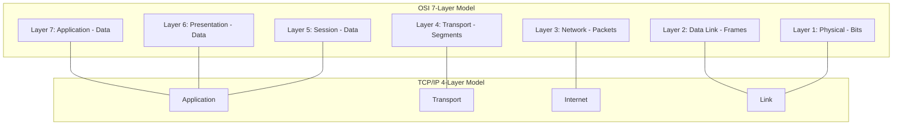
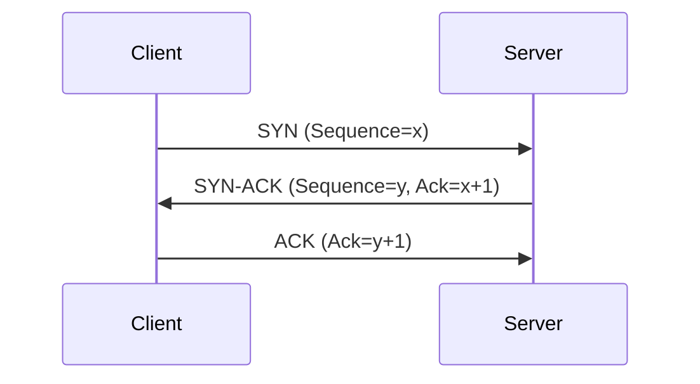
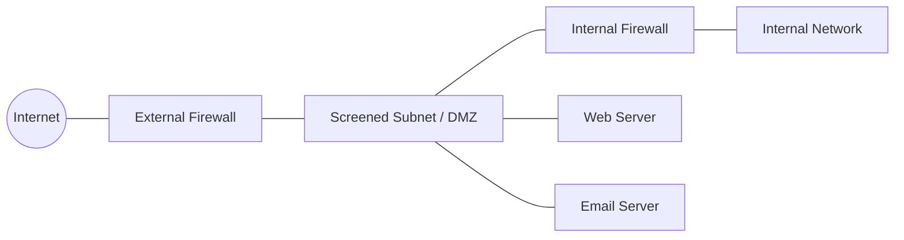

# Network Security Fundamentals for the CISSP Exam

A study-oriented overview of the network security question family on the CISSP. This is Domain 4 (Communication and Network Security), one of the core technical domains, weighted at roughly 13% of the exam.

## Where This Family Sits in the Exam

Domain 4 carries roughly 13% of the exam. The questions here trend more technical than the management-flavored content elsewhere on the CISSP. The OSI model, TCP/IP, firewall types, VPN architecture, wireless security generations, and IDS/IPS placement are the workhorse topics.

## The OSI Model & TCP/IP Stack

The OSI (Open Systems Interconnection) model is the foundational framework for understanding network communications in the CISSP CBK.

### OSI Layer Breakdown
| Layer | Name | Data Unit | Protocols / Devices | Attacks |
| :--- | :--- | :--- | :--- | :--- |
| 7 | Application | Data | HTTP, FTP, SMTP, DNS, SSH, Telnet | XSS, SQLi, Buffer Overflow |
| 6 | Presentation | Data | SSL/TLS, JPEG, GIF, TIFF | Format String Attacks |
| 5 | Session | Data | RPC, NetBIOS, NFS | Session Hijacking |
| 4 | Transport | Segments | TCP, UDP | SYN Flood, Port Scanning |
| 3 | Network | Packets | IP, ICMP, IGMP, ARP (per ISC2), Routers | IP Spoofing, ICMP Flood |
| 2 | Data Link | Frames | Ethernet, 802.11, Switches, Bridges | MAC Flooding, ARP Poisoning |
| 1 | Physical | Bits | Hubs, Cables, Repeaters, RJs | Wiretapping, Jamming |

## TCP 3-Way Handshake
TCP (Transmission Control Protocol) is a connection-oriented, reliable protocol at Layer 4.

## Firewall Types and Topology

1.  **Packet-Filtering**: Stateless; inspects headers only (L3/L4).
2.  **Stateful Inspection**: Tracks connection state; allows return traffic automatically.
3.  **Application-Level (Proxy)**: Inspects L7 content; understands protocol semantics.
4.  **Next-Generation (NGFW)**: Combines stateful inspection with DPI (Deep Packet Inspection), IDS/IPS, and app awareness.
5.  **Web Application Firewall (WAF)**: Specialized for HTTP/HTTPS; protects against SQLi, XSS (A03, A01).

### Secure Topology: The Screened Subnet
The screened subnet (formerly DMZ) uses two firewalls to create a neutral zone for public-facing servers.

## IPsec (Internet Protocol Security)
IPsec provides security at the Network Layer (Layer 3).

-   **IKE (Internet Key Exchange)**: Manages SAs (Security Associations).
    -   **Phase 1**: Establishes ISAKMP SA (Secure Channel).
    -   **Phase 2**: Negotiates IPsec SAs.
-   **AH (Authentication Header)**: Integrity and Authentication; **NO Encryption**.
-   **ESP (Encapsulating Security Payload)**: Confidentiality, Integrity, and Authentication.
-   **Transport Mode**: Encrypts only payload; used for host-to-host.
-   **Tunnel Mode**: Encrypts entire packet (including original header); used for site-to-site.

## Wireless Security Generations
-   **WEP**: RC4; fundamentally broken (IV reuse).
-   **WPA**: TKIP (transitional).
-   **WPA2**: AES-CCMP; the long-time standard.
-   **WPA3**: SAE (Simultaneous Authentication of Equals/Dragonfly); provides forward secrecy.

## Intrusion Detection and Prevention (IDS/IPS)
-   **IDS**: Passive; alerts only.
-   **IPS**: Active; sits in-line and blocks traffic.
-   **Signature-based**: Matches known patterns (fast, misses zero-days).
-   **Anomaly-based**: Identifies deviations from a baseline (catches zero-days, high false positives).

## Common Ports to Memorize
-   **22**: SSH
-   **23**: Telnet
-   **25**: SMTP
-   **53**: DNS
-   **80**: HTTP
-   **443**: HTTPS
-   **3389**: RDP
-   **161/162**: SNMP

## Exam Traps to Watch For
-   **ARP Layer**: ISC2 often places ARP at Layer 3 (Network) or Layer 2 (Data Link). If the choice is "between layers," it's 2.5, but usually tested as L2 in a technical context.
-   **DNSSEC**: Does **NOT** encrypt; it only provides integrity/authenticity (signing).
-   **WAF vs Firewall**: If the question mentions SQL injection or XSS, look for WAF.
-   **AH Encryption**: AH does **not** encrypt data.
