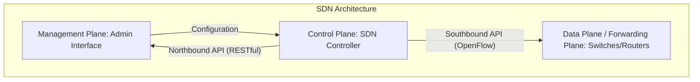
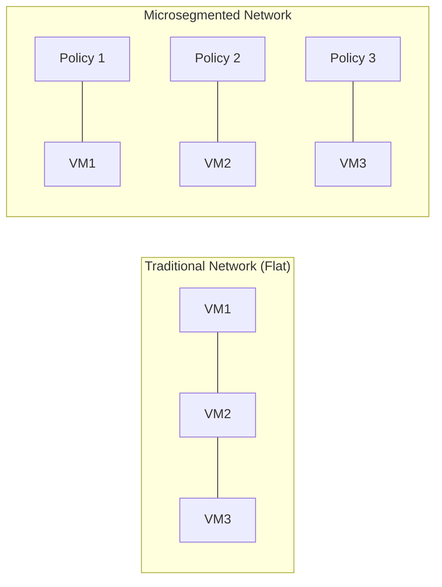

# SDN & Microsegmentation for the CISSP Exam

Software-Defined Networking (SDN) and Microsegmentation are modern network security paradigms that shift control from hardware to software, enabling more granular security and agility.

## Software-Defined Networking (SDN)

SDN decouples the network's control logic (the "brains") from the underlying hardware that forwards traffic (the "muscle").

### The Three Planes
1.  **Management Plane**: Where administrators configure the network (via GUI or API).
2.  **Control Plane**: The centralized intelligence (SDN Controller) that decides how traffic should flow.
3.  **Data (Forwarding) Plane**: The actual network devices (physical or virtual) that move packets based on instructions from the Control Plane.

### SDN APIs
-   **Northbound API**: Communication between the SDN Controller and applications or management consoles.
-   **Southbound API**: Communication between the SDN Controller and the network hardware (e.g., **OpenFlow**, NETCONF).

## Microsegmentation

Microsegmentation is a security technique that enables fine-grained security policies to be assigned to individual workloads, often down to the virtual machine or container level.

### Key Benefits
-   **Prevention of Lateral Movement**: If one workload is compromised, the attacker cannot easily move to others (East-West traffic control).
-   **Workload Isolation**: Security follows the workload, even if it moves to a different physical host.
-   **Least Privilege**: Only specific, authorized communication is allowed between microsegments.

## Network Virtualization Concepts

-   **VXLAN (Virtual Extensible LAN)**: A Layer 2 overlay scheme over a Layer 3 network. It uses a 24-bit VNI (VXLAN Network Identifier), allowing for up to 16 million logical networks (compared to VLAN's 4,096).
-   **SD-WAN (Software-Defined Wide Area Network)**: Applies SDN principles to WAN connections, allowing for centralized management of diverse links (MPLS, Broadband, LTE) and intelligent traffic steering.

## CISSP Relevance
-   SDN is often tested in the context of **Network Architecture** (Domain 4).
-   Microsegmentation is a core enabler of **Zero Trust** (Domain 3 and 4).
-   Understand the **Southbound vs. Northbound** API distinction—it's a frequent technical distractor.
