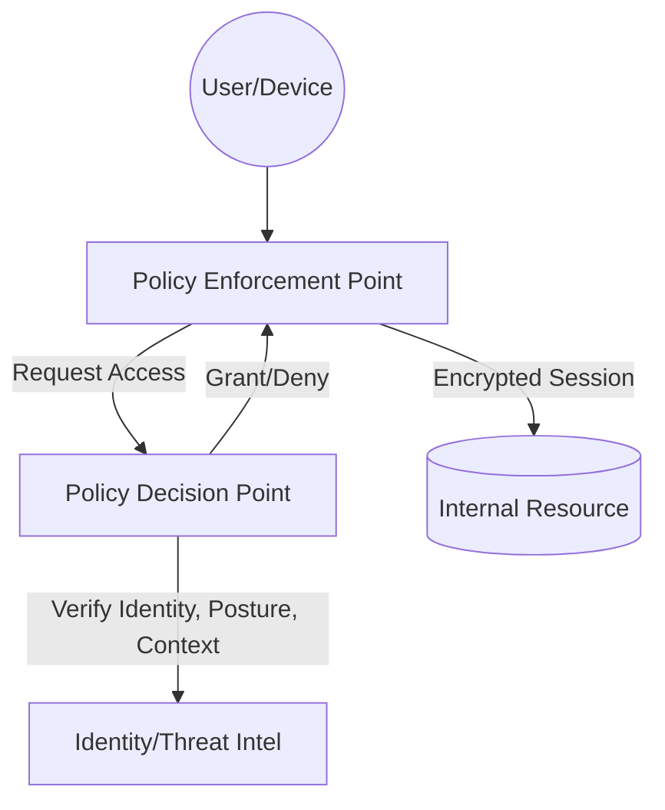
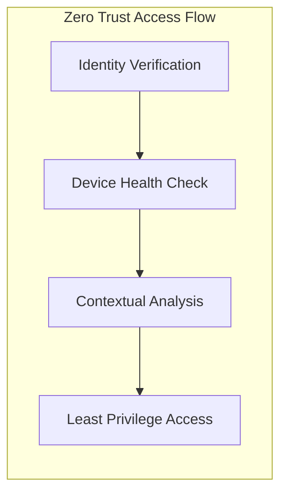

# Zero Trust Architecture (ZTA) for the CISSP Exam

Zero Trust is a security framework based on the realization that "trust" is a vulnerability. It moves defenses from static, network-based perimeters to focus on users, assets, and workloads.

## The Core Tenets of Zero Trust

As defined in **NIST SP 800-207**, Zero Trust assumes no implicit trust is granted to assets or user accounts based solely on their physical or network location.

### The Seven Pillars of Zero Trust
1.  **All data sources and computing services are considered resources.**
2.  **All communication is secured regardless of network location.**
3.  **Access to individual enterprise resources is granted on a per-session basis.**
4.  **Access to resources is determined by dynamic policy.**
5.  **The enterprise monitors and measures the integrity and security posture of all owned and associated assets.**
6.  **All resource authentication and authorization are dynamic and strictly enforced before access is allowed.**
7.  **The enterprise collects as much information as possible about the current state of assets, network infrastructure, and communications to improve security posture.**

## Logical Components of ZTA

-   **Policy Decision Point (PDP)**: The "brain" of the architecture. It is composed of the **Policy Engine** (makes the decision) and the **Policy Administrator** (executes the command to allow/deny).
-   **Policy Enforcement Point (PEP)**: The "gatekeeper." It is the component (e.g., gateway, agent, firewall) that sits in the path of the request and enforces the PDP's decision.

## Implementation Strategies

-   **Microsegmentation**: Breaking the network into small, isolated segments to limit lateral movement.
-   **Identity-Centric Access**: Using Identity Providers (IdP) and MFA as the primary gatekeepers rather than IP addresses.
-   **Software-Defined Perimeter (SDP)**: Hides resources from the public internet ("Dark Cloud") and only reveals them after successful authentication.

## CISSP Relevance
-   **Never Trust, Always Verify**: The mantra of modern security.
-   **Continuous Verification**: Verification is not a one-time event; it happens throughout the session.
-   **Least Privilege**: The foundational principle applied to every access request.
-   **Implicit Trust Zones**: ZTA aims to minimize these zones as much as possible.
