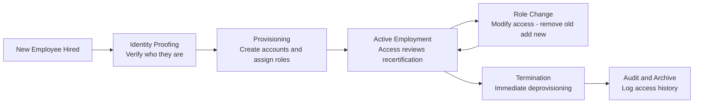
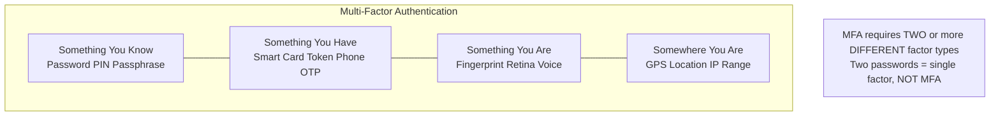
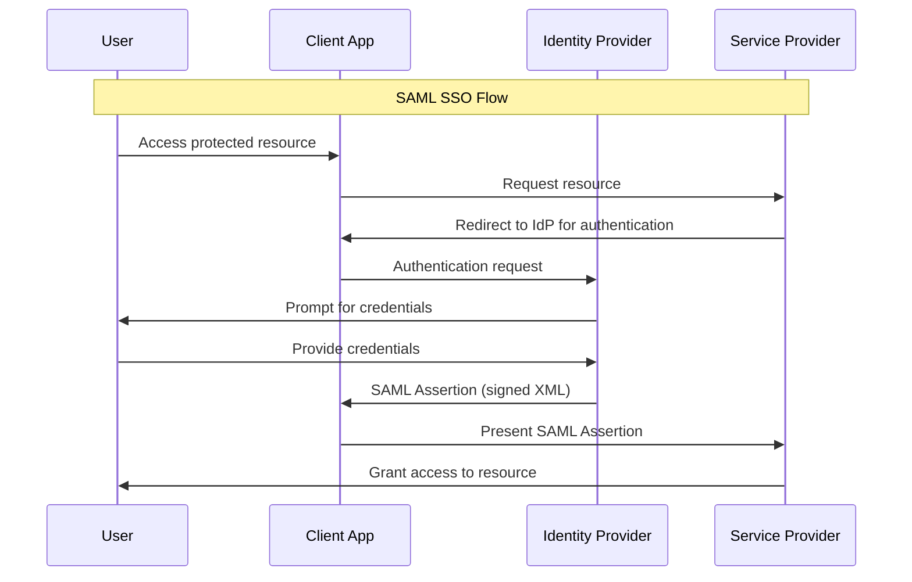
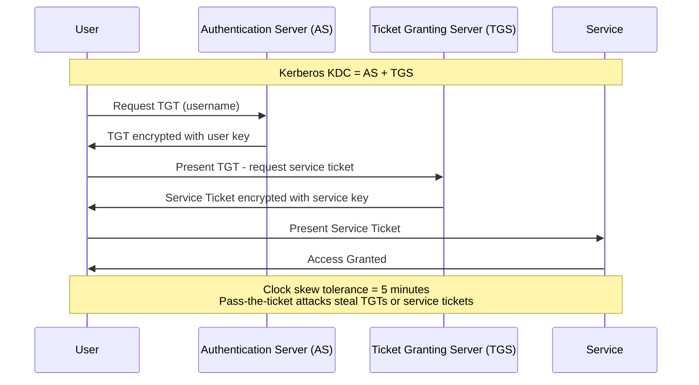
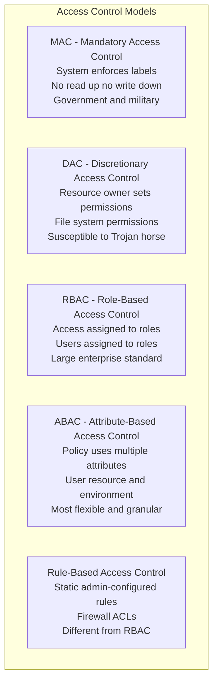
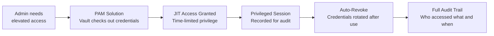
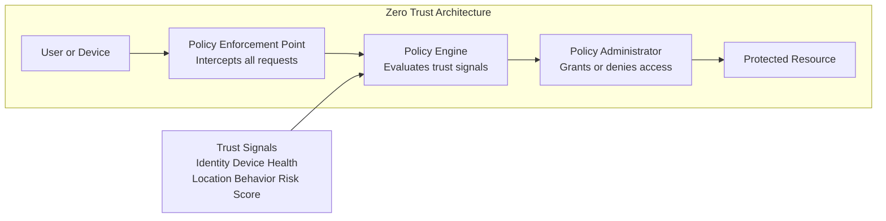

# Domain 5: Identity and Access Management

**Exam Weight: ~13% | Approximately 15–19 questions on a 125-question exam**

Identity and Access Management (IAM) is one of the highest-weighted domains on the CISSP exam and one of the most practical. It covers how organizations verify who you are, determine what you're allowed to do, and enforce those boundaries. Expect scenario-based questions that ask you to select the right access control model, authentication method, or identity governance approach for a given situation.

---

## Overview

IAM sits at the intersection of security policy and technical implementation. The core challenge is granting the **right access** to the **right people** at the **right time** — and revoking it when circumstances change. This domain spans everything from password policies to federated cloud identity, and from login flows to enterprise governance programs.

---

## Identity Management

**Provisioning and deprovisioning** are lifecycle events — creating, modifying, and removing accounts as employees join, change roles, or leave. Timely deprovisioning is critical; orphaned accounts are a major attack surface.

- **Identity proofing** establishes that a person is who they claim to be before an account is created (e.g., NIST SP 800-63A levels of assurance)
- **Directory services** (e.g., Microsoft Active Directory, LDAP) are the authoritative source for identity attributes
- **Identity federation** allows users from one organization (or identity provider) to authenticate to a partner system without a separate account — enabling cross-domain trust
- **Single Sign-On (SSO)** lets a user authenticate once and access multiple systems without re-entering credentials; reduces password fatigue and shrinks the attack surface, but creates a single point of failure if compromised
- **Just-in-Time (JIT) provisioning** creates accounts on first login via a federated assertion rather than pre-creating them

---

## Authentication

Authentication answers: **"Are you who you claim to be?"** The CISSP exam tests both the mechanics of authentication factors and the protocols that implement them.

### Authentication Factors

| Factor | Category | Examples |
|--------|----------|---------|
| Password, PIN, passphrase | Something you **know** | Knowledge-based |
| Smart card, hardware token, phone | Something you **have** | Possession-based |
| Fingerprint, retina, voice | Something you **are** | Inherence-based |
| GPS location, network segment | Somewhere you **are** | Location-based (sometimes added as 4th factor) |

**Multi-Factor Authentication (MFA)** requires two or more *different* factor types. Two passwords = single factor. Password + OTP = MFA.

### Key Authentication Protocols

- **Kerberos** — ticket-based protocol used in Windows/Active Directory environments. Uses a **Key Distribution Center (KDC)** with two components: **Authentication Server (AS)** and **Ticket Granting Server (TGS)**. Subject to pass-the-ticket attacks. Relies on synchronized clocks (default 5-minute skew tolerance).
- **RADIUS** — Remote Authentication Dial-In User Service. UDP-based, encrypts only the password field. Common in network access and VPN scenarios.
- **TACACS+** — Terminal Access Controller Access Control System Plus. TCP-based, encrypts the entire payload. Preferred for **device administration** (routers, switches). Separates Authentication, Authorization, and Accounting (AAA).
- **LDAP** — Lightweight Directory Access Protocol. Used to query and modify directory services. LDAPS (port 636) adds TLS encryption; plain LDAP (port 389) transmits in cleartext.
- **SAML** — Security Assertion Markup Language. XML-based standard for exchanging authentication/authorization data between an **Identity Provider (IdP)** and a **Service Provider (SP)**. Heavily used in enterprise SSO and federated identity.
- **OAuth 2.0** — An **authorization** framework (not authentication). Allows third-party apps to access resources on behalf of a user without sharing credentials. Uses access tokens.
- **OpenID Connect (OIDC)** — An **authentication** layer built on top of OAuth 2.0. Returns an **ID token** (JWT) that asserts the user's identity. OIDC = who you are; OAuth = what you can do.

> **CISSP trap:** OAuth is authorization, not authentication. When the question asks about identity verification, the answer is OIDC or SAML — not OAuth alone.

---

## Kerberos Authentication Flow

---

## Authorization Models

Authorization answers: **"What are you allowed to do?"** The exam heavily tests when to apply each model.

- **MAC** — exam cue: government/military, labels required
- **RBAC** — exam cue: large enterprise, role-based simplicity
- **ABAC** — exam cue: dynamic contextual decisions needed (time of day, location, device posture)

---

## Privileged Access Management (PAM)

Privileged accounts (admins, service accounts, root) are the highest-value targets for attackers. PAM controls and monitors this elevated access.

- **Just-in-Time (JIT) access** — Privileges are granted only when needed and automatically revoked afterward. Reduces standing privileges.
- **Password vaulting** — Privileged credentials are stored in a secure vault; users check them out rather than knowing them permanently.
- **Session recording** — All privileged sessions are logged and recorded for audit and forensic purposes.
- **Principle of least privilege** — Users and processes should only have the minimum access required.

---

## Access Control Attacks

- **Privilege escalation** — Gaining higher access than originally granted. *Vertical*: gaining admin from user. *Horizontal*: accessing another user's data at the same level.
- **Pass-the-hash** — Capturing a hashed credential and replaying it to authenticate without cracking the underlying password.
- **Credential stuffing** — Using large lists of breached username/password pairs against other services, exploiting password reuse.
- **Kerberoasting** — Requesting service tickets from Kerberos for offline cracking of service account passwords.
- **Golden Ticket attack** — Forging Kerberos TGTs using the KRBTGT hash, granting persistent, unchecked access.

---

## Identity Governance

Identity governance ensures that access rights remain appropriate over time.

- **Access reviews / recertification campaigns** — Periodic reviews where managers certify that employees still need their current access. Often quarterly or annually.
- **Segregation of duties (SoD)** — Divides critical tasks so no single person can complete a sensitive process alone (e.g., the person who submits a payment cannot also approve it).
- **User and Entity Behavior Analytics (UEBA)** — Uses baselines to detect anomalous access patterns that may indicate insider threat or compromised accounts.

---

## Zero Trust

**Zero Trust** is an architecture philosophy: **"Never trust, always verify."** No user or device is inherently trusted based on network location.

Key principles:
- Verify explicitly — always authenticate and authorize based on all available data points
- Use least privilege access — limit access with JIT and just-enough-access (JEA)
- Assume breach — minimize blast radius, segment access, encrypt everything

Zero Trust is increasingly referenced in CISSP questions framed around modern cloud and hybrid environments.

---

## Exam Tips

- **RADIUS vs. TACACS+:** RADIUS is for network *access* (VPN, Wi-Fi); TACACS+ is for device *administration* (routers, switches) and separates AAA fully. TCP + full encryption = TACACS+.
- **OAuth is not authentication** — it's an authorization delegation framework. OIDC adds the identity layer on top. This distinction appears repeatedly on the exam.
- **MAC vs. DAC:** When a question involves government/military classifications and labels, the answer is almost always MAC. When the resource owner sets permissions, it's DAC.
- **SSO trade-off:** SSO reduces password fatigue and shrinks attack surface, but creates a single point of failure — compromising the SSO credential compromises all connected systems.
- **Kerberos requires time sync** — tickets have a default 5-minute validity window. Clock skew > 5 minutes causes authentication failures.
- **Deprovisioning is as important as provisioning** — questions about terminated employees often test whether you know that revoking access should happen *immediately*, before or concurrent with termination notification.
