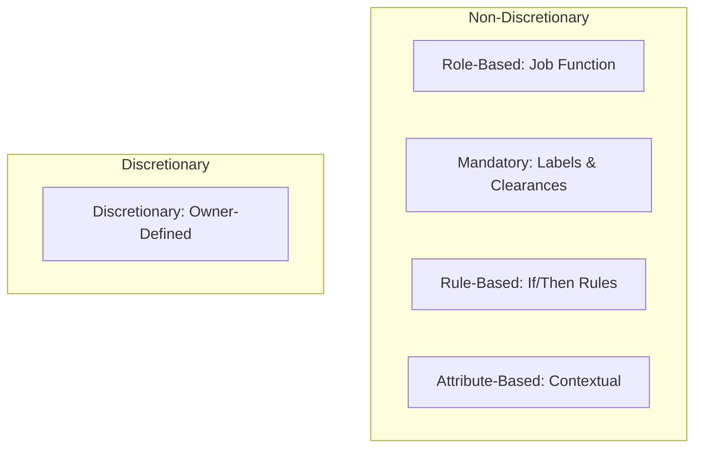
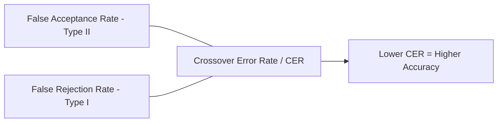
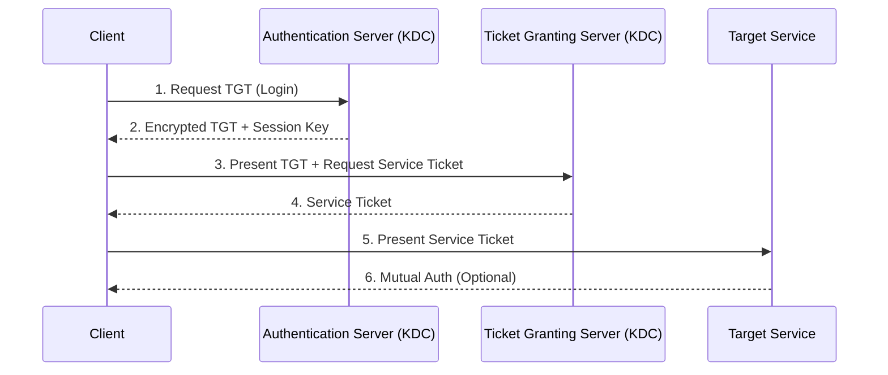

# Access Control Models & IAM Workflow for the CISSP Exam

A study-oriented overview of the access control and IAM question family on the CISSP. This is the dominant content area inside Domain 5 (Identity and Access Management).

## The IAAA Framework
Every access control system is built on these four pillars:
1.  **Identification**: Claiming an identity (e.g., username).
2.  **Authentication**: Proving the identity (e.g., password, biometric).
3.  **Authorization**: Granting permissions based on the authenticated identity.
4.  **Accountability**: Logging actions to a specific identity (Audit logs).

## Access Control Models

### 1. Discretionary Access Control (DAC)
-   **Definition**: The **owner** of the resource decides who has access.
-   **Use Case**: Small teams, standard file systems (NTFS, Unix permissions).
-   **Weakness**: Relies on user discretion; permissions can be easily "passed on."

### 2. Mandatory Access Control (MAC)
-   **Definition**: Access is based on **security labels** (Secret, Top Secret) and **clearances**.
-   **Key Concepts**: Lattice-based, strictly enforced by the OS.
-   **Use Case**: Military and high-security government environments.

### 3. Role-Based Access Control (RBAC)
-   **Definition**: Access is based on the user's **job function** or role in the organization.
-   **Benefit**: Simplifies administration; prevents "permission creep."
-   **Key Concept**: Roles are assigned permissions, and users are assigned to roles.

### 4. Attribute-Based Access Control (ABAC)
-   **Definition**: Access decisions are made based on attributes (Subject, Resource, Environment).
-   **Formula**: `If (User=Nurse) AND (Location=Ward) AND (Time=Shift) THEN Grant Access`.
-   **Benefit**: Most flexible and granular model.

## Bell-LaPadula vs. Biba

| Model | Focus | Simple Property | Star (*) Property |
| :--- | :--- | :--- | :--- |
| **Bell-LaPadula** | **Confidentiality** | No Read Up | No Write Down |
| **Biba** | **Integrity** | No Read Down | No Write Up |

## Biometric Metrics
Biometrics are Type 3 Authentication Factors (Something you are).

-   **Type I Error (FRR)**: Falsely rejecting a legitimate user (Usability issue).
-   **Type II Error (FAR)**: Falsely accepting an impostor (**Security failure**).
-   **CER (Crossover Error Rate)**: The point where FAR and FRR are equal. This is the metric used to compare biometric systems.

## Kerberos Authentication Flow
Kerberos is a ticket-based authentication protocol designed for trusted internal networks.

## Privileged Access Management (PAM)
-   **Credential Vaulting**: Storing root/admin passwords in a secure, audited vault.
-   **Just-in-Time (JIT) Access**: Providing elevated privileges only for the duration of a specific task.
-   **Just-Enough-Administration (JEA)**: Limiting the scope of what a privileged user can do.

## Exam Traps
-   **RBAC vs RuBAC**: RBAC is job-based; RuBAC is rule-based (e.g., "no access after 5 PM").
-   **MFA Composition**: To be MFA, factors must be from **different categories** (e.g., Password + SMS is MFA; Password + PIN is NOT).
-   **Separation of Duties**: No single person should have enough power to complete a fraudulent transaction from start to finish.
