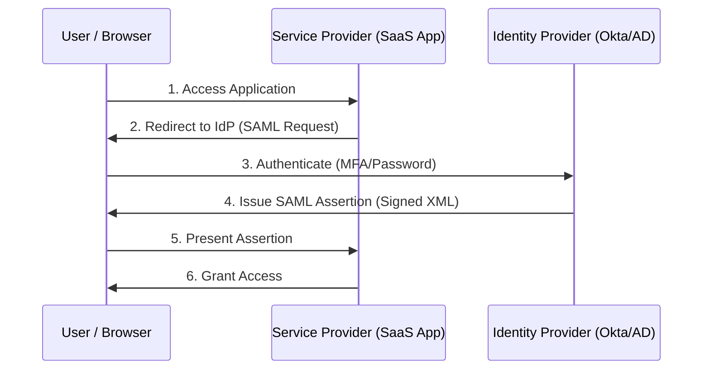
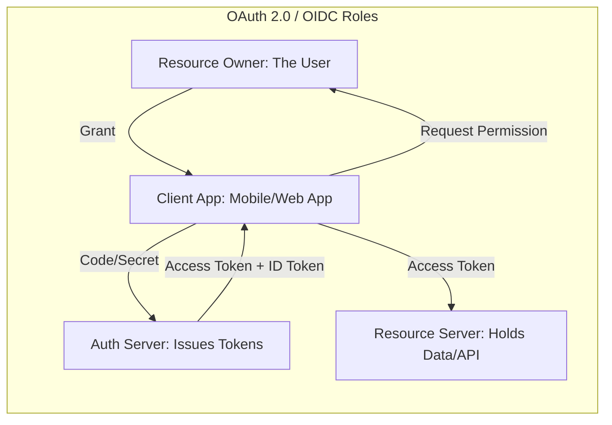

# Federated Identity & Third-Party ID for the CISSP Exam

Federation allows identities to be shared across organizational boundaries, enabling Single Sign-On (SSO) between disparate systems and domains.

## Key Terminology
-   **IdP (Identity Provider)**: The entity that maintains the user's identity and performs authentication (e.g., Okta, Azure AD, Google).
-   **SP (Service Provider) / RP (Relying Party)**: The application or service that provides the resource and relies on the IdP for authentication.
-   **Assertion / Token**: The cryptographic "claim" sent from the IdP to the SP to prove the user's identity.

## SAML (Security Assertion Markup Language)

SAML is an **XML-based** framework for exchanging authentication and authorization data. It is the enterprise standard for web-based SSO.

## OAuth 2.0 & OpenID Connect (OIDC)

-   **OAuth 2.0**: An **Authorization** framework (using JSON/JWT). It allows an app to access data on behalf of a user (e.g., "App X wants to view your Google Contacts").
-   **OpenID Connect (OIDC)**: An **Authentication** layer built on top of OAuth 2.0. It adds an **ID Token** to prove who the user is.

### SAML vs. OIDC Comparison
| Feature | SAML 2.0 | OpenID Connect (OIDC) |
| :--- | :--- | :--- |
| **Format** | XML | JSON / JWT |
| **Primary Use** | Enterprise Web SSO | Mobile Apps, Modern Web, APIs |
| **Complexity** | High (Heavyweight) | Moderate (Developer Friendly) |
| **Transport** | Browser Redirects (POST/Artifact) | REST / API calls |

## Provisioning Protocols

-   **SCIM (System for Cross-domain Identity Management)**: An open standard for automating the exchange of user identity information between identity domains and IT systems. It handles Create, Update, and Delete (CRUD) operations.
-   **Just-in-Time (JIT) Provisioning**: Automatically creating a user account in a Service Provider the first time they log in via SSO, using the attributes sent in the SAML assertion.

## CISSP Relevance
-   **XML vs. JSON**: SAML uses XML; OAuth/OIDC uses JSON.
-   **Authorization vs. Authentication**: OAuth is for Auth**Z**; OIDC and SAML are for Auth**N**.
-   **Trust**: Federation is built on a pre-established **Circle of Trust** or metadata exchange between the IdP and SP.
-   **Account De-provisioning**: One of the biggest benefits of Federation is that disabling a user in the IdP immediately cuts off access to all federated Service Providers.
