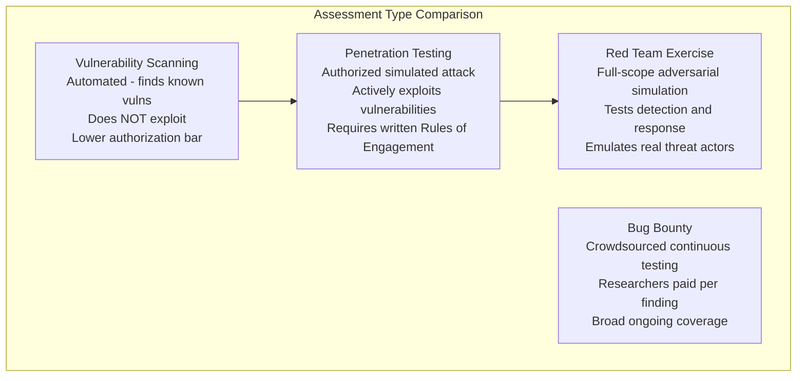
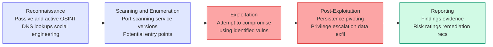
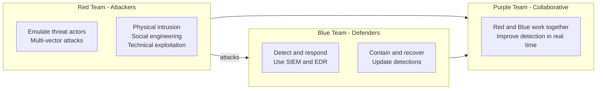
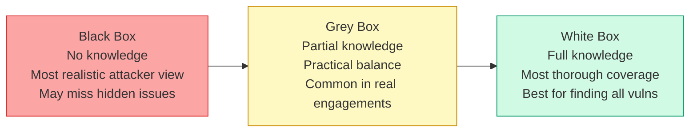
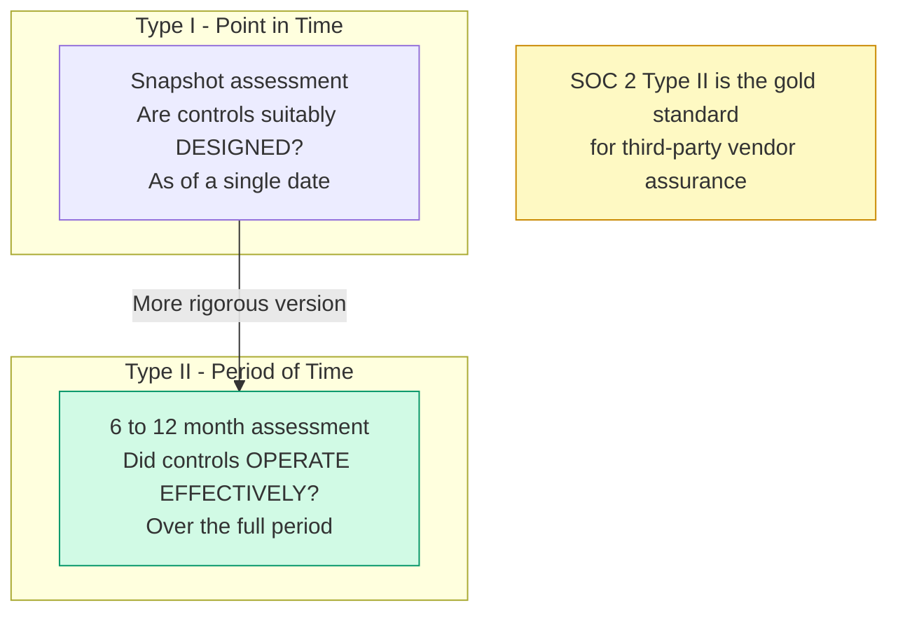
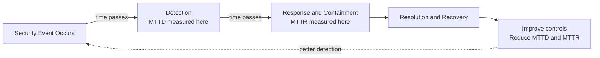

# Domain 6: Security Assessment and Testing

**Exam Weight: ~12% | Approximately 14–18 questions on a 125-question exam**

Security Assessment and Testing is a process-heavy domain that focuses on how organizations measure their security posture and verify that controls are working as intended. The CISSP exam tests your ability to select the right type of assessment for a given scenario, understand what each test can and cannot tell you, and recognize the governance requirements (especially written authorization) that must be in place before testing begins.

---

## Overview

Security programs are only as good as their ability to detect gaps and confirm that defenses are effective. This domain covers the full spectrum of assessment activities — from automated vulnerability scans to full adversarial red team exercises — as well as audit reporting standards, code review techniques, and the metrics programs use to track security over time.

A key theme throughout: **know when to use what, and what authorization is required.**

---

## Assessment Types

Understanding the differences between assessment types is the core exam competency for this domain.

### Vulnerability Scanning

- **What it is:** Automated scanning of systems to identify known vulnerabilities, misconfigurations, missing patches, and default credentials.
- **What it does NOT do:** It does not exploit vulnerabilities — it identifies and reports them.
- **Credentialed vs. uncredentialed scans:** Credentialed scans (with admin access) find far more issues; uncredentialed scans reflect what an unauthenticated attacker would see.
- **Tools:** Nessus, Qualys, Rapid7 InsightVM, OpenVAS.
- **Frequency:** Often continuous or weekly; required by PCI DSS quarterly for external-facing systems.
- **Authorization:** Lower bar than pen testing, but still requires approval from system owners.

### Penetration Testing

- **What it is:** A simulated attack conducted by authorized testers who attempt to *exploit* vulnerabilities to determine the real-world impact.
- **Critical requirement: Written authorization (Rules of Engagement / Statement of Work) must exist before any testing begins.** This is a firm CISSP exam point — no exceptions.

### Red Team Exercises

- **What it is:** A full-scope, adversarial simulation where a red team emulates a real threat actor — including physical intrusion, social engineering, and multi-vector attack chains — to test the organization's *detection and response* capability.
- **Key distinction from pen testing:** Red teams test whether the *blue team (defenders)* can detect and respond; pen tests focus on finding exploitable vulnerabilities.
- **Purple teaming:** Red and blue teams work collaboratively to improve detection logic in real time.

### Bug Bounty Programs

- Crowdsourced security testing where external researchers are paid for responsibly disclosed vulnerabilities. Provides broad, continuous coverage beyond what internal teams find.

---

## Testing Methodologies (Knowledge Levels)

| Methodology | Tester Knowledge | Simulates |
|-------------|-----------------|-----------|
| **Black box** | No prior knowledge of the target | External attacker with no insider access |
| **White box** | Full knowledge (architecture, source code, credentials) | Insider or auditor with full access |
| **Grey box** | Partial knowledge (some credentials, network diagrams) | Partially trusted insider or attacker who has done reconnaissance |

**Exam cue:** Black box = most realistic attacker simulation. White box = most thorough coverage (best for finding all vulnerabilities). Grey box = balanced — common in practice.

---

## Code Review Methods

Secure software testing often happens at the code and application layer.

- **Static Application Security Testing (SAST)** — Analyzes source code, bytecode, or binaries *without executing the program*. Finds issues like SQL injection, hard-coded credentials, and buffer overflows early in development. Also called **static analysis**.
- **Dynamic Application Security Testing (DAST)** — Tests the running application by sending inputs and observing behavior. Finds runtime issues like authentication flaws, injection vulnerabilities, and session management problems. Tools include OWASP ZAP, Burp Suite.
- **Interactive Application Security Testing (IAST)** — Combines SAST and DAST by instrumenting the running application to observe behavior from the inside.
- **Fuzzing (Fuzz Testing)** — Sends malformed, random, or unexpected inputs to an application to find crashes and unexpected behavior. Effective for finding memory corruption and input validation flaws. **Mutation-based fuzzing** modifies known-valid inputs; **generation-based fuzzing** creates inputs from scratch per a protocol specification.
- **Manual code review** — Human review of source code; most thorough but slowest. Catches logic flaws that automated tools miss.

---

## Security Audits and Third-Party Assessments

### SOC Reports (System and Organization Controls)

SOC reports are produced by independent auditors evaluating a service organization's controls. They are critical for third-party risk management.

| Report | Purpose | Audience |
|--------|---------|---------|
| **SOC 1** | Controls relevant to financial reporting (ICFR) | Customer financial auditors |
| **SOC 2** | Controls based on Trust Service Criteria (Security, Availability, Processing Integrity, Confidentiality, Privacy) | Management, security teams, business partners |
| **SOC 3** | Public-facing summary of SOC 2 — no detailed test results | General public, marketing use |

**SSAE 18** (Statements on Standards for Attestation Engagements No. 18) is the AICPA standard under which SOC reports are issued. Superseded SSAE 16.

### Other Audit Frameworks

- **ISO 27001 audits** — Certification against the ISO/IEC 27001 ISMS standard
- **PCI DSS assessments** — Conducted by Qualified Security Assessors (QSAs); required for payment card data environments
- **FedRAMP assessments** — Third Party Assessment Organizations (3PAOs) evaluate cloud providers for federal government use

---

## Log Reviews and Monitoring

- **Log review** is a detective control — it identifies what happened after the fact.
- **Key log sources:** Firewalls, IDS/IPS, authentication systems, servers, endpoints, DNS, proxy servers
- **SIEM (Security Information and Event Management)** — Aggregates, correlates, and analyzes log data from across the environment in real time. Enables detection of multi-step attacks that wouldn't be visible in any single log source.
- **Continuous monitoring** (as described in NIST SP 800-137) replaces periodic point-in-time assessments with ongoing visibility into the security state of systems and controls.
- **Sampling** — When reviewing large log volumes, statistical sampling is used to validate control effectiveness; the sample size must be statistically valid to support conclusions.

---

## Security Metrics and KPIs

Metrics translate security activities into business-relevant measurements.

- **Mean Time to Detect (MTTD)** — Average time between a security event occurring and being discovered
- **Mean Time to Respond (MTTR)** — Average time from detection to containment/resolution
- **Patch coverage rate** — Percentage of systems with critical patches applied within SLA
- **Vulnerability density** — Number of vulnerabilities per unit of code or per system
- **False positive rate** — High rates degrade analyst trust in alerting systems and cause alert fatigue
- **Control effectiveness** — Percentage of controls passing validation in audits or assessments

Metrics should be **actionable** (they drive decisions), **accurate** (based on reliable data), and **communicated** to the right audience (operational vs. executive).

---

## Test Coverage Concepts

- **Attack surface coverage** — Does the assessment scope include all entry points (external, internal, wireless, physical)?
- **Code coverage** — In software testing, the percentage of code paths exercised by tests; 100% coverage is ideal but rarely achieved
- **Risk-based prioritization** — High-value assets and high-likelihood attack vectors should receive the most testing attention
- **Scope creep** — In pen testing, testers going outside the agreed scope; the Rules of Engagement (RoE) document defines and limits scope

---

## Exam Tips

- **Written authorization is non-negotiable for penetration testing.** If a question asks what must happen before a pen test begins, the answer is always to obtain written permission — not just verbal approval.
- **Vulnerability scanning ≠ penetration testing.** Scanning identifies potential vulnerabilities; pen testing exploits them to confirm impact. The exam often presents scenarios where you must distinguish between what each provides.
- **SOC 2 Type II is the gold standard** for third-party vendor assurance in most enterprises — Type I only proves controls exist, not that they work over time.
- **Black box tests are realistic but may miss issues** that only show up with insider knowledge; white box tests are thorough but don't simulate real attackers. Grey box is a practical middle ground.
- **SAST finds bugs early and cheaply** (in code before deployment); DAST finds runtime vulnerabilities in running systems. Both are needed for comprehensive application security testing.
- **Fuzzing is especially effective against parsers and protocol implementations** — if a question describes software that processes external inputs (file formats, network packets), fuzzing is a strong answer for finding unexpected behavior.
