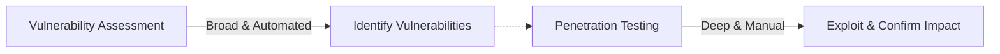
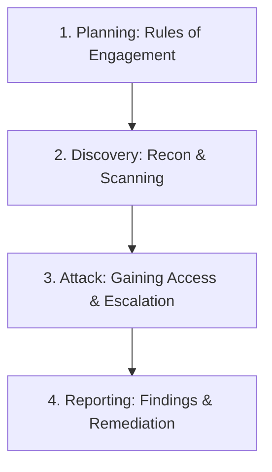
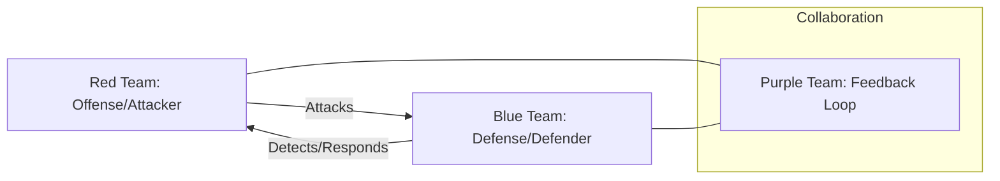

# Security Testing & Assessment for the CISSP Exam

Domain 6 (Security Assessment and Testing) focuses on the tools, techniques, and methodologies used to evaluate the effectiveness of security controls.

## Vulnerability Assessment vs. Penetration Testing

-   **Vulnerability Assessment**: A broad, typically automated process to identify known vulnerabilities (e.g., missing patches, misconfigurations). It does **not** involve exploitation.
-   **Penetration Testing**: A deep, manual process that mimics an attacker to exploit vulnerabilities and determine the actual risk and impact.

## Penetration Testing Phases (NIST SP 800-115)

1.  **Planning**: Defining the scope, goals, and Rules of Engagement (RoE). This phase must include **written authorization**.
2.  **Discovery**: Reconnaissance (passive and active) and vulnerability scanning.
3.  **Attack**: The "Exploitation" phase. Attempting to gain access, escalate privileges, and maintain persistence.
4.  **Reporting**: Documenting the findings, the methods used, and providing recommendations for remediation.

## Testing Perspectives
-   **Black Box**: Zero knowledge. The tester simulates an external attacker.
-   **White Box**: Full knowledge (source code, diagrams, credentials). The most thorough but least realistic as an attack simulation.
-   **Gray Box**: Partial knowledge. Simulates an insider or a persistent attacker who has already gained some access.

## Red, Blue, and Purple Teams

-   **Red Team**: Ethical hackers who simulate real-world attacks.
-   **Blue Team**: Security professionals who defend the organization (SOC, IR).
-   **Purple Team**: A collaborative approach where Red and Blue teams share knowledge to improve overall detection and response.

## Audit Types
-   **Internal (First-Party)**: Conducted by the organization's own auditors for internal assurance.
-   **External (Second-Party)**: Conducted by a customer or partner (e.g., supply chain audit).
-   **External (Third-Party)**: Conducted by an independent, certified auditing firm (e.g., SOC 2, ISO 27001).

## Exam Traps
-   **Authorization**: Never start a pentest without a **signed Rules of Engagement** document.
-   **Vulnerability Scan vs. Pentest**: If the question asks for a "comprehensive list of known weaknesses," it's a Vulnerability Scan. If it asks for "demonstrated impact," it's a Pentest.
-   **White Box vs. Realism**: White box is the **most thorough**, but Black box is the **most realistic** for simulating an external attack.
