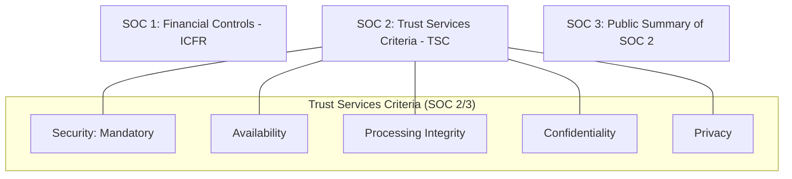
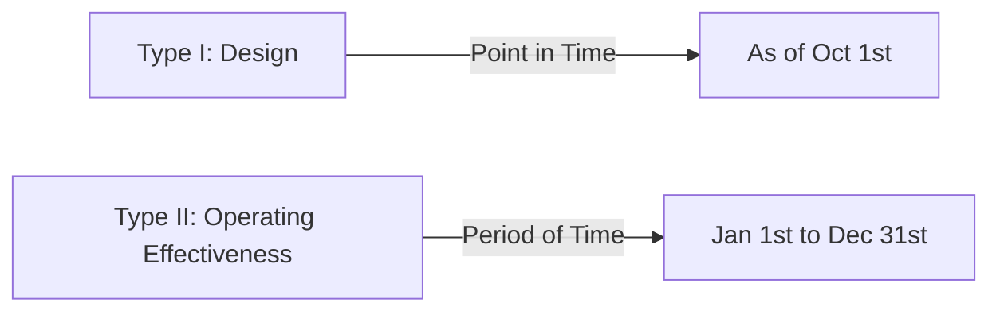

# SOC Reporting for the CISSP Exam

System and Organization Controls (SOC) reports are critical for evaluating the security of third-party service providers (e.g., Cloud, SaaS).

## SOC Report Types (The Hierarchy)

### 1. SOC 1 (SSAE 18)
-   **Focus**: Internal Control over **Financial Reporting** (ICFR).
-   **Audience**: The user's financial auditors.
-   **Use Case**: A payroll processor or a financial services firm.

### 2. SOC 2
-   **Focus**: Security, Availability, Processing Integrity, Confidentiality, and Privacy (**TSC**).
-   **Audience**: Management, regulators, and other informed parties (restricted use).
-   **Use Case**: Most cloud providers (AWS, Azure, GCP) and SaaS companies.
-   **Mandatory Criterion**: **Security** (the "Common Criteria") must always be included.

### 3. SOC 3
-   **Focus**: Same as SOC 2, but a **redacted, public-facing summary**.
-   **Audience**: General public (marketing).
-   **Use Case**: A company wants to display a "seal" on their website to show they are SOC 2 compliant without sharing sensitive details.

## Type I vs. Type II Reports

This distinction applies to both SOC 1 and SOC 2.

-   **Type I**: Evaluates the **design** of the controls at a **specific point in time**. Does the organization *have* the right controls in place?
-   **Type II**: Evaluates the **operating effectiveness** of the controls over a **period of time** (typically 6–12 months). Do the controls actually *work* consistently?

## Shared Responsibility and UCC
-   **UCC (User Control Considerations)**: Controls that the **customer** is responsible for implementing to ensure the service provider's controls are effective (e.g., "The customer must manage their own encryption keys").

## Exam Traps
-   **SOC 1 vs. SOC 2**: If the question mentions "financial reporting," choose SOC 1. If it's about "cloud security" or "data privacy," choose SOC 2.
-   **Type I vs. Type II**: Type II is always more rigorous and "better" for security assurance because it tests performance over time.
-   **SOC 3 for Details**: A SOC 3 report **never** contains detailed test results or auditor opinions; it is for marketing/public use.
