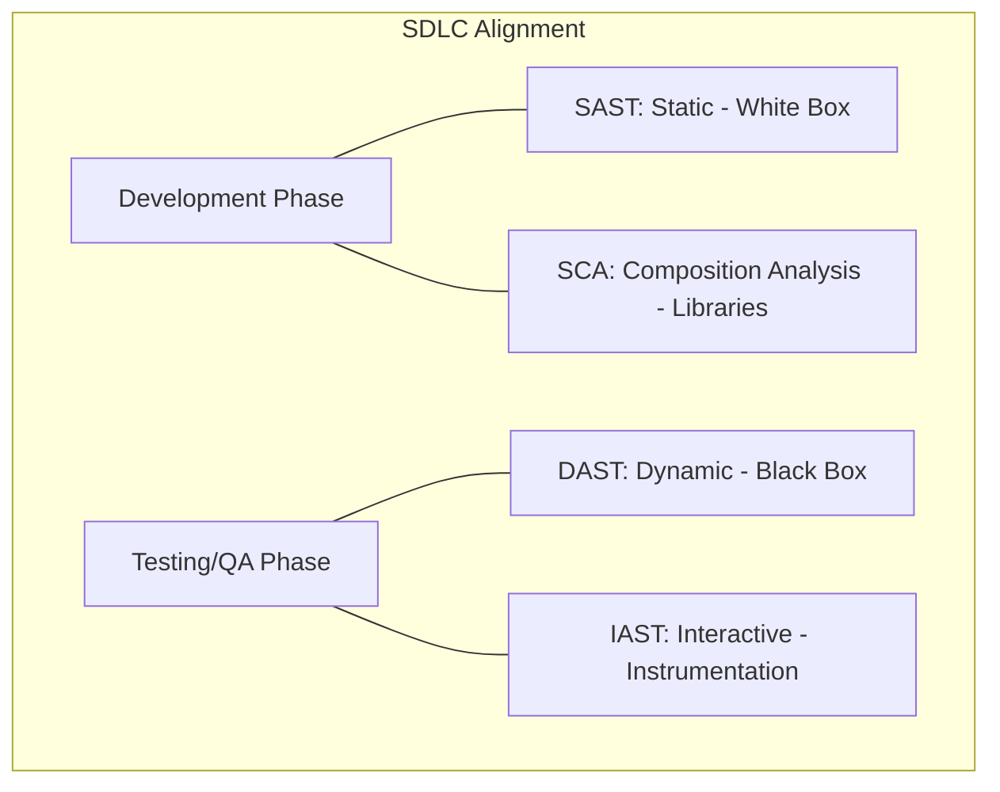
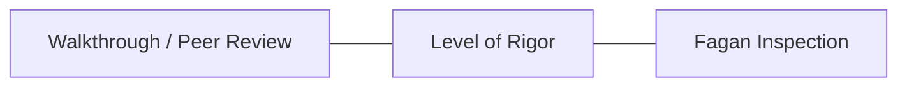

# Software Testing & Code Review for the CISSP Exam

Assessing software security requires a combination of automated tools and human review throughout the Software Development Life Cycle (SDLC).

## Application Security Testing (AST) Family

### 1. SAST (Static Application Security Testing)
-   **Method**: Analyzes **source code** or binaries without execution (**White Box**).
-   **Timing**: Early in the SDLC (Development).
-   **Pro**: Catches flaws (SQLi, hardcoded secrets) early.
-   **Con**: High false-positive rate; cannot see runtime issues.

### 2. DAST (Dynamic Application Security Testing)
-   **Method**: Tests the **running application** from the outside (**Black Box**).
-   **Timing**: Later in the SDLC (QA/Testing).
-   **Pro**: Finds runtime and configuration issues.
-   **Con**: Requires a running environment; cannot pinpoint exact code location of flaws.

### 3. IAST (Interactive Application Security Testing)
-   **Method**: Uses **instrumentation (agents)** inside the running app to monitor execution.
-   **Pro**: Combines the benefits of SAST and DAST with lower false positives.

### 4. SCA (Software Composition Analysis)
-   **Method**: Scans **third-party libraries** and open-source dependencies for known vulnerabilities (CVEs).
-   **Relevance**: Vital for modern supply chain security.

## Code Review Methodologies

-   **Fagan Inspection**: The most **formal and structured** review process.
    -   **Phases**: Planning → Overview → Preparation → Inspection → Rework → Follow-up.
-   **Walkthrough**: The author leads the team through the code to explain logic and find bugs.
-   **Pair Programming**: Real-time code review as it is being written.

## Software Testing Levels
1.  **Unit Testing**: Testing individual components or functions in isolation.
2.  **Integration Testing**: Testing how different components work together.
3.  **System Testing**: Testing the entire integrated system for compliance with requirements.
4.  **Regression Testing**: Testing to ensure that new changes haven't broken existing functionality.
5.  **User Acceptance Testing (UAT)**: The final phase where end-users verify the system meets business needs.

## Exam Traps
-   **SAST vs. DAST**: SAST is for **code**; DAST is for the **running app**.
-   **Fagan vs. Walkthrough**: If the question asks for the "highest defect detection" or "most formal," choose Fagan.
-   **Unit vs. Integration**: Unit tests are the smallest scope; integration tests are the first level where components meet.
