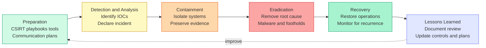
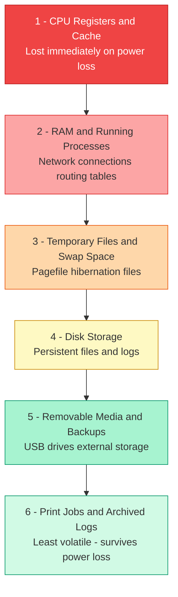
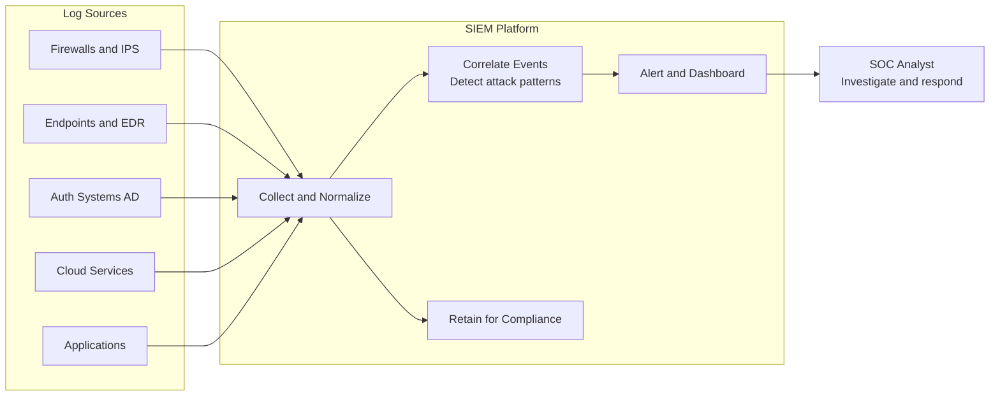
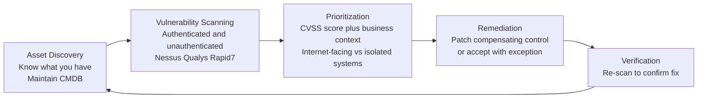
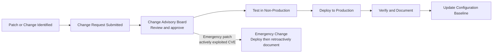
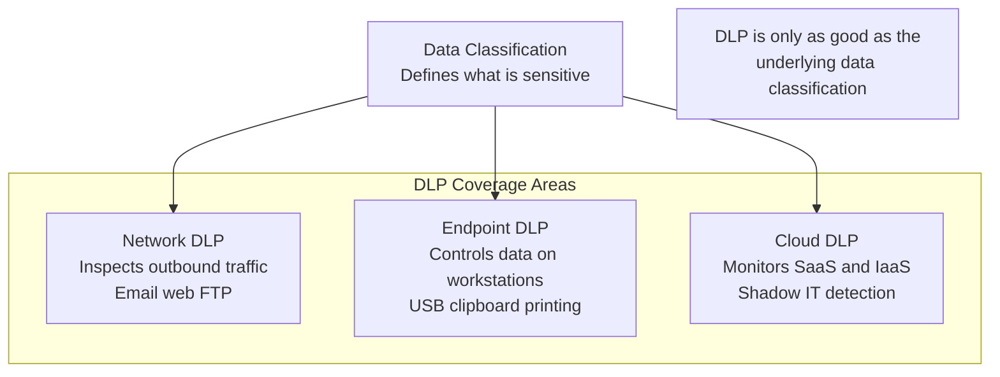
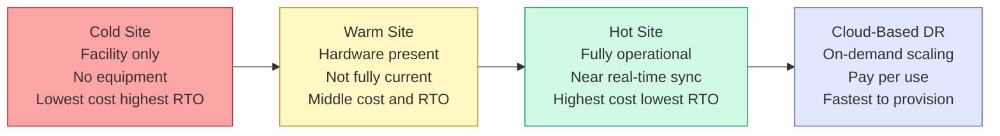

# Domain 7: Security Operations

**Exam Weighting: ~13% of the CISSP exam**

Security Operations is one of the largest and most practice-oriented domains on the CISSP exam. It covers the day-to-day activities that keep an organization secure: detecting and responding to incidents, managing vulnerabilities, maintaining visibility through logging, and ensuring continuity of operations. Expect scenario-based questions that test your judgment as a practitioner, not just your recall of definitions.

---

## Incident Response

The incident response (IR) lifecycle is the backbone of this domain. The **NIST SP 800-61** framework defines four phases, but CISSP questions often reference a six-phase model:

1. **Preparation** — Establishing the IR team (CSIRT), playbooks, tools, and communication plans before an incident occurs.
2. **Detection and Analysis** — Identifying indicators of compromise (IOCs), determining scope and severity, and declaring an incident.
3. **Containment** — Short-term containment (isolating affected systems) and long-term containment (patching, rebuilding). Preserve evidence during this phase.
4. **Eradication** — Removing the root cause: malware, attacker footholds, vulnerable configurations.
5. **Recovery** — Restoring systems to normal operation and monitoring for recurrence.
6. **Post-Incident Activity (Lessons Learned)** — Documenting the incident, reviewing response effectiveness, and updating controls.

Key terms: **CSIRT** (Computer Security Incident Response Team), **SIRT**, **IOC**, **TTPs** (Tactics, Techniques, and Procedures).

---

## Digital Forensics and Evidence Handling

Forensics questions are common and often involve sequencing decisions under exam pressure.

**Order of Volatility** (most volatile to least — collect in this order):

**Chain of Custody** documents who collected evidence, when, and how it was handled. Any gap weakens admissibility in court. Evidence must be collected using **write blockers** to prevent modification of original media.

**Legal holds** require suspending normal data destruction policies when litigation is reasonably anticipated. This applies to logs, emails, backups, and any relevant data.

Key forensics concepts: **forensic image** (bit-for-bit copy), **hash verification** (MD5/SHA to prove integrity), **Locard's Exchange Principle** (every contact leaves a trace), **live forensics vs. dead-box forensics**.

---

## Logging, Monitoring, and SIEM

Visibility is the foundation of security operations. Without comprehensive logging, detection is impossible.

**SIEM** (Security Information and Event Management) platforms aggregate, normalize, and correlate log data from across the environment. Key SIEM functions:
- **Log aggregation** from endpoints, network devices, cloud, applications
- **Correlation rules** to detect multi-step attack patterns
- **Alerting and dashboards** for analysts
- **Retention** for compliance requirements (e.g., 90 days online, 1 year archived)

**User and Entity Behavior Analytics (UEBA)** establishes baselines of normal behavior and flags deviations — critical for detecting insider threats and compromised credentials that evade rule-based detection.

**Continuous monitoring** ties into the **ISCM** (Information Security Continuous Monitoring) framework under NIST SP 800-137. Key metrics: mean time to detect (MTTD) and mean time to respond (MTTR).

---

## Vulnerability Management

A mature vulnerability management program follows a repeatable cycle:

1. **Asset Discovery** — You can't protect what you don't know exists. Maintain a CMDB (Configuration Management Database).
2. **Vulnerability Scanning** — Authenticated scans provide deeper findings than unauthenticated. Tools: Nessus, Qualys, Rapid7.
3. **Prioritization** — Use **CVSS** (Common Vulnerability Scoring System) scores alongside business context. A CVSS 9.8 on an isolated dev server may matter less than a CVSS 6.5 on an internet-facing payment system.
4. **Remediation** — Patch, compensating control, or accept risk with documented exception.
5. **Verification** — Re-scan to confirm remediation was effective.

---

## Configuration and Patch Management

**Configuration management** establishes and maintains known-good **baselines** (e.g., CIS Benchmarks, DISA STIGs). **Change management** ensures changes are reviewed, approved, tested, and documented before deployment — preventing unauthorized changes that introduce vulnerabilities.

**Patch management** must balance security urgency against operational stability. Emergency patches (out-of-band) bypass normal change cycles for critical vulnerabilities being actively exploited. **Mean Time to Patch (MTTP)** is a key operational metric.

---

## Data Loss Prevention (DLP)

**DLP** solutions monitor and control data movement to prevent unauthorized exfiltration of sensitive data.

DLP effectiveness depends on accurate **data classification** — if you don't know what's sensitive, you can't protect it.

---

## Disaster Recovery Operations

DR operations focus on restoring IT systems after a disruption. Key metrics:
- **RTO** (Recovery Time Objective) — Maximum acceptable downtime
- **RPO** (Recovery Point Objective) — Maximum acceptable data loss

Regularly test recovery plans:
- **Tabletop exercises** — discussion-based, no systems involved
- **Parallel tests** — recovery systems brought online alongside production
- **Full interruption tests** — production is actually shut down; highest risk, most realistic

---

## Exam Tips

- **Order of volatility** appears frequently — memorize the sequence from registers/RAM down to archival media. Questions may ask what to collect first at an incident scene.
- **Chain of custody** questions often hinge on documentation gaps or improper evidence handling. When in doubt, the answer that preserves evidence integrity and documentation is correct.
- **Containment before eradication** — the exam expects you to contain a threat before removing it to preserve evidence and prevent further damage.
- **SIEM vs. log management** — SIEM correlates and alerts; log management stores and indexes. Know the distinction when questions describe tool capabilities.
- **CVSS scores alone don't drive prioritization** — the CISSP manager mindset weighs business impact and exploitability context, not just the raw score.
- **Lessons learned is mandatory** — post-incident review is not optional housekeeping. Expect questions where the "correct" final step after recovery is conducting a formal review and updating the IR plan.
