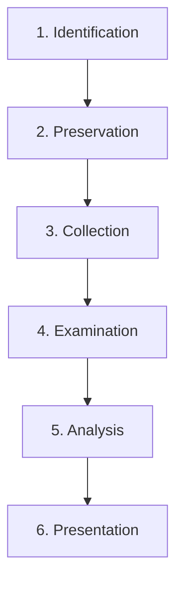
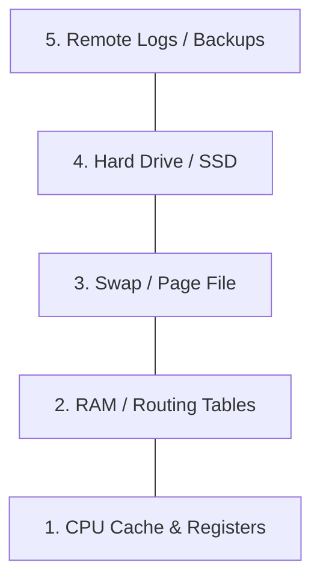

# Digital Forensics for the CISSP Exam

Digital forensics is the application of scientific techniques to identify, preserve, collect, examine, analyze, and present digital evidence.

## The Forensic Process (6-Step Model)

1.  **Identification**: Locating potential sources of evidence.
2.  **Preservation**: Protecting evidence from being altered (Write Blockers, Hashing).
3.  **Collection**: Acquiring the evidence (Bit-stream images).
4.  **Examination**: Technical processing (decryption, file carving).
5.  **Analysis**: Determining the significance and "who/what/when" of the evidence.
6.  **Presentation**: Reporting findings to a court or management.

## Order of Volatility (RFC 3227)

When collecting evidence, always start with the data that disappears the fastest.

1.  **CPU Cache/Registers**: Most volatile (nanoseconds).
2.  **RAM (Main Memory)**: Holds encryption keys, running processes.
3.  **Temporary Files**: Swap/Page files.
4.  **Disk (HDD/SSD)**: Persistent storage.
5.  **Remote Data**: Logs on a separate server, backups.

## Legal Evidence Types

-   **Best Evidence**: The original, unaltered object (e.g., the original hard drive). In digital cases, a bit-stream image is often accepted as best evidence if hashed correctly.
-   **Direct Evidence**: Testimony based on a witness's five senses.
-   **Circumstantial Evidence**: Evidence that proves a secondary fact from which a primary fact can be inferred.
-   **Hearsay**: Out-of-court statements (e.g., log files).
    -   **Business Records Exception**: Logs are admissible if they are created in the normal course of business.

## Evidence Admissibility (The Triad)
For evidence to be admissible in court, it must be:
1.  **Relevant**: It must prove or disprove a fact related to the case.
2.  **Reliable**: It must be trustworthy and unaltered.
3.  **Legally Permissible**: It must have been obtained legally (e.g., with a warrant).

## Exam Traps
-   **Volatility Swap**: Putting Disk before RAM in a sequencing question is a common trap.
-   **Pull the Plug?**: Modern advice is **Live Collection** first to preserve RAM, especially if encryption is suspected.
-   **Hashing**: Hashing should be done **immediately** after the image is created.
