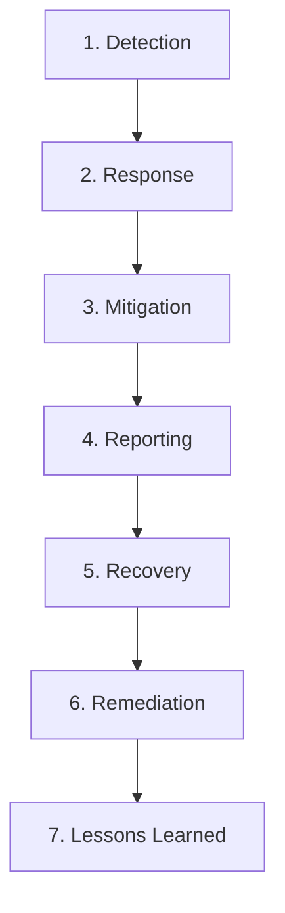
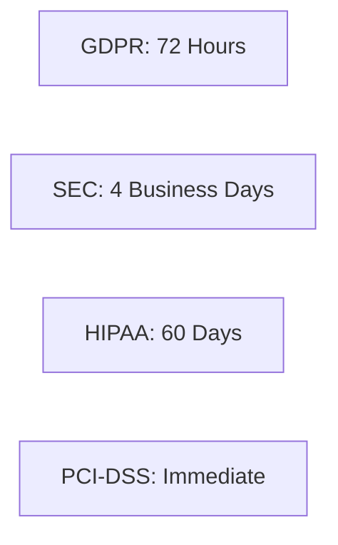

# Incident Response & Breach Handling for the CISSP Exam

Domain 7 (Security Operations) covers the lifecycle of an incident, from detection through to recovery and lessons learned.

## The Incident Response Lifecycle (ISC2 Seven-Step Model)

1.  **Detection**: Identifying that an event has occurred.
2.  **Response**: Triage and initial assessment.
3.  **Mitigation (Containment)**: "Stop the bleeding." Isolating affected systems to prevent further damage.
4.  **Reporting**: Internal and external notifications (Legal, CISO, Regulators).
5.  **Recovery**: Restoring systems to normal operation.
6.  **Remediation**: Addressing the **root cause** and patching vulnerabilities.
7.  **Lessons Learned**: Post-mortem analysis to improve future response.

### Mitigation vs. Remediation
-   **Mitigation**: Short-term containment (e.g., pulling a network cable).
-   **Remediation**: Long-term fix (e.g., patching the software flaw that allowed the entry).

## Breach Notification Timelines

Different regulations have specific requirements for when a breach must be reported after it is discovered.

-   **GDPR**: 72 hours from awareness (to the Supervisory Authority).
-   **SEC**: 4 business days after determination of materiality.
-   **HIPAA**: 60 days (for breaches affecting 500+ individuals).
-   **PCI-DSS**: Immediate notification to card brands/banks.

## Triage and Severity
Triage is the process of sorting and prioritizing incidents based on their potential impact.
-   **Low**: Minor policy violation, no data loss.
-   **Medium**: Limited impact, recoverable within standard timeframes.
-   **High**: Critical business process interrupted, sensitive data exposure.
-   **Critical**: Widespread impact, potential for business failure (Activate BCP/DR).

## Evidence Handling
-   **Chain of Custody**: A chronological record of everyone who has handled the evidence.
-   **Integrity**: Use of **cryptographic hashes** (MD5/SHA) to prove evidence hasn't changed.
-   **Best Evidence**: The original version of a document or object.

## Exam Traps
-   **Mitigation vs. Remediation**: Exam writers love to swap these. Mitigation = Containment; Remediation = Root Cause Fix.
-   **Lessons Learned**: This is the **most important** step for future improvement and is always the **last step** in the cycle.
-   **External Reporting**: Always notify **internal** stakeholders (Legal, CISO) before going public or contacting law enforcement.
