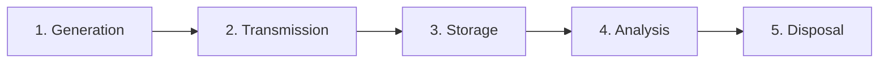
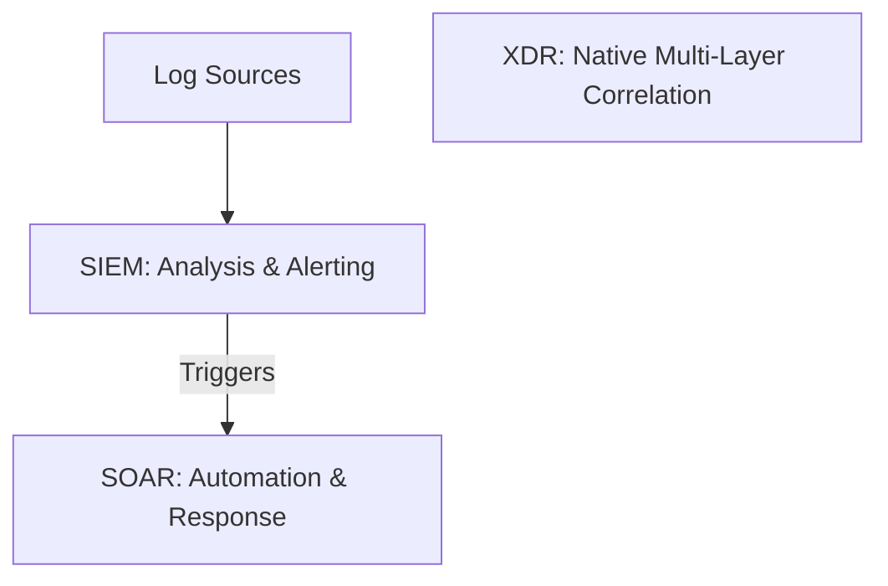

# Logging, Monitoring & SIEM for the CISSP Exam

Logging and monitoring provide the visibility necessary to detect attacks, audit user behavior, and maintain compliance.

## The Log Management Lifecycle (NIST SP 800-92)

1.  **Generation**: The system or application creates the log entry.
2.  **Transmission**: The log is sent to a central server (e.g., via Syslog).
3.  **Storage**: Logs are stored with integrity controls (WORM, Hashing).
4.  **Analysis**: Automated correlation and manual review (SIEM).
5.  **Disposal**: Secure deletion after the retention period (e.g., 1 year for PCI).

## SIEM, SOAR, and XDR

-   **SIEM (Security Information and Event Management)**: Centralizes logs and performs **correlation** across multiple sources to detect complex attack patterns.
-   **SOAR (Security Orchestration, Automation, and Response)**: Takes SIEM alerts and uses **playbooks** to automate response actions (e.g., automatically blocking an IP in the firewall).
-   **XDR (Extended Detection and Response)**: A vendor-specific approach that provides deep, native integration across endpoints, networks, and cloud workloads.

## Detection Methodologies

1.  **Signature-based**: Matches known "fingerprints" of attacks. Very fast, but fails against zero-day threats.
2.  **Anomaly-based (Heuristic)**: Baselines "normal" behavior and alerts on deviations. Can catch zero-days but produces many **false positives**.
3.  **Behavior-based (UEBA)**: Focuses on the behavior of users and entities (e.g., "Why is an HR user accessing the Source Code repository at 3 AM?").

## Network Telemetry: NetFlow vs. Packet Capture
-   **NetFlow (IPFIX)**: Provides "metadata" about network flows (Source IP, Dest IP, Port, Duration). Lightweight and great for baseline analysis.
-   **Full Packet Capture (PCAP)**: Records every single byte of traffic. Invaluable for forensics but extremely storage-heavy.

## Exam Traps
-   **Sensitive Data**: **NEVER** log plain-text passwords, PII, or full credit card numbers.
-   **Integrity**: Logs should be stored on **read-only media (WORM)** or forwarded to a server that the source system cannot modify.
-   **Retention**: Understand the major timelines (PCI = 1 year, HIPAA = 6 years).
