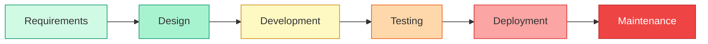
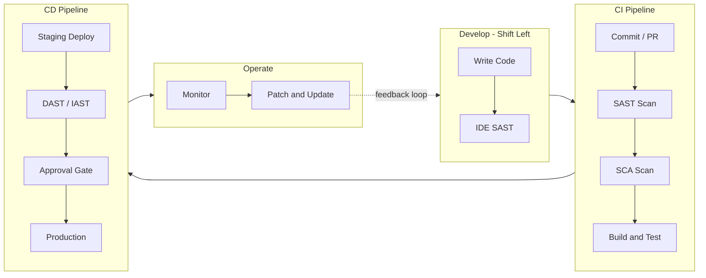
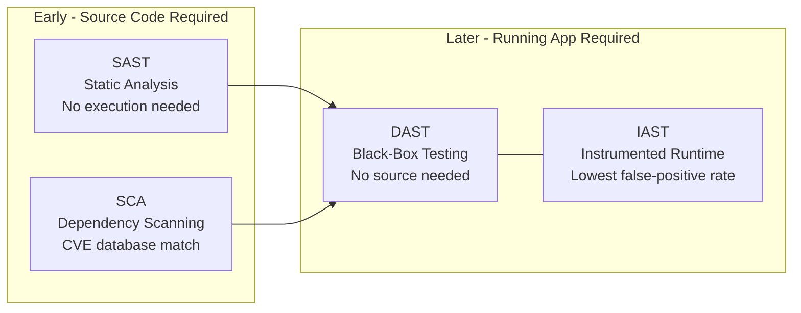
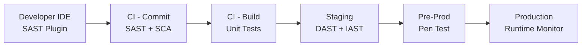
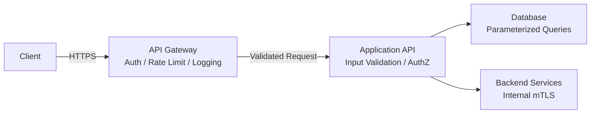
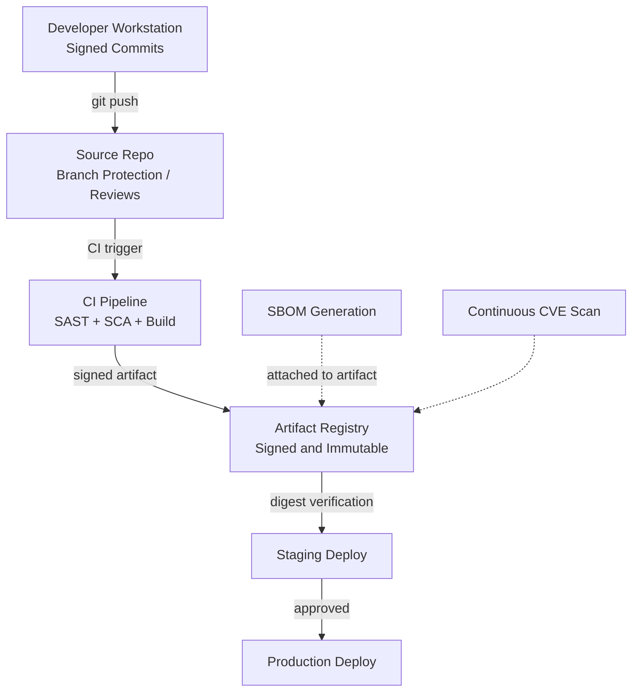
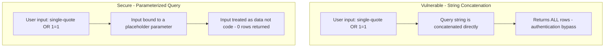
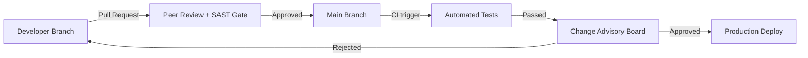

# Domain 8: Software Development Security

**Exam Weighting: ~11% of the CISSP exam**

Software Development Security is where security meets the engineering process. This domain tests your understanding of how security principles integrate into every phase of building software — from architecture and design through coding, testing, deployment, and maintenance. The emphasis is shifting: expect increasing coverage of DevSecOps, supply chain risks, and cloud-native development practices alongside the classic SDLC fundamentals.

---

## The Software Development Lifecycle (SDLC)

Security must be integrated at every phase of the SDLC, not bolted on at the end. Late-stage security fixes are dramatically more expensive: the **rule of ten** holds that a defect costs roughly 10x more to fix at each subsequent phase (a design flaw caught in requirements costs $1 to fix; the same flaw caught in production costs $1,000+).

The colour gradient above represents the **rule of ten**: cost to fix a defect escalates ~10x at each successive phase — cheapest at Requirements ($1), most expensive in Maintenance ($1,000+).

**SDLC Phases and Security Integration:**

- **Requirements** — Define security requirements alongside functional ones. Classify data, identify regulatory obligations, establish threat categories.
- **Design** — Apply **threat modeling** (STRIDE, PASTA, DREAD). Design with **security by design** principles: least privilege, defense in depth, fail secure, separation of duties.
- **Development/Coding** — Enforce secure coding standards (OWASP, CERT). Conduct peer code reviews. Integrate SAST tooling into the IDE and CI pipeline.
- **Testing** — Run SAST, DAST, and penetration testing. Validate security requirements, not just functional ones.
- **Deployment** — Harden configurations, manage secrets securely, validate the build pipeline itself.
- **Maintenance** — Patch vulnerabilities, monitor for new CVEs affecting dependencies, manage end-of-life software.

---

## Development Methodologies

Different development models have different security implications:

- **Waterfall** — Sequential phases with formal gates. Security reviews occur at defined checkpoints. Good documentation but slow to respond to new threats.
- **Agile** — Iterative sprints. Security must be embedded in each sprint (security stories, acceptance criteria). Risk: security is deferred as "tech debt" under time pressure.
- **DevOps** — Continuous integration and delivery (CI/CD). Rapid release cycles demand automated security controls — manual gates don't scale.
- **DevSecOps** — Security integrated into every DevOps stage. Key principle: **"shift left"** means moving security checks earlier (to development and design), not just automating them in deployment. Security is a shared responsibility across Dev, Sec, and Ops teams.

> **Exam tip:** "Shift left" is the driving principle of DevSecOps. On the exam, the best time to address a security issue is always the **earliest** feasible phase — requirements or design, not testing or production.

---

## Secure Coding Practices

Core principles that appear across CISSP questions:

- **Input validation** — Validate all input server-side. Never trust client-supplied data. Use allowlisting (permitted characters/formats) over denylisting (blocking known bad patterns).
- **Output encoding** — Encode output for its context (HTML, URL, JavaScript) to prevent injection attacks.
- **Error handling** — Fail securely. Error messages should not reveal stack traces, database schemas, or internal paths. Log details server-side; show generic messages to users.
- **Secure defaults** — Systems should be secure out of the box. Require explicit action to reduce security, not to enable it.
- **Least privilege** — Code and services should run with the minimum permissions needed. Database accounts used by an application should not have DBA privileges.

---

## Common Vulnerabilities — OWASP Top 10

The **OWASP Top 10** is a critical reference for CISSP exam questions on application vulnerabilities:

| Vulnerability                                   | Key Concept                                                                                          |
| ----------------------------------------------- | ---------------------------------------------------------------------------------------------------- |
| **SQL Injection**                               | Unsanitized input alters database queries. Prevent with parameterized queries and stored procedures. |
| **Broken Authentication**                       | Weak session management, credential stuffing, missing MFA.                                           |
| **Cross-Site Scripting (XSS)**                  | Malicious scripts injected into pages viewed by other users. Prevent with output encoding.           |
| **Insecure Direct Object Reference**            | Access to resources by guessing identifiers without authorization checks.                            |
| **Security Misconfiguration**                   | Default credentials, open cloud storage, verbose error messages.                                     |
| **Sensitive Data Exposure**                     | Unencrypted data in transit or at rest; weak cryptography.                                           |
| **CSRF (Cross-Site Request Forgery)**           | Tricks authenticated users into submitting malicious requests. Prevent with anti-CSRF tokens.        |
| **Insecure Deserialization**                    | Malicious objects crafted to exploit deserialization logic.                                          |
| **Using Components with Known Vulnerabilities** | Unpatched libraries, frameworks, and dependencies. Address with SCA tools.                           |
| **Insufficient Logging and Monitoring**         | Inability to detect breaches in progress.                                                            |

---

## Code Security Testing Tools

Four key tool categories, each finding different types of issues:

- **SAST** (Static Application Security Testing) — Analyzes source code without executing it. Finds issues like SQL injection patterns, hardcoded credentials, buffer overflows. Runs early (in IDE or CI pipeline). High false-positive rate requires tuning.
- **DAST** (Dynamic Application Security Testing) — Tests the running application from the outside (black-box). Finds runtime issues: authentication flaws, XSS, injection. Does not require source code access.
- **IAST** (Interactive Application Security Testing) — Instruments the running application from within. Combines SAST accuracy with DAST runtime context. Lower false-positive rate but requires agent installation.
- **SCA** (Software Composition Analysis) — Identifies known vulnerabilities in open-source and third-party dependencies by comparing against CVE databases. Critical for supply chain security.

The diagram below shows where each tool fits in the pipeline and what it requires:

**When each tool runs in the pipeline:**

---

## API Security

APIs are a primary attack surface in modern applications. Key controls:

- **Authentication and authorization** on every endpoint — never rely on obscurity
- **Rate limiting** to prevent enumeration and brute force
- **Input validation** for all parameters (query strings, headers, body)
- **Versioning** to allow deprecated endpoints to be retired securely
- **API gateway** to centralize authentication, logging, and throttling

Common API vulnerabilities include **IDOR** (Insecure Direct Object Reference), **broken object-level authorization**, and **mass assignment** (API accepting fields it shouldn't).

---

## Software Supply Chain Security

Supply chain attacks (e.g., SolarWinds, Log4Shell) have made this a growing focus area.

Key controls:

- **Dependency pinning** — Pin libraries to known-good versions rather than using floating version ranges
- **Artifact signing** — Verify integrity of build artifacts and container images
- **SBOM** (Software Bill of Materials) — A machine-readable inventory of all components in software. Required by US executive order for software sold to federal agencies
- **Secure build pipelines** — Protect CI/CD systems from unauthorized modification; validate pipeline-as-code
- **Vendor risk assessment** — Evaluate security practices of third-party software providers

---

## Database Security

Databases require specific security controls beyond general application security:

- **Parameterized queries / prepared statements** are the primary defense against SQL injection — they separate query logic from user-supplied data
- **Stored procedures** can provide a defined, controllable API layer to the database
- **Principle of least privilege** for database accounts — application accounts should not have DROP or ALTER permissions
- **Encryption** of sensitive columns and full-disk encryption for database files
- **Database activity monitoring (DAM)** for detecting anomalous query patterns

**SQL Injection — vulnerable vs. secure:**

---

## Change Management and Version Control

**Version control** (Git, SVN) provides traceability for all code changes. Security controls:

- Require **code review and approval** before merging to main branches
- Use **branch protection rules** to prevent direct commits to production branches
- **Sign commits** cryptographically to verify author identity
- Store secrets in a **secrets manager** (HashiCorp Vault, AWS Secrets Manager), never in source code

**Change management** for software follows the same principles as infrastructure: changes must be reviewed, tested, and approved before production deployment. Emergency changes require retroactive documentation.

---

## Exam Tips

- **"Shift left" means earlier in the SDLC** — when a question asks the best time to address a vulnerability, the answer is almost always the earliest phase (requirements or design), not testing or production.
- **Parameterized queries are the correct defense against SQL injection** — not input filtering or escaping alone. Know this cold.
- **SAST vs. DAST**: SAST requires source code and runs statically; DAST tests the running app with no source code required. IAST does both from inside the running app.
- **Threat modeling belongs in the design phase** — not after the code is written. CISSP questions about when to perform threat modeling have one right answer.
- **DevSecOps is increasingly tested** — know that it integrates security into CI/CD pipelines and emphasizes shared responsibility, not a separate security team reviewing releases at the end.
- **Supply chain and SBOM** are emerging topic areas — questions may describe a scenario where an attacker compromised a software vendor. The CISSP answer involves SCA tooling, vendor assessment, and artifact integrity verification.
