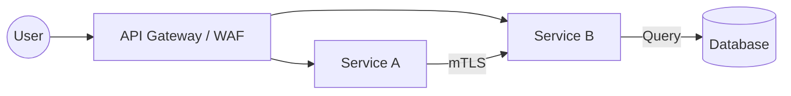
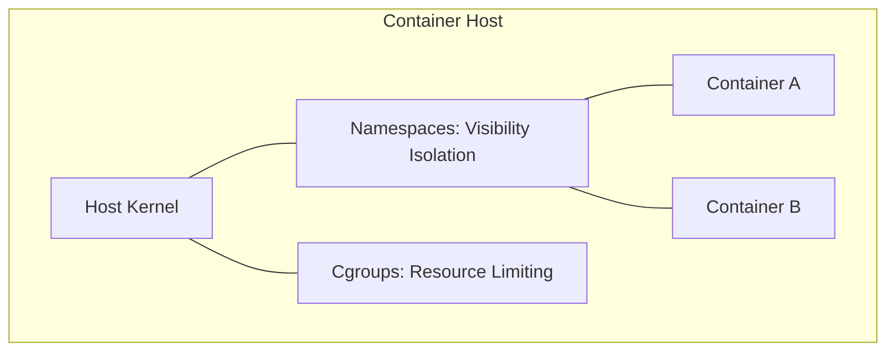

# Modern API & Cloud-Native Security for the CISSP Exam

Cloud-native security focuses on protecting distributed architectures, including microservices, containers, and serverless functions.

## Microservices & API Security

### 1. API Security
-   **REST (Representational State Transfer)**: Uses standard HTTP; lightweight and typically uses JSON.
-   **SOAP (Simple Object Access Protocol)**: Uses XML; supports **WS-Security** for message-level encryption.
-   **Authentication**: Typically handled via **JWT (JSON Web Tokens)** or OAuth 2.0.
-   **mTLS (Mutual TLS)**: Ensuring that not only the client trusts the server, but the server also trusts the client (essential for service-to-service communication).

### 2. JSON Web Tokens (JWT)
-   **Header**: Specifies the algorithm (e.g., RS256).
-   **Payload**: Contains the "claims" (e.g., user ID, roles).
-   **Signature**: Proves the token hasn't been tampered with.
-   **Security Risk**: The payload is only **encoded**, not encrypted. Never put sensitive PII in a JWT payload unless using JWE (JSON Web Encryption).

## Container Security

Containers provide isolation at the OS level using Linux primitives.

-   **Namespaces**: Provide **visibility isolation** (Processes, Network, Mounts). A process in one namespace cannot see processes in another.
-   **Cgroups (Control Groups)**: Provide **resource limiting** (CPU, Memory, I/O). Prevents a single container from starving the host.
-   **Image Scanning**: Scanning container images for vulnerabilities (SCA) before they are deployed.

## Serverless / FaaS (Function as a Service)
-   **Shared Responsibility**: 
    -   **Provider**: Secures the host, runtime, and physical infrastructure.
    -   **Customer**: Secures the **function code**, IAM roles, and data.
-   **Key Risk**: The attack surface is huge due to the number of small, interconnected functions. Least privilege for IAM roles is critical.

## CISSP Relevance
-   **East-West Traffic**: Communication between internal services. Requires mTLS and microsegmentation.
-   **North-South Traffic**: Communication from the internet to the application. Handled by API Gateways and WAFs.
-   **Immutable Infrastructure**: The practice of replacing components rather than modifying them.

## Exam Traps
-   **JWT Payload**: It is **not** secret. Anyone with the token can read the payload (Base64).
-   **Privileged Containers**: Never run containers as 'privileged' or 'root' unless absolutely necessary, as it allows for container breakout.
-   **Namespaces vs. Cgroups**: Namespaces = **Who can I see?**; Cgroups = **How much can I use?**
