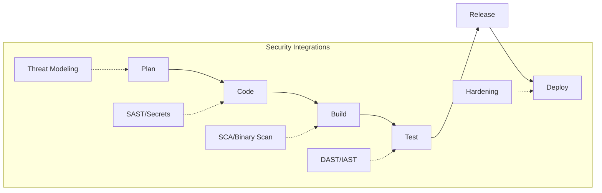

# DevSecOps & CI/CD Security for the CISSP Exam

DevSecOps is the evolution of DevOps that treats security as an integral, automated part of the continuous integration and continuous delivery (CI/CD) pipeline.

## The CI/CD Pipeline with Security (Shift-Left)

### Key Concepts
-   **Shift-Left**: Moving security activities as early as possible in the development lifecycle (e.g., SAST in the IDE).
-   **Security as Code (SaC)**: Defining security policies, configurations, and tests in machine-readable code (e.g., Terraform scans, OPA policies).
-   **Continuous Monitoring**: Real-time observability of the application and infrastructure in production.

## Secure Pipeline Controls
1.  **Pre-commit Hooks**: Automated checks that run on a developer's machine before code is pushed (e.g., checking for hardcoded API keys).
2.  **Ephemeral Runners**: Using short-lived, isolated environments for builds to prevent "poisoning" the build environment.
3.  **Artifact Signing**: Cryptographically signing build artifacts (images, binaries) to ensure they aren't tampered with during deployment.
4.  **Secrets Management**: Using a vault (e.g., HashiCorp Vault) rather than storing credentials in environment variables or code.

## The Shared Responsibility Model

```mermaid
graph TD
    subgraph "Responsibility Layers"
    Code[Application Code: Developer]
    Infra[Infrastructure: Ops/Cloud Provider]
    Sec[Security Policy: Security Team]
    end
    
    Code --- Sec
    Infra --- Sec
```

-   **Developers**: Responsible for writing secure code and fixing vulnerabilities.
-   **Operations**: Responsible for secure infrastructure (IaC) and pipeline availability.
-   **Security**: Responsible for setting the standards, providing tools, and auditing compliance.

## CISSP Relevance
-   **Automation**: In DevSecOps, automation is the key to maintaining security at scale.
-   **Immutable Infrastructure**: Replacing servers/containers rather than patching them in place.
-   **Policy as Code**: Ensuring compliance is automatically enforced rather than manually checked.

## Exam Traps
-   **Secrets in Env Vars**: Env vars are often logged or exposed in process lists; use a **Vault** instead.
-   **Shared Runners**: Shared build runners can lead to cross-job data leakage; use **isolated/ephemeral** runners.
-   **Manual Gates**: While traditional SDLC uses manual gates, DevSecOps aims to replace them with **automated gates**.
