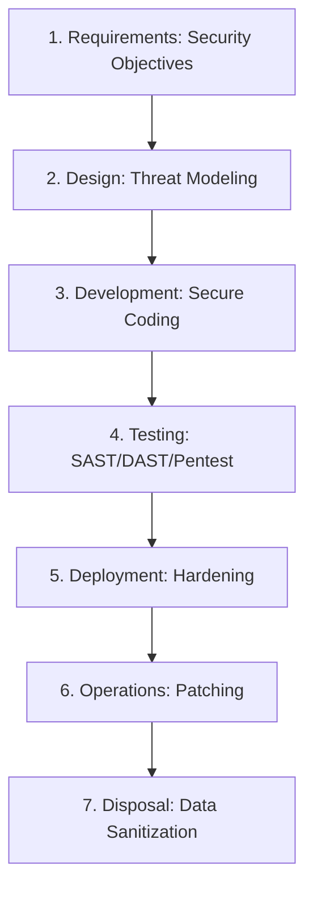
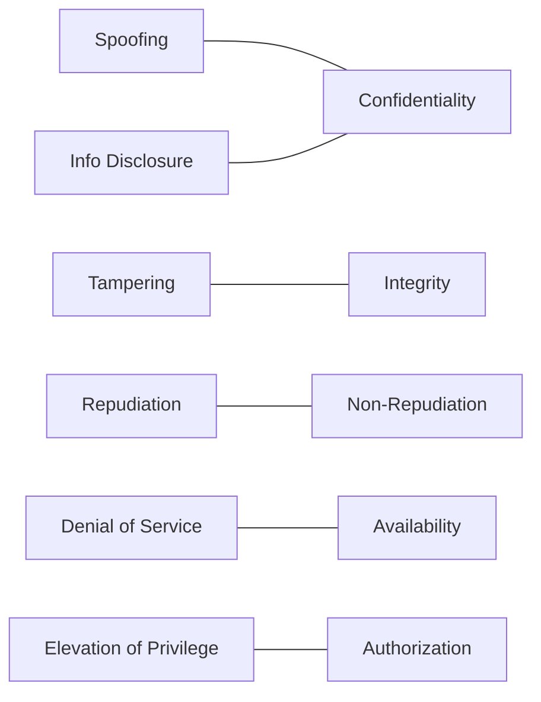

# Secure SDLC & OWASP for the CISSP Exam

Domain 8 (Software Development Security) covers the integration of security into the development process and the mitigation of common software vulnerabilities.

## The Secure SDLC Lifecycle

### Security Activities per Phase
1.  **Requirements**: Identify security requirements, privacy needs, and regulatory constraints.
2.  **Design**: Conduct **Threat Modeling** (STRIDE, PASTA), attack surface analysis, and secure architecture review.
3.  **Development**: Use secure coding standards, perform **SAST**, and conduct peer code reviews.
4.  **Testing**: Perform **DAST**, fuzzing, and security regression testing.
5.  **Deployment**: Implement secure configurations and verify artifact integrity.
6.  **Operations**: Ongoing vulnerability management, patching, and logging.
7.  **Disposal**: Secure decommissioning and data sanitization (Overwriting, Degaussing, Physical Destruction).

## Threat Modeling: STRIDE

-   **Spoofing**: Pretending to be someone else (Violates Authentication).
-   **Tampering**: Modifying data (Violates Integrity).
-   **Repudiation**: Denying an action took place (Violates Non-repudiation).
-   **Information Disclosure**: Exposing sensitive data (Violates Confidentiality).
-   **Denial of Service**: Crashing the system (Violates Availability).
-   **Elevation of Privilege**: Gaining unauthorized access (Violates Authorization).

## OWASP Top 10 (2021) Quick Reference
1.  **A01 Broken Access Control**: Unauthorized access to data or functions.
2.  **A02 Cryptographic Failures**: Weak encryption or hardcoded keys.
3.  **A03 Injection**: SQLi, Command Injection. Defense: **Parameterized Queries**.
4.  **A04 Insecure Design**: Missing threat modeling or secure patterns.
5.  **A05 Security Misconfiguration**: Default passwords, unnecessary services.
6.  **A06 Vulnerable and Outdated Components**: Using libraries with known CVEs.
7.  **A07 Identification and Authentication Failures**: Weak passwords, missing MFA.
8.  **A08 Software and Data Integrity Failures**: Malicious CI/CD or dependencies.
9.  **A09 Security Logging and Monitoring Failures**: Insufficient audit trails.
10. **A10 Server-Side Request Forgery (SSRF)**: Tricking a server into making requests.

## Software Maturity Models
-   **BSIMM (Building Security In Maturity Model)**: **Descriptive** (observational) model based on what companies are actually doing.
-   **OWASP SAMM (Software Assurance Maturity Model)**: **Prescriptive** (roadmap) model for building a secure development program.

## Exam Traps
-   **Threat Modeling Phase**: Threat modeling belongs in the **Design** phase.
-   **SQL Injection Defense**: The **primary** defense is Parameterized Queries (Prepared Statements). Input validation is secondary.
-   **Disposal**: Deleting a file is NOT disposal; you must overwrite, degauss, or physically destroy the media.
